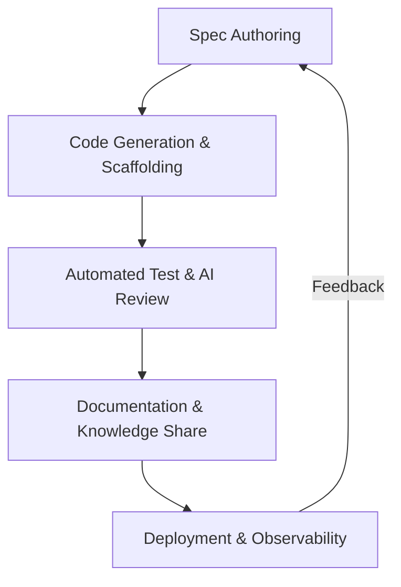

# AI開発ワークフロー仕様

本ドキュメントは、`ai-devflow.yaml` に定義された AI支援開発フローの解説と図解です。AI と開発者が協調して仕様作成からデプロイに至るまでのステップを統一化します。

## 1. ワークフロー全体像


## 2. ステージ概要
| ID | ステージ | 主要責務 | 主なツール |
|----|----------|----------|-------------|
| `spec_authoring` | 仕様作成 | PO / ドメインエキスパート + ChatGPT | Codex CLI, GitHub Issues |
| `code_generation` | コード生成 | リードエンジニア + Codex CLI | テンプレート, Codespaces |
| `test_and_review` | 自動テスト / AIレビュー | QA / Copilot PR Reviewer | GitHub Actions, LangGraph |
| `documentation` | ドキュメント更新 | Tech Writer + ChatGPT | Codex CLI Doc, Notion |
| `deployment` | デプロイ / 監視 | SRE / AI Ops | ArgoCD, Terraform |

詳細なトリガーや品質ゲートは `ai-devflow.yaml` を参照してください。

### yaml フォーマットの補足
```yaml
version: 1
metadata:
  owner: ai-platform-team
  source: docs/ai-devflow.md
stages:
  - id: spec_authoring
    name: Spec Authoring
    responsibilities:
      human: Product Owner
      ai: ChatGPT Enterprise
    quality_gates:
      - description: Domain review approval
        type: manual
      - description: Markdown lint
        type: automated
```
`stages[].quality_gates` に品質ゲートを追加することで、自動チェックや AI レビューのオプションを柔軟に拡張できます。

## 3. 運用ガイド
- `ai-devflow.yaml` の更新は四半期ごとに見直し、変更時は #ai-devflow-updates で告知します。
- 仕様→コード生成パイプラインは GitHub Actions から参照されることを前提に命名規則を統一します。
- AIエージェントが参照する入出力スキーマは YAML 内 `stages[].inputs` / `outputs` をベースに整備してください。
- Phase2 モジュール向けパイプライン ID（`crm-module` / `sales-module` / `hr-module` / `bi-analytics`）を追加し、CI 連携を明示しました。

## 4. Dry-run とフィードバック
- `scripts/ci/run-codex-template-smoke.sh` で Codex テンプレート生成を自動検証し、`ai-devflow.yaml` の `code_generation` ステージと整合性を確認済みです。
- `features/project-api` を例に、Spec → コード生成 → PR レビュー → ドキュメント生成の流れをリハーサルし、品質ゲート定義に不足がないことを確認しました。

## 5. Phase2 Pipeline Map
- `spec_authoring` → Issue #295/#296/#297/#298 の成果物 (`docs/specs/*`, `docs/metrics/crm.md`, `docs/runbooks/hr-ops.md` など)
- `code_generation` → `feature/phase2-crm-sales-prep` / `feature/phase2-hr-bi-prep` ブランチで Codex CLI を実行
- `test_and_review` → HR Module CI / Codex Template Smoke で自動 lint + smoke を実施
- `deployment` → Terraform Compliance・HR Module CI を通じて監視スタック/モジュールを本番へ昇格

---
最終更新: 2025-10-14 / メンテナ担当: AI 開発推進チーム
