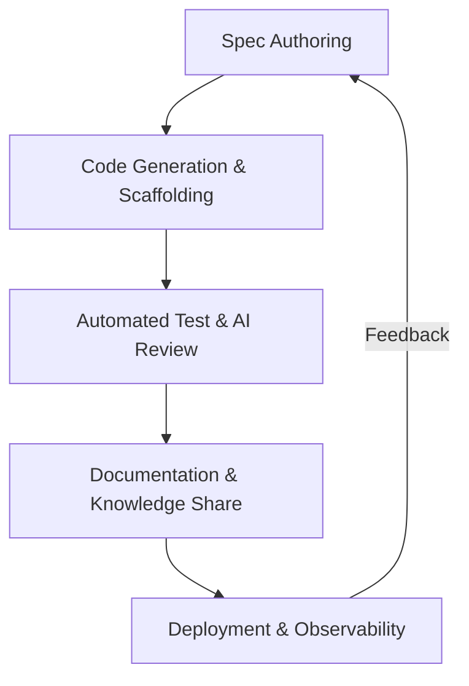

# AI開発ワークフロー仕様

本ドキュメントは、`ai-devflow.yaml` に定義された AI支援開発フローの解説と図解です。AI と開発者が協調して仕様作成からデプロイに至るまでのステップを統一化します。

## 1. ワークフロー全体像

## 2. ステージ概要
| ID | ステージ | 主要責務 | 主なツール |
|----|----------|----------|-------------|
| `spec_authoring` | 仕様作成 | PO / ドメインエキスパート + ChatGPT | Codex CLI, GitHub Issues |
| `code_generation` | コード生成 | リードエンジニア + Codex CLI | テンプレート, Codespaces |
| `test_and_review` | 自動テスト / AIレビュー | QA / Copilot PR Reviewer | GitHub Actions, LangGraph |
| `documentation` | ドキュメント更新 | Tech Writer + ChatGPT | Codex CLI Doc, Notion |
| `deployment` | デプロイ / 監視 | SRE / AI Ops | ArgoCD, Terraform |

詳細なトリガーや品質ゲートは `ai-devflow.yaml` を参照してください。

## 3. 運用ガイド
- `ai-devflow.yaml` の更新は四半期ごとに見直し、変更時は #ai-devflow-updates で告知します。
- 仕様→コード生成パイプラインは GitHub Actions から参照されることを前提に命名規則を統一します。
- AIエージェントが参照する入出力スキーマは YAML 内 `stages[].inputs` / `outputs` をベースに整備してください。

---
最終更新: 2025-10-12 / メンテナ担当: AI 開発推進チーム
