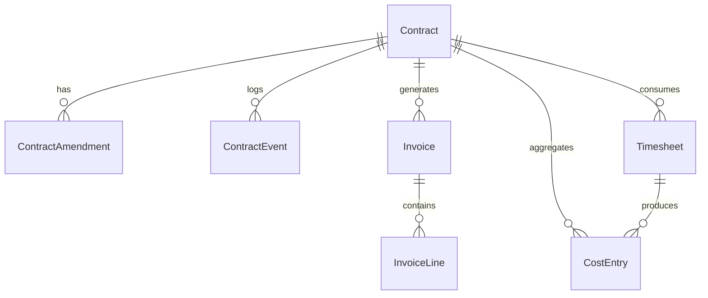

# 契約・請求・原価モジュール ERD

```mermaid
erDiagram
  Contract ||--o{ ContractAmendment : has
  Contract ||--o{ ContractEvent : logs
  Contract ||--o{ Invoice : generates
  Contract ||--o{ CostEntry : aggregates
  Contract ||--o{ Timesheet : consumes
  Invoice ||--o{ InvoiceLine : contains
  Timesheet ||--o{ CostEntry : produces
```

- **ContractEvent** は DocuSign など外部署名サービスとの連携でイベントを蓄積
- **CostEntry** は承認済みタイムシートから自動計上され、請求の原価基準となる
- **InvoiceLine** はコスト情報と契約定義されたレートから算出

最終更新: 2025-10-12
