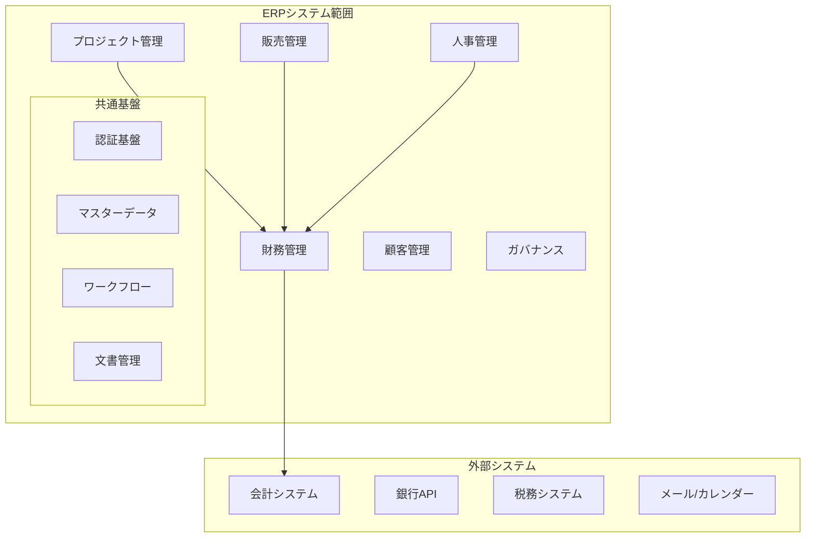
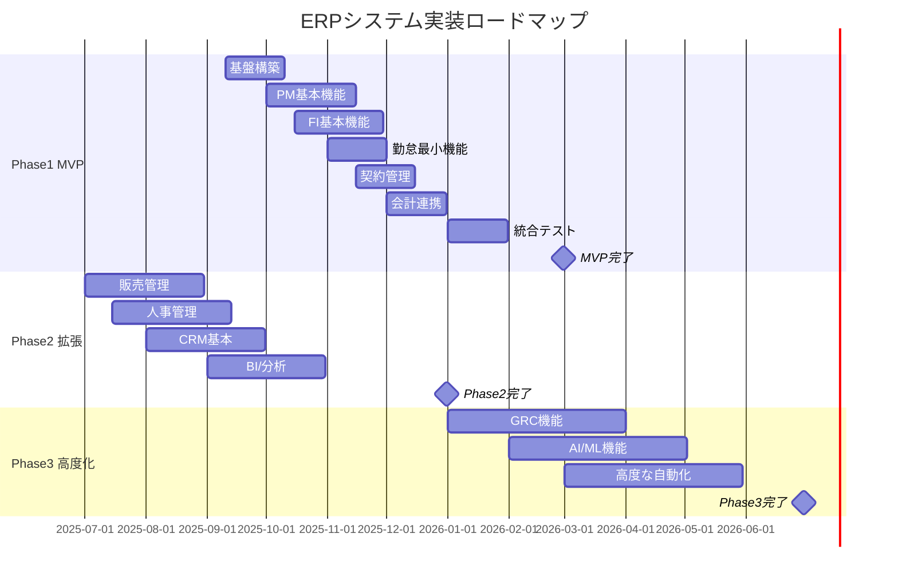

# モダンERPシステム概要仕様書
## System Overview Specification

### 1. エグゼクティブサマリー

#### 1.1 プロジェクト概要
本プロジェクトは、レガシーProject-Openシステムから、クラウドネイティブなモダンERPシステムへの移行を目的としています。MVPアプローチによる段階的実装により、リスクを最小化しながら確実な移行を実現します。

#### 1.2 ビジネス目標
- **業務効率化**: 統合システムによる業務プロセスの20%効率化
- **原価精度向上**: プロジェクト原価計算精度を誤差1%以内に
- **意思決定迅速化**: リアルタイムダッシュボードによる経営判断の高速化
- **コンプライアンス強化**: 日本法制度（インボイス、J-SOX）への完全対応

#### 1.3 成功指標（KPI）
| 指標 | 現状 | 目標値 | 達成時期 |
|------|------|--------|----------|
| システム稼働率 | 95% | 99.9% | MVP完了時 |
| 月次決算時間 | 10営業日 | 5営業日 | Phase2完了時 |
| プロジェクト原価精度 | ±5% | ±1% | MVP完了時 |
| ユーザー満足度 | - | 80%以上 | 各Phase完了時 |
| 工数削減率 | - | 20% | MVP完了時 |
| TCO削減率 | - | 30% | 3年後 |
| 法令遵守率 | 70% | 100% | MVP完了時 |

---

### 2. システムスコープと境界

#### 2.1 スコープマトリックス（MoSCoW）

##### Must Have（MVP - 6ヶ月）
```yaml
プロジェクト管理:
  - WBS/タスク管理（依存関係FS/SS/FF/SF対応）
  - リソース管理（キャパシティ制御付き）
  - 進捗管理（EVM指標：PV/EV/AC/SPI/CPI）
  - ガントチャート（1万行対応、仮想スクロール）
  - ベースライン管理

財務管理:
  - タイムシート（承認ワークフロー、締め処理）
  - プロジェクト原価計算（標準/時間外/休日レート）
  - 請求書発行（インボイス完全対応）
  - 基本予実管理
  - 電子帳簿保存法対応（7年保存、検索要件充足）

勤怠管理（最小機能）:
  - 打刻（出勤/退勤/休憩）
  - 36協定管理（時間外上限チェック）
  - 月次勤怠締め
  - 既存勤怠システム連携IF

契約管理:
  - 契約基本情報管理（ID/期間/金額/改定履歴）
  - 請求条件管理（締め日/支払日）
  - 更新アラート
  - 電子署名連携

システム基盤:
  - 認証・認可（SSO/MFA、OAuth 2.0/JWT）
  - ゼロトラストセキュリティ
  - 会計システム連携（勘定科目マッピング）
  - 監査ログ（改ざん防止、KMS暗号化）
```

##### Should Have（Phase2 - 12ヶ月）
```yaml
販売管理:
  - 見積・受注管理
  - 与信管理

人事管理:
  - 従業員情報管理
  - 勤怠管理
  - スキル管理

CRM:
  - 顧客情報管理
  - 営業支援

BI/分析:
  - 基本ダッシュボード
  - 定型レポート
```

##### Could Have（Phase3 - 18ヶ月）
```yaml
ガバナンス:
  - 内部統制（J-SOX）
  - リスク管理
  - 監査管理

高度な機能:
  - AI/ML予測分析
  - 固定資産管理
  - 高度なワークフロー自動化
```

##### Won't Have（将来検討）
- ABC原価計算
- IFRS16完全対応
- RFIDベース資産管理
- 競合価格分析

#### 2.2 システム境界図



---

### 3. 全体アーキテクチャ

#### 3.1 アーキテクチャ原則

| 原則 | 説明 | 実装方針 |
|------|------|----------|
| **クラウドネイティブ** | クラウド最適化設計 | AWS東京リージョン、コスト最適化重視（ECS/Fargate優先） |
| **マイクロサービス** | 疎結合・高凝集 | モジュール単位でのサービス分割 |
| **API First** | API中心設計 | OpenAPI 3.0仕様、REST/GraphQL |
| **セキュリティ by Design** | セキュリティ内在化 | ゼロトラスト、多層防御 |
| **データ駆動** | データ中心の意思決定 | リアルタイム分析、単一情報源 |

#### 3.2 システム構成図

```yaml
プレゼンテーション層:
  - Webアプリケーション (React/Next.js)
  - モバイルアプリ (React Native)
  - 管理コンソール

API層:
  - API Gateway
  - GraphQL Server
  - WebSocket Server

ビジネスロジック層:
  - プロジェクト管理サービス
  - 財務管理サービス
  - 人事管理サービス
  - 販売管理サービス
  - 契約管理サービス

データ層:
  - PostgreSQL (トランザクション＋JSONB活用)
  - Redis (キャッシュ)
  - S3 (ファイルストレージ、電子帳簿保存)

インフラ層:
  - AWS ECS/Fargate (コンテナ実行)
  - AWS RDS (マネージドDB)
  - AWS ElastiCache (Redis)
  - AWS CloudFront (CDN)
  - VPCエンドポイント (NAT削減)
```

#### 3.3 技術スタック

| レイヤー | 技術要素 | 選定理由 |
|----------|----------|----------|
| **フロントエンド** | React 18, Next.js 14, TypeScript | 高性能、開発効率、型安全性 |
| **バックエンド** | Node.js, NestJS, TypeScript | 統一言語、高い生産性 |
| **データベース** | PostgreSQL 15 + JSONB | 信頼性、JSON対応、MongoDB代替可能 |
| **キャッシュ** | Redis 7 | 高速、多機能 |
| **検索** | Elasticsearch 8 | 全文検索、分析機能 |
| **メッセージング** | Apache Kafka | 高スループット、信頼性 |
| **コンテナ** | Docker, ECS/Fargate | 可搬性、運用簡素化、コスト削減 |
| **CI/CD** | GitHub Actions, ArgoCD | 自動化、GitOps |
| **監視** | Datadog, Prometheus | 統合監視、可観測性 |

---

### 4. 実装ロードマップ

#### 4.1 フェーズ別実装計画



#### 4.2 マイルストーン

| フェーズ | 期間 | 主要成果物 | 成功基準 |
|---------|------|-----------|----------|
| **Phase1 MVP** | 6ヶ月 | PM/FI基本機能、会計連携 | 基本業務の実行可能 |
| **Phase2 拡張** | 6ヶ月 | 販売/HR/CRM、BI | 全社業務カバー |
| **Phase3 高度化** | 6ヶ月 | GRC、AI/ML、自動化 | 競争優位性確立 |

---

### 5. プロジェクト体制

#### 5.1 組織構造

```yaml
ステアリングコミッティ:
  - エグゼクティブスポンサー（役員）
  - 事業部門長
  - IT部門長

プロジェクト管理:
  - プロジェクトマネージャー: 1名
  - PMO: 2名

開発チーム:
  - テックリード: 2名
  - バックエンド開発: 4名
  - フロントエンド開発: 4名
  - インフラ/DevOps: 2名

品質保証:
  - QAリード: 1名
  - テストエンジニア: 2名

業務チーム:
  - ビジネスアナリスト: 2名
  - 業務エキスパート: 各部門1名

サポート:
  - データ移行: 2名
  - トレーニング: 1名
  - 変更管理: 1名
```

#### 5.2 コミュニケーション計画

| 会議体 | 頻度 | 参加者 | 目的 |
|--------|------|--------|------|
| ステアリング会議 | 月次 | 経営層 | 意思決定、課題解決 |
| プロジェクト定例 | 週次 | PM、各リード | 進捗確認、課題共有 |
| デイリースクラム | 日次 | 開発チーム | タスク調整、障害除去 |
| スプリントレビュー | 2週次 | 全員 | 成果確認、フィードバック |

---

### 6. リスク管理

#### 6.1 主要リスクと対策

| リスク | 影響 | 確率 | 対策 |
|--------|------|------|------|
| **データ移行失敗** | 高 | 中 | 段階移行、3回リハーサル、ロールバック計画 |
| **ユーザー抵抗** | 高 | 高 | 早期参画、段階導入、十分な研修 |
| **性能問題** | 中 | 中 | 性能テスト、段階的負荷増加 |
| **セキュリティ侵害** | 高 | 低 | 多層防御、定期監査、侵入テスト |
| **スコープクリープ** | 中 | 高 | 変更管理プロセス、MVP明確化 |

#### 6.2 コンティンジェンシープラン

```yaml
データ移行失敗時:
  - 即座にロールバック実行
  - 原因分析と対策実施
  - 再移行計画策定

性能問題発生時:
  - 負荷分散とスケールアウト
  - ボトルネック分析
  - アーキテクチャ見直し

重大セキュリティインシデント:
  - CSIRT即時対応
  - 影響範囲特定と封じ込め
  - 関係者通知と報告
```

---

### 7. 成功要因

#### 7.1 Critical Success Factors

1. **経営層のコミットメント**
   - 明確なビジョンと支援
   - 必要リソースの確保
   - 変更への推進力

2. **段階的アプローチ**
   - MVPによるリスク最小化
   - 早期の価値提供
   - 継続的な改善

3. **ユーザー中心設計**
   - 業務部門の早期参画
   - UI/UXの重視
   - フィードバックループ

4. **技術的卓越性**
   - モダンアーキテクチャ
   - 自動化の推進
   - 品質の作り込み

5. **変更管理**
   - 組織文化の変革
   - 十分なトレーニング
   - 継続的なサポート

---

### 8. 次のステップ

1. **承認プロセス** (2週間)
   - ステアリングコミッティでの承認
   - 予算確保
   - チーム編成

2. **詳細設計** (1ヶ月)
   - 各モジュール詳細仕様確定
   - 技術検証（PoC）
   - 開発環境構築

3. **MVP開発開始** (6ヶ月)
   - スプリント0: 環境構築
   - スプリント1-12: 機能開発
   - 並行して移行準備

---

### 改訂履歴

| 版数 | 日付 | 変更内容 | 承認者 |
|------|------|----------|--------|
| 1.0 | 2025-08-23 | 初版作成 | - |

---

*本仕様書は、ERPシステム全体の概要を示すものです。詳細仕様は各個別仕様書を参照してください。*