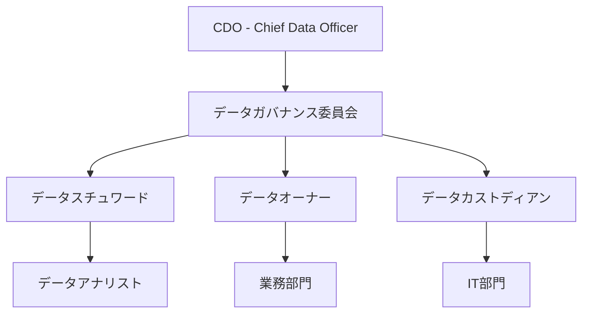
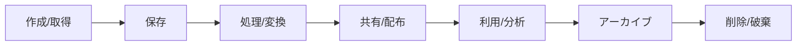

# データガバナンス仕様書
## Data Governance Specification

### 1. 概要

#### 1.1 目的
本仕様書は、ERPシステムにおけるデータの品質、一貫性、セキュリティ、コンプライアンスを確保するためのデータガバナンスフレームワークを定義し、データを戦略的資産として管理・活用するための要件を明確化します。

#### 1.2 基本原則
- **データは企業の重要な資産である**
- **単一の信頼できる情報源（Single Source of Truth）**
- **データ品質は全従業員の責任**
- **プライバシー・バイ・デザイン**
- **データの民主化と適切な統制の両立**

#### 1.3 適用範囲
- データガバナンス体制
- データ品質管理
- データライフサイクル管理
- マスターデータ管理（MDM）
- メタデータ管理
- データプライバシー・コンプライアンス

---

### 2. データガバナンス体制

#### 2.1 組織構造



#### 2.2 役割と責任（RACI）

| 活動 | CDO | データオーナー | データスチュワード | IT部門 | 業務部門 |
|------|-----|--------------|------------------|--------|----------|
| データポリシー策定 | A | C | R | I | I |
| データ品質管理 | A | R | R | C | I |
| アクセス権限管理 | I | A | R | R | C |
| データ定義 | C | A | R | I | C |
| セキュリティ実装 | I | C | I | R | I |
| データ利活用推進 | R | C | R | C | C |
| コンプライアンス確保 | A | R | R | C | I |

*R=実行責任、A=説明責任、C=協議、I=情報共有

#### 2.3 データガバナンス委員会

##### 2.3.1 委員会構成
| 役職 | メンバー | 役割 |
|------|---------|------|
| 委員長 | CDO | 全体統括、最終決定 |
| 副委員長 | CIO | IT戦略との整合 |
| 委員 | 各事業部長 | 事業視点の提供 |
| 委員 | CFO/財務責任者 | 財務データ管理 |
| 委員 | 法務責任者 | コンプライアンス確保 |
| 委員 | リスク管理責任者 | リスク評価 |
| 事務局 | データ管理部門 | 運営支援 |

##### 2.3.2 運営ルール
- **開催頻度**: 月次定例 + 臨時（重要事項発生時）
- **定足数**: 過半数の出席
- **決議方法**: 出席者の過半数、重要事項は2/3以上
- **議事録**: 全社公開（機密事項除く）

#### 2.4 データオーナーシップ

##### 2.4.1 データドメイン別責任者
| データドメイン | データオーナー | 主要データ | 責任範囲 |
|---------------|---------------|-----------|----------|
| **顧客データ** | 営業本部長 | 顧客マスター、取引履歴、連絡先 | 定義、品質、アクセス制御 |
| **商品データ** | 商品企画部長 | 商品マスター、価格、在庫 | ライフサイクル管理 |
| **財務データ** | CFO | 会計、予算、資産、原価 | 正確性、法令遵守 |
| **人事データ** | 人事部長 | 従業員、給与、評価 | プライバシー、セキュリティ |
| **プロジェクトデータ** | PMO責任者 | WBS、進捗、リソース | 完全性、適時性 |
| **契約データ** | 法務部長 | 契約書、条件、更新 | 機密性、証跡管理 |

##### 2.4.2 データスチュワード配置
| 部門 | 人数 | 主要責務 | 必要スキル |
|------|------|---------|-----------|
| 営業 | 2名 | 顧客データ品質向上、CRMデータ管理 | SQL、データ分析、業務知識 |
| 財務 | 2名 | 財務データ整合性、監査対応 | 会計知識、データモデリング |
| IT | 3名 | 技術的実装、データ統合、監視 | データベース、ETL、プログラミング |
| 人事 | 1名 | 個人情報保護、アクセス管理 | 法令知識、セキュリティ |
| PMO | 1名 | プロジェクトデータ標準化 | プロジェクト管理、分析 |

---

### 3. データアーキテクチャ

#### 3.1 データアーキテクチャ原則

| 原則 | 説明 | 実装方法 |
|------|------|----------|
| **一元管理** | マスターデータの単一管理 | MDMシステム導入 |
| **疎結合** | システム間の独立性確保 | API/イベント駆動連携 |
| **スケーラビリティ** | データ量増加への対応 | クラウド、分散処理 |
| **リアルタイム性** | 最新データの即時提供 | ストリーミング、CDC |
| **セキュリティ** | データ保護の徹底 | 暗号化、アクセス制御 |
| **可用性** | 高い稼働率の確保 | 冗長化、バックアップ |

#### 3.2 データレイヤー構造

```yaml
データソース層:
  - 業務システム（ERP各モジュール）
  - 外部データ（市場データ、SNS）
  - IoT/センサーデータ
  - 非構造化データ（文書、画像）

データ統合層:
  - ETL/ELT処理
  - CDC（Change Data Capture）
  - ストリーミング処理
  - データクレンジング

データ蓄積層:
  - データレイク（S3）
  - データウェアハウス（Redshift）
  - オペレーショナルデータストア
  - マスターデータハブ

データ活用層:
  - BIツール（Tableau, PowerBI）
  - アナリティクス（Python, R）
  - AI/ML（SageMaker）
  - API提供
```

#### 3.3 データモデル管理

##### 3.3.1 モデリング標準
| レベル | モデル種別 | 目的 | 責任者 | ツール |
|--------|-----------|------|--------|--------|
| 概念 | 概念データモデル | ビジネス要件定義 | 業務部門 + IT | Enterprise Architect |
| 論理 | 論理データモデル | システム設計 | データアーキテクト | ERwin |
| 物理 | 物理データモデル | DB実装 | DBA | DDL, Liquibase |

##### 3.3.2 命名規則
| オブジェクト | 命名規則 | 例 |
|-------------|---------|-----|
| テーブル | 大文字スネークケース、複数形 | CUSTOMERS, ORDER_ITEMS |
| カラム | 小文字スネークケース | customer_id, created_at |
| 主キー | PK_{テーブル名} | PK_CUSTOMERS |
| 外部キー | FK_{親テーブル}_{子テーブル} | FK_CUSTOMERS_ORDERS |
| インデックス | IX_{テーブル名}_{カラム名} | IX_ORDERS_CUSTOMER_ID |
| ビュー | V_{用途}_{テーブル名} | V_ACTIVE_CUSTOMERS |

---

### 4. データ品質管理

#### 4.1 データ品質フレームワーク

##### 4.1.1 データ品質6次元
| ディメンション | 定義 | 測定指標 | 目標値 | 測定頻度 |
|---------------|------|---------|--------|----------|
| **完全性** | 必要なデータが全て存在 | NULL率、欠損率 | <1% | 日次 |
| **正確性** | データが事実と一致 | エラー率、検証失敗率 | <0.1% | 日次 |
| **一貫性** | データ間の整合性 | 不整合件数、矛盾率 | 0件 | 日次 |
| **適時性** | データの鮮度 | 更新遅延時間 | <1時間 | リアルタイム |
| **妥当性** | ビジネスルール準拠 | ルール違反率 | <0.5% | 日次 |
| **一意性** | 重複がない | 重複率 | 0% | 週次 |

##### 4.1.2 品質スコアカード
```yaml
総合品質スコア計算:
  スコア = (完全性×0.2 + 正確性×0.3 + 一貫性×0.2 
           + 適時性×0.1 + 妥当性×0.1 + 一意性×0.1) × 100

品質レベル:
  - 優秀: 95%以上
  - 良好: 90-94%
  - 要改善: 80-89%
  - 問題あり: 80%未満
```

#### 4.2 データ品質ルール

##### 4.2.1 ルール定義
| ルールID | ルール種別 | 対象 | 条件 | アクション | 重要度 |
|----------|-----------|------|------|-----------|--------|
| DQ-001 | 必須チェック | 顧客.会社名 | NOT NULL | エラー、登録拒否 | 高 |
| DQ-002 | 形式チェック | 顧客.メール | 正規表現一致 | 警告、修正要求 | 中 |
| DQ-003 | 範囲チェック | 受注.金額 | 0 < 金額 < 10億 | エラー、確認要求 | 高 |
| DQ-004 | 参照整合性 | 受注.顧客ID | 顧客マスター存在 | エラー、登録拒否 | 高 |
| DQ-005 | ビジネスルール | プロジェクト.終了日 | 終了日 > 開始日 | エラー、修正要求 | 中 |
| DQ-006 | 重複チェック | 顧客.税務番号 | ユニーク | 警告、確認要求 | 高 |

##### 4.2.2 品質チェック実装
```yaml
実装レベル:
  データベース層:
    - NOT NULL制約
    - CHECK制約
    - UNIQUE制約
    - 外部キー制約
  
  アプリケーション層:
    - 入力検証
    - ビジネスルールチェック
    - 条件付き検証
  
  バッチ処理層:
    - 定期品質チェック
    - クレンジング処理
    - 異常値検出
```

#### 4.3 データプロファイリング

##### 4.3.1 プロファイリング実施計画
| 対象データ | 頻度 | 分析内容 | ツール | 責任者 |
|-----------|------|---------|--------|--------|
| マスターデータ | 週次 | 完全性、一意性、パターン | Talend | データスチュワード |
| トランザクション | 日次 | 統計、異常値、トレンド | Python/Pandas | データアナリスト |
| 参照データ | 月次 | 更新頻度、利用状況 | SQL | DBA |
| 非構造化データ | 四半期 | メタデータ、分類 | Elasticsearch | データエンジニア |

##### 4.3.2 異常検出ルール
```python
# 異常値検出アルゴリズム例
異常検出基準:
  統計的手法:
    - 3σルール（平均±3標準偏差外）
    - 四分位範囲（IQR）法
    - Zスコア
  
  機械学習:
    - Isolation Forest
    - Local Outlier Factor
    - Autoencoder
  
  時系列:
    - 季節性調整
    - トレンド除去
    - 変化点検出
```

---

### 5. データライフサイクル管理

#### 5.1 データライフサイクルステージ



#### 5.2 データ保持ポリシー

##### 5.2.1 法定保存期間
| データ種別 | 保存期間 | 根拠法令 | 保存形式 |
|-----------|---------|---------|----------|
| 会計帳簿 | 10年 | 会社法・税法 | 電子/紙 |
| 取引書類 | 7年 | 税法 | 電子（電帳法準拠） |
| 人事記録 | 退職後7年 | 労働基準法 | 電子/紙 |
| 契約書 | 契約終了後10年 | 民法 | 電子/紙 |
| 個人情報 | 利用目的達成後速やかに | 個人情報保護法 | - |

##### 5.2.2 データ分類別保持期間
| データ分類 | オンライン | ニアライン | アーカイブ | 削除 |
|-----------|-----------|-----------|-----------|------|
| **極秘** | 2年 | 3年 | 5年 | 法定期間後 |
| **秘** | 1年 | 2年 | 5年 | 7年 |
| **社外秘** | 6ヶ月 | 1年 | 3年 | 5年 |
| **公開** | 3ヶ月 | 6ヶ月 | 1年 | 2年 |

#### 5.3 データアーカイブ戦略

##### 5.3.1 アーカイブ基準
```yaml
アーカイブ対象選定:
  時間基準:
    - 最終アクセスから1年経過
    - 作成から2年経過
  
  利用頻度基準:
    - 月間アクセス10回未満
    - 四半期で参照なし
  
  ビジネス基準:
    - プロジェクト完了
    - 顧客契約終了
    - 会計年度終了
```

##### 5.3.2 アーカイブ実装
| ストレージ階層 | 用途 | アクセス速度 | コスト | 技術 |
|---------------|------|-------------|--------|------|
| ホット | 日常業務 | ミリ秒 | 高 | SSD, RDS |
| ウォーム | 月次参照 | 秒 | 中 | HDD, S3 Standard |
| コールド | 年次参照 | 分 | 低 | S3 IA |
| アーカイブ | 法定保存 | 時間 | 最低 | S3 Glacier |

#### 5.4 データ削除・破棄

##### 5.4.1 削除プロセス
```yaml
削除承認フロー:
  1. 削除申請（データオーナー）
  2. 影響分析（データスチュワード）
  3. 法務確認（法務部門）
  4. 承認（データガバナンス委員会）
  5. 実行（IT部門）
  6. 証跡記録（監査ログ）
```

##### 5.4.2 安全な削除方法
| データ種別 | 削除方法 | 検証方法 |
|-----------|---------|----------|
| データベース | 論理削除→物理削除 | 削除フラグ→VACUUM |
| ファイル | 上書き削除（3回） | ランダムデータ書込 |
| バックアップ | 世代管理による自動削除 | 保持期間超過確認 |
| ログ | ローテーション削除 | 古いファイルから削除 |

---

### 6. マスターデータ管理（MDM）

#### 6.1 マスターデータ定義

##### 6.1.1 マスターデータ一覧
| マスター名 | データオーナー | 更新頻度 | レコード数 | 重要度 |
|-----------|---------------|----------|-----------|--------|
| 顧客マスター | 営業部門 | 日次 | 10,000 | 極高 |
| 従業員マスター | 人事部門 | 即時 | 1,000 | 極高 |
| 商品マスター | 商品企画 | 週次 | 5,000 | 高 |
| 組織マスター | 人事部門 | 月次 | 100 | 高 |
| 勘定科目マスター | 財務部門 | 年次 | 500 | 高 |
| 取引先マスター | 購買部門 | 日次 | 3,000 | 高 |

##### 6.1.2 ゴールデンレコード管理
```yaml
ゴールデンレコード作成プロセス:
  1. データソース特定
     - 信頼度スコアリング
     - 優先順位付け
  
  2. データマッチング
     - 確定的マッチング（ID一致）
     - 確率的マッチング（類似度）
  
  3. データマージ
     - 優先度ルール適用
     - 競合解決
  
  4. 品質検証
     - 完全性チェック
     - 妥当性検証
  
  5. 配信
     - 各システムへ同期
     - 変更通知
```

#### 6.2 MDM成熟度モデル

| レベル | 状態 | 特徴 | 目標時期 |
|--------|------|------|----------|
| レベル1 | 初期 | データサイロ、手動管理 | 現状 |
| レベル2 | 管理 | 基本的な統合、品質ルール | 6ヶ月 |
| レベル3 | 定義 | MDMツール導入、プロセス標準化 | 12ヶ月 |
| レベル4 | 定量管理 | メトリクス管理、自動化 | 18ヶ月 |
| レベル5 | 最適化 | 継続的改善、AI活用 | 24ヶ月 |

---

### 7. メタデータ管理

#### 7.1 メタデータ種別

##### 7.1.1 メタデータ分類
| 種別 | 内容 | 例 | 管理ツール |
|------|------|-----|-----------|
| **技術メタデータ** | 物理構造 | テーブル定義、カラム型 | データカタログ |
| **ビジネスメタデータ** | 業務的意味 | 用語定義、計算式 | ビジネスグロサリー |
| **運用メタデータ** | 処理情報 | 実行時間、データ量 | 監視ツール |
| **ガバナンスメタデータ** | 管理情報 | オーナー、品質スコア | MDMツール |

##### 7.1.2 データリネージ
```yaml
リネージ追跡項目:
  - データソース
  - 変換処理
  - 中間データ
  - 最終出力
  - 利用システム
  
可視化:
  - データフロー図
  - 影響分析マップ
  - 依存関係グラフ
```

#### 7.2 データカタログ

##### 7.2.1 カタログ構成要素
```yaml
データセット情報:
  基本情報:
    - 名称、説明
    - オーナー、管理者
    - 作成日、更新日
  
  技術情報:
    - 格納場所
    - スキーマ定義
    - アクセス方法
  
  品質情報:
    - 品質スコア
    - 更新頻度
    - データ量
  
  利用情報:
    - 利用者リスト
    - 利用頻度
    - 関連レポート
```

---

### 8. データプライバシー・コンプライアンス

#### 8.1 個人情報保護

##### 8.1.1 個人情報の特定と分類
| 分類 | 定義 | 例 | 保護レベル |
|------|------|-----|-----------|
| **特定個人情報** | マイナンバー含む | マイナンバー、関連情報 | 最高 |
| **要配慮個人情報** | センシティブ情報 | 病歴、犯罪歴、思想信条 | 最高 |
| **一般個人情報** | 個人識別可能 | 氏名、住所、電話番号 | 高 |
| **仮名加工情報** | 仮名化済み | ID化された個人データ | 中 |
| **匿名加工情報** | 復元不可能 | 統計処理済みデータ | 低 |

##### 8.1.2 プライバシー保護対策
```yaml
技術的対策:
  - データ暗号化（AES-256）
  - アクセス制御（Need to Know）
  - 仮名化・匿名化
  - データマスキング
  - 監査ログ

組織的対策:
  - プライバシーポリシー
  - 従業員教育
  - 委託先管理
  - インシデント対応
  - 定期監査
```

#### 8.2 規制対応

##### 8.2.1 GDPR対応
| 要件 | 対応内容 | 実装 |
|------|---------|------|
| 同意管理 | 明示的同意取得、記録 | 同意管理システム |
| アクセス権 | 個人データ開示 | セルフサービスポータル |
| 訂正権 | データ修正機能 | 管理画面 |
| 削除権 | 忘れられる権利 | 削除申請フロー |
| データポータビリティ | データエクスポート | API/ダウンロード |
| プライバシー影響評価 | DPIA実施 | 評価テンプレート |

##### 8.2.2 日本法対応
```yaml
個人情報保護法:
  - 利用目的の特定・通知
  - 第三者提供の制限
  - 開示請求対応
  - オプトアウト対応
  - 漏洩時の報告義務

電子帳簿保存法:
  - タイムスタンプ
  - 検索機能確保
  - 真実性・可視性確保
  - システム要件適合

インボイス制度:
  - 適格請求書発行事業者番号管理
  - 必要記載事項確認
  - 電子インボイス対応
```

---

### 9. データ活用推進

#### 9.1 データの民主化

##### 9.1.1 セルフサービス分析環境
```yaml
提供機能:
  データアクセス:
    - SQLクエリツール
    - ビジュアルクエリビルダー
    - データプレビュー
  
  分析ツール:
    - BIダッシュボード
    - アドホックレポート
    - 統計分析
  
  共有・協業:
    - レポート共有
    - ダッシュボード公開
    - コメント・議論
```

##### 9.1.2 データリテラシー向上
| 対象者 | 研修内容 | 頻度 | 形式 |
|--------|---------|------|------|
| 経営層 | データ駆動経営 | 年2回 | セミナー |
| 管理職 | データ分析基礎 | 四半期 | ワークショップ |
| 一般社員 | データ活用入門 | 月次 | e-learning |
| データスチュワード | 高度分析手法 | 月次 | ハンズオン |
| IT部門 | 技術トレーニング | 随時 | 認定研修 |

#### 9.2 データ価値の測定

##### 9.2.1 データROI測定
```yaml
価値測定指標:
  直接的価値:
    - 意思決定時間短縮: 50%削減
    - レポート作成時間: 80%削減
    - データ品質向上: エラー率90%減
  
  間接的価値:
    - 顧客満足度向上: NPS 20ポイント上昇
    - 新規ビジネス機会: 年間10件創出
    - リスク低減: インシデント30%減
```

---

### 10. 実装ロードマップ

#### 10.1 段階的実装計画

| フェーズ | 期間 | 実装内容 | 成果物 |
|---------|------|---------|--------|
| **Phase 1** | 0-3ヶ月 | ガバナンス体制構築 | 組織設立、ポリシー策定 |
| **Phase 2** | 4-6ヶ月 | 基本品質管理 | 品質ルール、プロファイリング |
| **Phase 3** | 7-9ヶ月 | MDM導入 | マスターデータ統合 |
| **Phase 4** | 10-12ヶ月 | 高度化 | メタデータ管理、データカタログ |
| **Phase 5** | 13-18ヶ月 | 最適化 | AI/ML活用、自動化 |

#### 10.2 成功指標（KPI）

| KPI | 現状 | 6ヶ月後 | 12ヶ月後 | 18ヶ月後 |
|-----|------|---------|----------|----------|
| データ品質スコア | 60% | 75% | 85% | 95% |
| マスターデータ重複率 | 15% | 5% | 1% | 0.1% |
| データ関連インシデント | 月10件 | 月5件 | 月2件 | 月0件 |
| セルフサービス利用率 | 10% | 30% | 50% | 70% |
| データリテラシースコア | 40% | 60% | 75% | 85% |

---

### 改訂履歴

| 版数 | 日付 | 変更内容 | 承認者 |
|------|------|---------|--------|
| 1.0 | 2025-08-23 | 初版作成 | - |

---

*本仕様書は、データガバナンスの成熟度に応じて定期的に見直し、更新されます。*