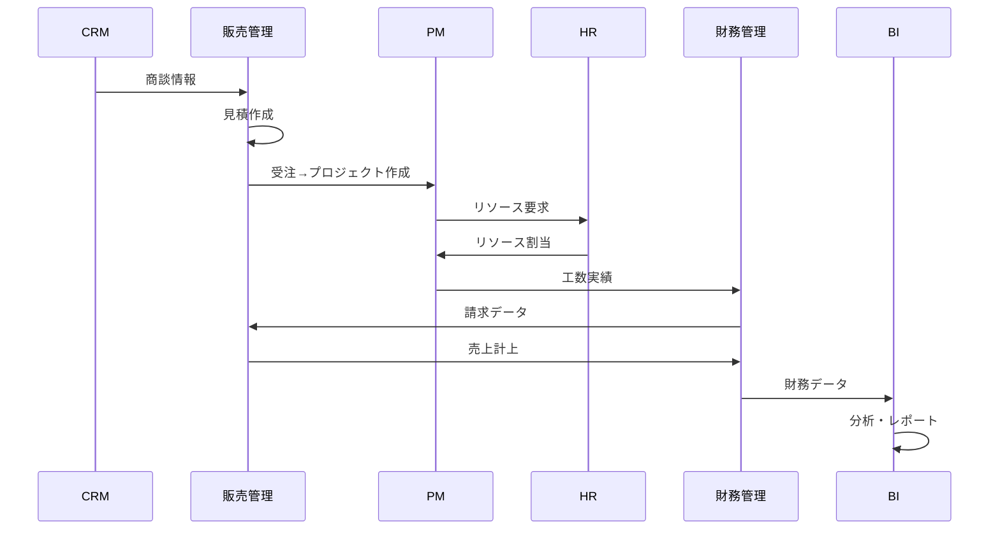

# システム統合仕様書
## System Integration Specification

### 1. 概要

#### 1.1 目的
本仕様書は、ERPシステムの各モジュール間の統合方法、データフロー、API連携、イベント処理を定義し、システム全体の一貫性と整合性を確保します。

#### 1.2 統合アーキテクチャ方針
- **疎結合**: マイクロサービス間の独立性確保
- **非同期通信**: イベント駆動による拡張性
- **API標準化**: OpenAPI 3.0準拠
- **データ整合性**: 分散トランザクション管理

---

### 2. モジュール間連携

#### 2.1 連携強度マトリックス

| 連携元＼連携先 | PM | FI | HR | Sales | CRM | BI | CKM | GRC |
|----------------|----|----|----|----|-----|----|-----|-----|
| **PM（プロジェクト）** | - | ★★★ | ★★★ | ★★ | ★★ | ★★★ | ★★ | ★★ |
| **FI（財務）** | ★★★ | - | ★★ | ★★★ | ★ | ★★★ | ★ | ★★★ |
| **HR（人事）** | ★★★ | ★★ | - | ★★ | ★★ | ★★ | ★★ | ★★ |
| **Sales（販売）** | ★★ | ★★★ | ★★ | - | ★★★ | ★★★ | ★ | ★★ |
| **CRM（顧客）** | ★★ | ★ | ★★ | ★★★ | - | ★★ | ★★ | ★ |
| **BI（分析）** | ★ | ★ | ★ | ★ | ★ | - | ★ | ★ |
| **CKM（協働）** | ★★ | ★ | ★★ | ★ | ★★ | ★ | - | ★★ |
| **GRC（統制）** | ★★ | ★★★ | ★★ | ★★ | ★ | ★★ | ★★ | - |

**凡例**: ★★★=強い連携（リアルタイム）, ★★=中程度（準リアルタイム）, ★=弱い連携（バッチ）

#### 2.2 主要データフロー

##### 2.2.1 プロジェクト実行フロー


##### 2.2.2 タイムシート→原価計算フロー
```yaml
フロー定義:
  1. タイムシート入力（PM）
     - 従業員が日次/週次で工数入力
     - プロジェクト・タスク単位
     
  2. 承認ワークフロー（PM→HR）
     - 上司承認（48時間以内）
     - PM承認
     
  3. 原価計算（FI）
     - 工数×標準単価
     - 間接費配賦
     - プロジェクト原価集計
     
  4. 請求処理（FI→Sales）
     - 実績ベース請求
     - 固定額請求
     - インボイス発行
     
  5. 分析（BI）
     - 収益性分析
     - 生産性分析
```

---

### 3. API設計

#### 3.1 API設計原則

| 原則 | 説明 | 実装方法 |
|------|------|----------|
| **RESTful** | リソース指向設計 | HTTP動詞の適切な使用 |
| **統一性** | 一貫したURL構造 | /api/v{n}/{module}/{resource} |
| **バージョニング** | 後方互換性 | URLパスバージョン管理 |
| **認証・認可** | セキュアな通信 | OAuth 2.0 + JWT |
| **エラー処理** | 標準エラー形式 | RFC 7807 Problem Details |
| **ページネーション** | 大量データ対応 | Cursor-based pagination |
| **Rate Limiting** | 負荷制御 | Token bucket algorithm |

#### 3.2 標準APIエンドポイント

##### 3.2.1 基本CRUD操作
```yaml
# リソース一覧取得
GET /api/v1/{module}/{resource}
  Query Parameters:
    - page: ページ番号
    - limit: 取得件数
    - sort: ソート条件
    - filter: フィルタ条件

# リソース詳細取得
GET /api/v1/{module}/{resource}/{id}

# リソース作成
POST /api/v1/{module}/{resource}
  Body: JSON形式のリソースデータ

# リソース更新
PUT /api/v1/{module}/{resource}/{id}
  Body: JSON形式の更新データ

# リソース部分更新
PATCH /api/v1/{module}/{resource}/{id}
  Body: JSON Patch形式

# リソース削除
DELETE /api/v1/{module}/{resource}/{id}
```

##### 3.2.2 モジュール別主要API

**プロジェクト管理（PM）**
```yaml
/api/v1/pm/projects:
  - GET: プロジェクト一覧
  - POST: プロジェクト作成

/api/v1/pm/projects/{id}/tasks:
  - GET: タスク一覧
  - POST: タスク作成

/api/v1/pm/projects/{id}/resources:
  - GET: リソース配置状況
  - POST: リソース割当

/api/v1/pm/timesheets:
  - GET: タイムシート一覧
  - POST: 工数入力
  - PUT /{id}/approve: 承認
```

**財務管理（FI）**
```yaml
/api/v1/fi/costs/projects/{id}:
  - GET: プロジェクト原価取得

/api/v1/fi/invoices:
  - GET: 請求書一覧
  - POST: 請求書作成
  - GET /{id}/pdf: PDF取得

/api/v1/fi/budgets:
  - GET: 予算一覧
  - POST: 予算登録
  - GET /{id}/actuals: 予実比較
```

#### 3.3 GraphQL API

##### 3.3.1 スキーマ定義例
```graphql
type Project {
  id: ID!
  name: String!
  startDate: Date!
  endDate: Date!
  status: ProjectStatus!
  manager: Employee!
  tasks: [Task!]!
  resources: [Resource!]!
  costs: ProjectCost
  budget: Budget
}

type Query {
  project(id: ID!): Project
  projects(filter: ProjectFilter, page: Int, limit: Int): ProjectConnection!
  projectDashboard(id: ID!): ProjectDashboard!
}

type Mutation {
  createProject(input: CreateProjectInput!): Project!
  updateProject(id: ID!, input: UpdateProjectInput!): Project!
  assignResource(projectId: ID!, resourceId: ID!, allocation: Float!): Resource!
}
```

---

### 4. イベント駆動アーキテクチャ

#### 4.1 イベント設計

##### 4.1.1 イベント命名規則
```yaml
形式: {module}.{entity}.{action}
例:
  - pm.project.created
  - fi.invoice.generated
  - hr.employee.onboarded
  - sales.order.confirmed
```

##### 4.1.2 標準イベント構造（CloudEvents準拠）
```json
{
  "specversion": "1.0",
  "type": "pm.project.created",
  "source": "/api/v1/pm/projects",
  "id": "A234-1234-1234",
  "time": "2025-08-23T12:34:56Z",
  "datacontenttype": "application/json",
  "data": {
    "projectId": "PRJ-2025-001",
    "name": "新規システム開発",
    "managerId": "EMP-001",
    "startDate": "2025-09-01",
    "budget": 10000000
  }
}
```

#### 4.2 イベントフロー

##### 4.2.1 主要イベントチェーン
```yaml
受注確定イベントチェーン:
  1. sales.order.confirmed
     → pm.project.created
     → hr.resource.requested
     → fi.budget.allocated
     
  2. pm.task.completed
     → pm.milestone.achieved
     → fi.invoice.triggered
     → sales.payment.requested

タイムシート承認チェーン:
  1. pm.timesheet.submitted
     → pm.timesheet.approved
     → fi.cost.calculated
     → fi.project.cost.updated
```

##### 4.2.2 イベントサブスクリプション
| イベント | パブリッシャー | サブスクライバー | 処理内容 |
|---------|---------------|----------------|----------|
| pm.project.created | PM | FI, HR, BI | 予算設定、リソース準備、分析初期化 |
| fi.invoice.generated | FI | Sales, CRM | 請求管理、顧客通知 |
| hr.employee.onboarded | HR | PM, FI, IT | アカウント作成、権限設定 |
| sales.order.confirmed | Sales | PM, FI | プロジェクト作成、与信確認 |

---

### 5. データ統合

#### 5.1 マスターデータ管理（MDM）

##### 5.1.1 マスターデータ種別
| マスター種別 | オーナー | 参照モジュール | 更新頻度 |
|-------------|---------|---------------|----------|
| **顧客マスター** | CRM | Sales, PM, FI | 日次 |
| **従業員マスター** | HR | PM, FI, 全モジュール | 即時 |
| **商品マスター** | Sales | PM, FI | 週次 |
| **組織マスター** | HR | 全モジュール | 月次 |
| **勘定科目マスター** | FI | 全モジュール | 年次 |

##### 5.1.2 データ同期戦略
```yaml
同期パターン:
  即時同期:
    - 従業員情報変更
    - 組織変更
    - 権限変更
    方式: イベント駆動 + API

  準リアルタイム同期:
    - 顧客情報
    - プロジェクト情報
    方式: CDC (Change Data Capture)
    頻度: 5分間隔

  バッチ同期:
    - 勘定科目
    - 分析用データ
    方式: ETL
    頻度: 日次（深夜）
```

#### 5.2 データ整合性保証

##### 5.2.1 分散トランザクション管理
```yaml
Sagaパターン実装:
  受注→プロジェクト作成Saga:
    1. 受注確定（Sales）
    2. 与信確認（FI）
    3. プロジェクト作成（PM）
    4. リソース予約（HR）
    5. 予算割当（FI）
    
  補償トランザクション:
    - 各ステップに対する取消処理定義
    - 失敗時の自動ロールバック
```

##### 5.2.2 データ品質チェック
| チェック項目 | 実装方法 | 実行タイミング |
|-------------|---------|---------------|
| **必須項目** | NOT NULL制約 | 入力時 |
| **形式検証** | 正規表現 | 入力時 |
| **参照整合性** | 外部キー制約 | 保存時 |
| **ビジネスルール** | ドメインロジック | 処理時 |
| **重複チェック** | ユニーク制約 | 保存時 |

---

### 6. 統合セキュリティ

#### 6.1 認証・認可統合

##### 6.1.1 シングルサインオン（SSO）
```yaml
実装:
  プロトコル: SAML 2.0 / OpenID Connect
  IdP連携: Azure AD / Google Workspace
  
  認証フロー:
    1. ユーザーアクセス
    2. IdPへリダイレクト
    3. 認証実行
    4. SAMLアサーション/IDトークン取得
    5. アプリケーションアクセス許可
```

##### 6.1.2 API認証
```yaml
方式: OAuth 2.0 + JWT
  
トークン構造:
  Header:
    alg: RS256
    typ: JWT
  
  Payload:
    sub: ユーザーID
    roles: [role1, role2]
    permissions: [perm1, perm2]
    exp: 有効期限
    iat: 発行時刻
```

#### 6.2 監査ログ統合

##### 6.2.1 統合監査ログ形式
```json
{
  "timestamp": "2025-08-23T12:34:56Z",
  "userId": "USER-001",
  "sessionId": "SESSION-123",
  "module": "PM",
  "action": "UPDATE",
  "resource": "project",
  "resourceId": "PRJ-001",
  "changes": {
    "before": {"status": "active"},
    "after": {"status": "completed"}
  },
  "ipAddress": "192.168.1.100",
  "userAgent": "Mozilla/5.0..."
}
```

---

### 7. 統合監視

#### 7.1 メトリクス収集

##### 7.1.1 ビジネスメトリクス
| メトリクス | 収集元 | 頻度 | アラート閾値 |
|-----------|--------|------|-------------|
| アクティブプロジェクト数 | PM | リアルタイム | - |
| 日次売上 | Sales | 日次 | 前年比-20% |
| 請求処理時間 | FI | トランザクション毎 | >5秒 |
| API応答時間 | 全モジュール | リアルタイム | p95 > 3秒 |

##### 7.1.2 システムメトリクス
```yaml
収集項目:
  - CPU使用率
  - メモリ使用率
  - ディスクI/O
  - ネットワークスループット
  - エラー率
  - リクエスト数

可視化:
  - Datadogダッシュボード
  - Prometheusメトリクス
  - Grafanaビジュアライゼーション
```

#### 7.2 分散トレーシング

```yaml
実装:
  - OpenTelemetry準拠
  - Jaeger / Zipkin連携
  
トレース項目:
  - リクエストID
  - スパンID
  - 親スパンID
  - サービス名
  - 処理時間
  - エラー情報
```

---

### 8. 外部システム連携

#### 8.1 会計システム連携

##### 8.1.1 連携対象システム
| システム | 連携方式 | 連携データ | 頻度 |
|---------|---------|-----------|------|
| **freee** | REST API | 仕訳、請求、入金 | リアルタイム |
| **マネーフォワード** | REST API | 仕訳、経費、請求 | リアルタイム |
| **弥生会計** | CSV/API | 仕訳、売掛、買掛 | 日次バッチ |

##### 8.1.2 連携データマッピング
```yaml
請求データ連携:
  ERP側:
    - 請求番号
    - 顧客コード
    - 請求日
    - 請求金額
    - 税額
    - 適格請求書番号
  
  会計システム側:
    - 取引先コード（マッピング）
    - 勘定科目（売掛金）
    - 税区分
    - 部門コード
    - プロジェクトコード
```

#### 8.2 銀行API連携

```yaml
連携内容:
  - 口座残高照会
  - 入出金明細取得
  - 振込依頼（全銀協API）
  
セキュリティ:
  - 電子証明書認証
  - APIキー + Secret
  - IP制限
  - 取引限度額設定
```

---

### 9. 統合テスト

#### 9.1 統合テストシナリオ

##### 9.1.1 エンドツーエンドシナリオ
```yaml
シナリオ1: 受注から入金まで:
  1. 見積作成（Sales）
  2. 受注確定（Sales）
  3. プロジェクト作成（PM）
  4. リソース割当（HR）
  5. 作業実施・工数入力（PM）
  6. 原価計算（FI）
  7. 請求書発行（FI）
  8. 入金処理（FI）
  9. 売上計上（FI）
  10. 分析レポート（BI）
```

#### 9.2 統合テスト自動化

```yaml
テストツール:
  - API: Postman/Newman
  - E2E: Cypress/Playwright
  - 負荷: JMeter/K6
  
CI/CD統合:
  - GitHubActions
  - 自動回帰テスト
  - 性能ベースライン監視
```

---

### 10. 移行時の統合考慮事項

#### 10.1 段階的統合アプローチ

```yaml
Phase 1:
  - 基本マスターデータ統合
  - 認証基盤統合
  - 基本API連携

Phase 2:
  - イベント駆動連携
  - リアルタイムデータ同期
  - 外部システム連携

Phase 3:
  - 高度な統合機能
  - AI/ML統合
  - 完全自動化
```

---

### 改訂履歴

| 版数 | 日付 | 変更内容 | 承認者 |
|------|------|----------|--------|
| 1.0 | 2025-08-23 | 初版作成 | - |

---

*本仕様書は定期的に見直し、システムの成長に合わせて更新されます。*