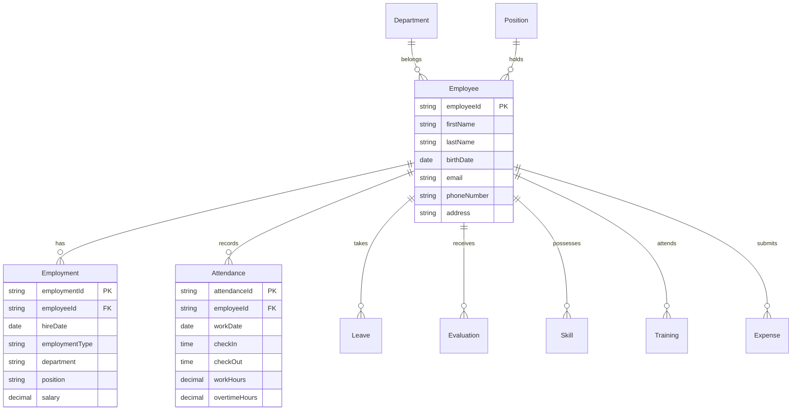
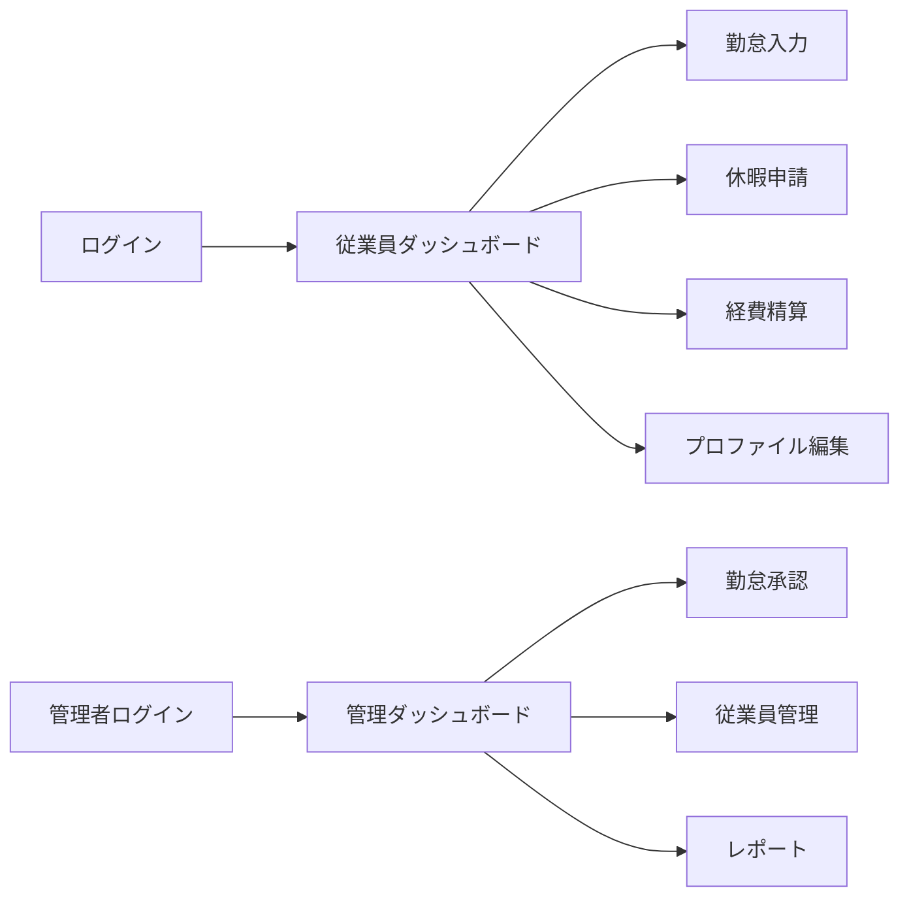
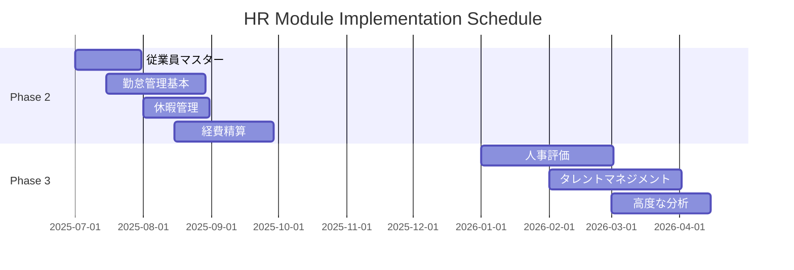

# 人事管理モジュール仕様書
## Human Resources Management Module Specification

### 1. モジュール概要

#### 1.1 目的
人事管理モジュールは、従業員のライフサイクル全体を管理し、タレントマネジメント、勤怠管理、給与計算基礎データの提供を通じて、組織の人的資源を最適化します。

#### 1.2 対象ユーザー
- 人事部門担当者
- 部門管理者
- 従業員（セルフサービス）
- 経営層（人事分析）

#### 1.3 実装優先度
- **Phase 2（7-12ヶ月）**: 基本機能実装
- **Phase 3（13-18ヶ月）**: 高度な機能実装

---

### 2. 機能要件

#### 2.1 従業員情報管理

##### 2.1.1 基本情報管理
| 機能ID | 機能名 | 説明 | 優先度 | Phase |
|--------|--------|------|--------|-------|
| HR-001 | 従業員マスター管理 | 基本情報の登録・更新・削除 | Must | 2 |
| HR-002 | 組織図管理 | 部門・階層構造の管理 | Must | 2 |
| HR-003 | 役職・職位管理 | 役職マスター、昇進履歴 | Must | 2 |
| HR-004 | 雇用形態管理 | 正社員/契約/パート/派遣 | Must | 2 |
| HR-005 | 従業員ポータル | セルフサービス機能 | Should | 2 |

##### 2.1.2 従業員属性データ
```yaml
基本情報:
  - 従業員番号（自動採番）
  - 氏名（漢字・かな・ローマ字）
  - 生年月日・年齢
  - 性別
  - 国籍
  - 顔写真

連絡先情報:
  - 住所（現住所・本籍地）
  - 電話番号（自宅・携帯）
  - メールアドレス（社内・個人）
  - 緊急連絡先

雇用情報:
  - 入社日・勤続年数
  - 雇用形態
  - 所属部門・職位
  - 直属上司
  - 勤務地
  - 社員区分

個人情報:
  - マイナンバー（暗号化保存）
  - 年金番号
  - 雇用保険番号
  - 健康保険情報
  - 銀行口座情報
```

#### 2.2 勤怠管理

##### 2.2.1 勤怠機能一覧
| 機能ID | 機能名 | 説明 | 優先度 | Phase |
|--------|--------|------|--------|-------|
| HR-010 | 出退勤記録 | 打刻・記録管理 | Must | 2 |
| HR-011 | 勤務シフト管理 | シフト作成・割当 | Must | 2 |
| HR-012 | 休暇管理 | 有給・特別休暇管理 | Must | 2 |
| HR-013 | 残業管理 | 残業申請・承認、36協定管理 | Must | 2 |
| HR-014 | 勤怠集計 | 月次集計・レポート | Must | 2 |
| HR-015 | テレワーク管理 | 在宅勤務記録 | Should | 2 |

##### 2.2.2 勤怠ルール設定
```yaml
労働時間制度:
  - 通常勤務（9:00-18:00）
  - フレックスタイム制
  - 裁量労働制
  - 変形労働時間制

休憩時間:
  - 6時間超：45分
  - 8時間超：60分

残業区分:
  - 法定内残業（〜8時間）
  - 法定外残業（8時間超）
  - 深夜労働（22:00-5:00）
  - 休日労働

36協定管理:
  - 月45時間上限
  - 年360時間上限
  - 特別条項（年6回まで）
  - アラート通知
```

#### 2.3 休暇管理

##### 2.3.1 休暇種別
| 機能ID | 機能名 | 説明 | 優先度 | Phase |
|--------|--------|------|--------|-------|
| HR-020 | 年次有給休暇 | 付与・取得・残日数管理 | Must | 2 |
| HR-021 | 特別休暇 | 慶弔・病気・介護等 | Must | 2 |
| HR-022 | 代休・振休 | 休日出勤の代休管理 | Must | 2 |
| HR-023 | 時間単位年休 | 時間単位での有給取得 | Should | 2 |
| HR-024 | 有給取得促進 | 5日取得義務管理 | Must | 2 |

##### 2.3.2 有給休暇自動付与ロジック
```yaml
付与ルール:
  入社6ヶ月: 10日
  1年6ヶ月: 11日
  2年6ヶ月: 12日
  3年6ヶ月: 14日
  4年6ヶ月: 16日
  5年6ヶ月: 18日
  6年6ヶ月以上: 20日

繰越ルール:
  - 最大40日まで繰越可能
  - 2年で時効消滅

計画年休:
  - 年5日の取得義務
  - 未取得者アラート
```

#### 2.4 人事評価管理

##### 2.4.1 評価機能
| 機能ID | 機能名 | 説明 | 優先度 | Phase |
|--------|--------|------|--------|-------|
| HR-030 | 目標管理（MBO） | 目標設定・進捗管理 | Should | 3 |
| HR-031 | 評価シート | 評価入力・集計 | Should | 3 |
| HR-032 | 360度評価 | 多面評価の実施 | Could | 3 |
| HR-033 | 1on1記録 | 面談記録管理 | Should | 3 |
| HR-034 | 評価分析 | 評価分布・推移分析 | Could | 3 |

##### 2.4.2 評価プロセス
```yaml
年間スケジュール:
  4月: 目標設定
  7月: 中間レビュー
  10月: 自己評価
  11月: 一次評価
  12月: 二次評価・調整
  1月: フィードバック
  2月: 評価確定
  3月: 昇進・昇給反映

評価要素:
  - 成果（40%）
  - 行動（30%）
  - 能力（30%）

評価段階:
  S: 期待を大きく上回る
  A: 期待を上回る
  B: 期待通り
  C: 期待を下回る
  D: 大幅に下回る
```

#### 2.5 タレントマネジメント

##### 2.5.1 スキル・キャリア管理
| 機能ID | 機能名 | 説明 | 優先度 | Phase |
|--------|--------|------|--------|-------|
| HR-040 | スキル管理 | スキルマップ・レベル管理 | Should | 3 |
| HR-041 | 資格管理 | 保有資格・有効期限管理 | Must | 2 |
| HR-042 | 研修管理 | 受講履歴・研修計画 | Should | 3 |
| HR-043 | キャリアパス | キャリア開発支援 | Could | 3 |
| HR-044 | 後継者計画 | サクセッションプラン | Could | 3 |

##### 2.5.2 スキルマトリックス
```yaml
技術スキル:
  - プログラミング言語
  - フレームワーク
  - データベース
  - クラウドサービス
  レベル: 1-5（初級〜エキスパート）

ビジネススキル:
  - プロジェクト管理
  - プレゼンテーション
  - ドキュメント作成
  - 交渉力
  レベル: 1-5

資格:
  - IT系資格
  - ビジネス系資格
  - 語学資格
  有効期限管理
```

#### 2.6 経費精算

##### 2.6.1 経費精算機能
| 機能ID | 機能名 | 説明 | 優先度 | Phase |
|--------|--------|------|--------|-------|
| HR-050 | 経費申請 | 経費の申請・登録 | Must | 2 |
| HR-051 | 領収書管理 | OCR読取・電子保存 | Should | 2 |
| HR-052 | 交通費精算 | IC連携・自動計算 | Should | 2 |
| HR-053 | 仮払管理 | 仮払金の精算 | Should | 2 |
| HR-054 | 承認ワークフロー | 多段階承認 | Must | 2 |

---

### 3. データモデル

#### 3.1 主要エンティティ



#### 3.2 データ連携

##### 3.2.1 他モジュールとの連携
| 連携先 | データ | 方向 | 頻度 |
|--------|------|------|------|
| PM | リソース情報、スキル | 送信 | リアルタイム |
| FI | 勤怠データ、経費データ | 送信 | 日次 |
| FI | 給与計算結果 | 受信 | 月次 |
| BI | 人事分析データ | 送信 | 日次 |

---

### 4. 画面仕様

#### 4.1 主要画面一覧

| 画面ID | 画面名 | 説明 | 利用者 |
|--------|--------|------|--------|
| HR-S001 | 従業員ダッシュボード | 個人情報・勤怠状況表示 | 全従業員 |
| HR-S002 | 勤怠入力画面 | 出退勤打刻・勤怠修正 | 全従業員 |
| HR-S003 | 休暇申請画面 | 各種休暇の申請 | 全従業員 |
| HR-S004 | 経費精算画面 | 経費申請・精算 | 全従業員 |
| HR-S005 | 人事管理画面 | 従業員情報管理 | HR担当 |
| HR-S006 | 勤怠承認画面 | 勤怠・休暇承認 | 管理者 |
| HR-S007 | 人事分析画面 | 各種人事指標表示 | HR・経営層 |

#### 4.2 画面遷移



---

### 5. API仕様

#### 5.1 主要API

##### 5.1.1 従業員管理API
```yaml
# 従業員一覧取得
GET /api/v1/hr/employees
Query:
  - department: 部門ID
  - position: 役職ID
  - employmentType: 雇用形態

# 従業員詳細取得
GET /api/v1/hr/employees/{employeeId}

# 従業員情報更新
PUT /api/v1/hr/employees/{employeeId}
Body:
  - personal: 個人情報
  - employment: 雇用情報
  - contact: 連絡先
```

##### 5.1.2 勤怠管理API
```yaml
# 打刻
POST /api/v1/hr/attendance/clock
Body:
  - employeeId: 従業員ID
  - type: checkIn/checkOut
  - timestamp: 打刻時刻
  - location: 打刻場所

# 勤怠データ取得
GET /api/v1/hr/attendance
Query:
  - employeeId: 従業員ID
  - startDate: 開始日
  - endDate: 終了日

# 勤怠承認
POST /api/v1/hr/attendance/{attendanceId}/approve
Body:
  - approverId: 承認者ID
  - comments: コメント
```

---

### 6. セキュリティ要件

#### 6.1 個人情報保護

##### 6.1.1 データ保護対策
```yaml
暗号化:
  - マイナンバー: AES-256暗号化
  - 給与情報: 暗号化保存
  - 健康情報: 暗号化+アクセス制限

アクセス制御:
  - 本人: 自身の情報のみ参照可
  - 上司: 直属部下の基本情報のみ
  - HR: 業務必要範囲のみ
  - システム管理者: 緊急時のみ

監査ログ:
  - 全アクセス記録
  - 変更履歴保持
  - 不正アクセス検知
```

##### 6.1.2 コンプライアンス対応
| 法規制 | 対応内容 |
|--------|---------|
| 個人情報保護法 | 同意取得、安全管理措置 |
| マイナンバー法 | 特定個人情報の厳格管理 |
| 労働基準法 | 労働時間の適正管理 |
| 労働安全衛生法 | 健康情報の適切な取扱い |

---

### 7. 非機能要件

#### 7.1 パフォーマンス要件

| 処理 | 目標値 | 条件 |
|------|--------|------|
| 従業員検索 | 2秒以内 | 1万件から検索 |
| 勤怠データ表示 | 1秒以内 | 月次データ |
| 組織図表示 | 3秒以内 | 1000人規模 |
| レポート生成 | 10秒以内 | 年次集計 |

#### 7.2 可用性要件

- システム稼働率：99.5%（営業時間内）
- 計画停止：月1回、最大2時間
- バックアップ：日次（勤怠データは即時）

---

### 8. 移行要件

#### 8.1 移行対象データ

| データ種別 | 件数 | 移行方法 |
|-----------|------|----------|
| 従業員マスター | 1,000件 | CSV一括 |
| 組織マスター | 50件 | 手動登録 |
| 勤怠データ | 過去2年分 | バッチ移行 |
| 有給残日数 | 現時点 | 個別計算 |

---

### 9. 実装スケジュール



---

### 改訂履歴

| 版数 | 日付 | 変更内容 | 承認者 |
|------|------|---------|--------|
| 1.0 | 2025-08-23 | 初版作成 | - |

---

*本仕様書は、Phase 2以降の実装を前提とした人事管理モジュールの要件定義です。*