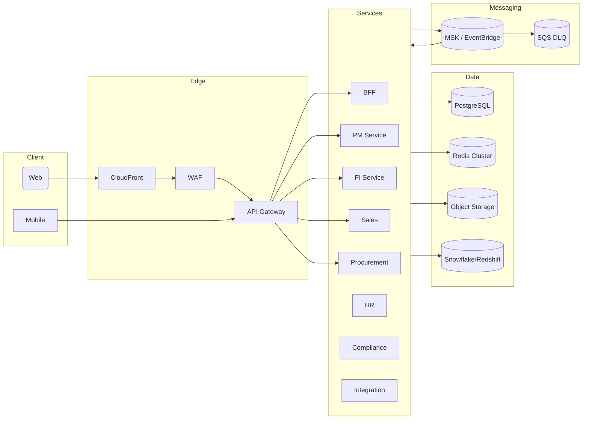

# 技術アーキテクチャ仕様書
## Technical Architecture Specification

### 1. 概要

#### 1.1 目的
本仕様書は、ITDO ERP3 の技術アーキテクチャ全体像を定義し、モジュール別仕様や運用仕様と整合した実装・運用の共通指針を提供する。クラウドネイティブ ERP の標準構成、非機能要件の担保方法、環境毎の構成差異を明確化し、開発・運用チーム間で統一された理解を形成することを目的とする。

#### 1.2 適用範囲
- アプリケーションおよびマイクロサービスの論理構成
- AWS を前提としたインフラストラクチャ/ネットワーク構成
- 共通コンポーネント（API ゲートウェイ、メッセージング、ストレージ 等）
- 環境（本番/ステージング/開発）ごとのデプロイメントパターン
- 可用性・スケーラビリティ・可観測性に関する設計方針

#### 1.3 前提と非機能要求
| 項目 | 要求値 | 根拠 |
|------|--------|------|
| 可用性 | 99.9% (コアサービス) | 運用管理仕様書 SLA (operation-spec.md) |
| RPO/RTO | RPO: 15分 / RTO: 2時間 | 財務・工数データ保護 |
| スケーラビリティ | テナント数 100 / 同時接続 1,000 | MVPロードマップ (integrated-specs/README.md) |
| セキュリティ | J-SOX / インボイス対応 | security-spec.md に準拠 |
| オブザーバビリティ | OpenTelemetry + 集約基盤 | 障害時の MTTR 30分以内 |

---

### 2. アーキテクチャ全体像

#### 2.1 レイヤー構成
| レイヤー | 主なコンポーネント | 技術スタック | 備考 |
|----------|------------------|--------------|------|
| プレゼンテーション | Web クライアント (Next.js) / モバイル (将来) | React 18+, Next.js 14+ | CDN 配信 |
| API Gateway / Edge | API Gateway, WAF, CDN | AWS API Gateway + CloudFront | 認証・レート制御 |
| アプリケーション | BFF, モジュール別サービス | NestJS (Node.js 20) | TypeScript, Clean Architecture |
| メッセージング | イベントバックボーン | Amazon MSK / RabbitMQ (PoC) | 非同期連携, DLQ |
| データ | RDB, NoSQL, キャッシュ | Amazon RDS (PostgreSQL), Redis, S3 | マルチテナント (tenant_id) |
| オブザーバビリティ | ログ/メトリクス/トレース | CloudWatch, OpenTelemetry, Grafana | SLO 監視 |
| IaC / CI | Terraform, GitHub Actions, ArgoCD | | Immutable Infrastructure |

#### 2.2 論理アーキテクチャ (概要)

#### 2.3 環境別デプロイ概要
| 環境 | 主目的 | デプロイ先 | リリース経路 | 特記事項 |
|------|--------|------------|--------------|----------|
| 本番 | 顧客利用 | EKS Production Cluster | GitHub Actions → ArgoCD | Multi-AZ, 自動スケール |
| ステージング | リグレッション/負荷試験 | EKS Staging Cluster | GitHub Actions → ArgoCD | 本番相当構成, Feature Flag |
| 開発 | 内部検証 | Podman/K3d (ローカル) or EKS Dev Cluster | GitHub Actions (preview) | 簡易構成, RDS Proxy |

---

### 3. アプリケーションアーキテクチャ

#### 3.1 サービス境界 (Bounded Context)
| サービス | 主責務 | 主なAPI/イベント | データソース |
|----------|--------|------------------|-------------|
| BFF (Graph/API) | クライアント向け集約、認可判定 | `/ui/*` GraphQL, `/api/v1/*` 集約 | Redis, RDS |
| projects-service | プロジェクト、タスク、メンバー | `/api/v1/projects`, `pm.timesheet.approved` | projects, tasks |
| timesheets-service | 工数登録・承認 | `/api/v1/timesheets`, `pm.timesheet.approved` | timesheets |
| sales-service | 見積・受注・請求連携 | `/api/v1/sales/orders`, `sales.order.confirmed` | sales_orders* |
| procurement-service | 発注・検収・買掛 | `/api/v1/procurement/purchase-orders` | purchase_orders* |
| contracts-service | 契約・更新管理 | `/api/v1/contracts` | contracts* |
| fi-service | 会計連携、仕訳出力 | `/api/v1/accounting/*`, `fi.invoice.generated` | journal_exports |
| compliance-service | インボイス/電帳法対応 | `/api/v1/compliance/invoices` | s3_invoice_store |
| integration-hub | OCR/外部SaaS連携 | `/api/v1/integration/*`, `integration.ocr.completed` | integration_jobs |

a) `*` は本仕様で追加するデータモデル (Section 4) に対応する。

#### 3.2 共通コンポーネント
- **認証/認可**: Cognito + OIDC (Auth0等) と統合。API Gateway + Lambda Authorizer でトークン検証。ロール/スコープは `ae/permissions.yaml` を起点にサービス側でも enforcement。
- **設定管理**: AWS SSM Parameter Store / AWS Secrets Manager。サービスは起動時に参照し、`env` で供給。
- **ファイル・添付**: S3 バケット (tenant プレフィックス) + SSE-KMS 暗号化。`poc/event-backbone/local` では MinIO を代替利用。
- **ジョブ/スケジューラ**: EventBridge Scheduler + ECS Fargate タスク or Step Functions。月次締めやバッチ処理に利用。

---

### 4. データアーキテクチャ

#### 4.1 マルチテナント方針
- `tenant_id` による論理分離を全テーブルで徹底。PostgreSQL Row Level Security (RLS) を導入し、サービス層でも tenant コンテキストを要求。
- 大容量マスタ (取引先、仕訳) はテナント毎パーティション (HASH) を検討。TimescaleDB 拡張で時間軸の集計を最適化。

#### 4.2 データストアの役割
| 種別 | 用途 | 管理方式 |
|------|------|----------|
| RDS (PostgreSQL) | 取引・原価・契約・購買などコアトランザクション | マネージド、Multi-AZ、Point-in-time recovery |
| Redis Cluster | セッション、キャッシュ、ジョブロック | AWS ElastiCache、AutoFailover |
| S3 | 添付書類、帳票、イベントペイロード | SSE-KMS、ライフサイクル管理 |
| OpenSearch | 監査ログ、全文検索 | マネージド (将来検討) |
| DWH (Snowflake/Redshift) | 分析・BI 用集計 | ETL/ELT: AWS Glue + dbt |

#### 4.3 データフロー
- **トランザクション → 会計**: `pm.timesheet.approved` → fi-service で原価計上 → `fi.invoice.generated` → 会計システム連携 (journal_exports)。
- **販売 ↔ プロジェクト**: `sales.order.confirmed` イベントを projects-service が購読し、自動プロジェクト生成 (PoC `pm-service` 参考)。
- **外部連携**: OCR 処理結果を integration-hub が受け取り、compliance-service に登録。添付は S3 へ保存。

---

### 5. インフラストラクチャ設計

#### 5.1 ネットワーク分離
| サブネット | 用途 | 構成 |
|------------|------|------|
| Public Subnet | NAT, ALB, Bastion | Multi-AZ, /24 |
| Private Subnet (App) | EKS Worker, ECS Fargate | Multi-AZ, /22 |
| Private Subnet (Data) | RDS, ElastiCache | Multi-AZ, /26 |
| Shared Services | CI/CD Runner, Monitoring | 専用 VPC or Transit Gateway |

- Zero Trust 原則を採用し、Security Group と NACL で東西トラフィックを制限。
- VPC Peering/Transit Gateway を活用して外部連携や社内ネットワークを接続。

#### 5.2 コンピューティング
- **EKS**: マイクロサービスをデプロイ。Managed Node Group + Fargate Profile 併用。Horizontal Pod Autoscaler (HPA) + Cluster Autoscaler。
- **Lambda**: 軽量な連携/API 補助、S3 イベントハンドリングなどに利用。
- **Batch 処理**: AWS Batch または Argo Workflows。会計締めや大規模 ETL で使用。

#### 5.3 ストレージとバックアップ
- RDS: Multi-AZ, AutoBackup, PITR。週次フルバックアップ + 日次スナップショット。DR 用にクロスリージョンレプリカ。
- S3: バージョニング + MFA Delete。監査証跡は Glacier Deep Archive へエクスポート。
- Redis: Automatic Snapshot + Multi-AZ。フェイルオーバーテストは四半期で実施。

#### 5.4 可観測性
| 種別 | 実装 | 集約先 | アラート |
|------|------|--------|----------|
| メトリクス | Prometheus (AMP) / CloudWatch | Grafana | SLO 逸脱で PagerDuty |
| ログ | Fluent Bit → CloudWatch Logs / OpenSearch | Kibana | 5xx Rate, Error Keyword |
| トレース | OpenTelemetry Collector → AWS X-Ray | X-Ray Console | p95 遅延閾値超過 |
| 監査ログ | audit_logs テーブル + S3 Export | Security チーム | security-spec.md と連携 |

#### 5.5 レジリエンス
- Chaos Engineering: GameDay を四半期に実施 (pod kill, AZ 障害想定)。
- サーキットブレーカー/リトライパターンを NestJS 共通ライブラリとして提供。
- DLQ の自動リドライブと手動リトライ手順を運用仕様書に記載。

---

### 6. セキュリティ連携
- `security-spec.md` に定義されたポリシーを基に AWS IAM, KMS, GuardDuty, Security Hub を有効化。
- API は OIDC Bearer + `X-Tenant-ID` 必須。API Gateway で `tenant_id` header を検証し、各サービスが再検証。
- ゼロトラスト実践のため、Bastion は SSM Session Manager を利用し公開鍵方式を廃止。
- データ分類に応じた暗号化レイヤー: RDS (AES-256), S3 (SSE-KMS), Secrets (KMS CMK)。

---

### 7. 運用との接続
- 運用手順、エスカレーション、SLA/SLO は operation-spec.md を参照。アーキテクチャとしては自動復旧と観測性を仕組み化し、運用負荷を軽減。
- Terraform + Atlantis/Spacelift を用いた IaC ワークフローを標準化。PR レビュー → Plan → Apply を GitHub Actions で統制。
- 各サービスのリリースは GitOps (ArgoCD) を採用し、ステージングでの承認後に本番へ昇格。

---

### 8. 今後の検討事項
| テーマ | 概要 | 優先度 |
|--------|------|--------|
| イベントバス採用判断 | `poc/event-backbone` の PoC に基づき MSK vs EventBridge vs GCP Pub/Sub を決定 | 高 |
| マルチリージョン対応 | DR 要件に応じたアクティブ-スタンバイ構成を検討 | 中 |
| サービスメッシュ | Istio / AWS App Mesh 導入による Zero Trust 強化 | 中 |
| データマスキング | PII データのマスキング/Tokenization | 高 |
| FinOps | コスト最適化ダッシュボードとアラート | 中 |

---

### 9. 関連ドキュメント
- [セキュリティ仕様書](security-spec.md)
- [運用管理仕様書](operation-spec.md)
- [統合仕様書](../01-core/integration-spec.md)
- [モジュール別仕様書](../02-modules/)
- [テスト仕様書](../04-implementation/testing-spec.md)
- [デプロイメント仕様書](../04-implementation/deployment-spec.md) ※本ドキュメント整備後に参照
