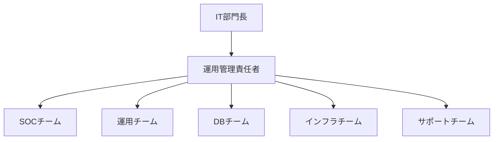

# 運用管理仕様書
## Operation Management Specification

### 1. 概要

#### 1.1 目的
本仕様書は、ERPシステムの安定稼働を実現するための運用管理体制、プロセス、手順を定義し、99.9%の可用性とビジネス継続性を確保するための指針を提供します。

#### 1.2 運用方針
- **24時間365日安定稼働**: ビジネスクリティカルシステムとしての高可用性
- **プロアクティブ運用**: 予防保守による障害の未然防止
- **自動化推進**: 運用タスクの自動化による効率化とヒューマンエラー削減
- **継続的改善**: メトリクス分析に基づく運用改善

#### 1.3 適用範囲
- システム監視・管理
- インシデント管理
- 変更管理
- バックアップ・リカバリ
- パフォーマンス管理
- キャパシティ管理

---

### 2. 運用体制

#### 2.1 組織構造



#### 2.2 役割と責任

| 役割 | 人数 | 責任範囲 | 勤務体制 |
|------|------|---------|----------|
| **運用管理責任者** | 1名 | 運用統括、エスカレーション判断 | 平日日勤 |
| **SOCオペレーター** | 6名 | 24時間監視、一次対応 | 3交代制 |
| **システム運用** | 4名 | 定常運用、変更作業 | 平日日勤+オンコール |
| **DBA** | 2名 | DB管理、パフォーマンスチューニング | 平日日勤 |
| **インフラ管理** | 3名 | AWS管理、ネットワーク管理 | 平日日勤+オンコール |
| **ヘルプデスク** | 4名 | ユーザーサポート、問い合わせ対応 | 平日日勤 |

#### 2.3 エスカレーション体制

```yaml
Level 1（15分以内）:
  対応者: SOCオペレーター
  対応内容: 監視アラート確認、既知問題対応
  
Level 2（30分以内）:
  対応者: システム運用チーム
  対応内容: システム再起動、設定変更
  
Level 3（1時間以内）:
  対応者: 各専門チーム（DBA/インフラ）
  対応内容: 詳細調査、復旧作業
  
Level 4（2時間以内）:
  対応者: 運用管理責任者
  対応内容: 重大インシデント指揮、業務影響判断
  
Level 5（4時間以内）:
  対応者: IT部門長/経営層
  対応内容: BCP発動判断、対外発表
```

---

### 3. SLA（Service Level Agreement）

#### 3.1 可用性目標

| サービス分類 | 目標稼働率 | 年間停止許容時間 | 測定方法 |
|-------------|-----------|----------------|----------|
| **コアサービス** | 99.9% | 8.76時間 | 5分単位測定 |
| **バッチ処理** | 99.5% | 43.8時間 | ジョブ完了率 |
| **レポート機能** | 99.0% | 87.6時間 | アクセス可能率 |
| **開発環境** | 95.0% | 438時間 | - |

#### 3.2 パフォーマンス目標

| メトリクス | 目標値 | 測定条件 |
|-----------|--------|----------|
| **画面応答時間** | 2秒以内（95パーセンタイル） | 通常負荷時 |
| **API応答時間** | 1秒以内（95パーセンタイル） | 1000req/min |
| **バッチ処理時間** | 6時間以内 | 日次バッチ |
| **同時接続数** | 1000ユーザー | ピーク時 |
| **データベース応答** | 100ms以内 | 単純クエリ |

#### 3.3 サポート対応時間

| サポート種別 | 対応時間 | 初回応答 | 解決目標 |
|-------------|---------|---------|----------|
| **Critical** | 24時間365日 | 15分以内 | 4時間以内 |
| **High** | 24時間365日 | 30分以内 | 8時間以内 |
| **Medium** | 営業時間内 | 2時間以内 | 2営業日以内 |
| **Low** | 営業時間内 | 4時間以内 | 5営業日以内 |

---

### 4. システム監視

#### 4.1 監視項目

##### 4.1.1 インフラ監視
| 監視対象 | 監視項目 | 閾値 | 通知条件 |
|---------|---------|------|----------|
| **CPU** | 使用率 | Warning: 70%, Critical: 90% | 5分継続 |
| **メモリ** | 使用率 | Warning: 80%, Critical: 95% | 5分継続 |
| **ディスク** | 使用率 | Warning: 70%, Critical: 85% | 即時 |
| **ネットワーク** | 帯域使用率 | Warning: 70%, Critical: 90% | 5分継続 |
| **プロセス** | 死活監視 | プロセス停止 | 即時 |

##### 4.1.2 アプリケーション監視
```yaml
Webサーバー:
  - HTTPステータスコード（5xx発生率）
  - レスポンスタイム
  - スループット
  - エラーログ出力

アプリケーションサーバー:
  - JVMヒープ使用率
  - スレッド数
  - GC頻度・時間
  - デッドロック検出

データベース:
  - コネクション数
  - スロークエリ
  - ロック待ち
  - レプリケーション遅延

バッチジョブ:
  - ジョブ実行状況
  - 処理時間
  - エラー発生
  - リトライ状況
```

##### 4.1.3 ビジネスメトリクス監視
| メトリクス | 監視内容 | アラート条件 |
|-----------|---------|-------------|
| ログイン数 | 1時間あたりのログイン数 | 通常の50%以下 |
| トランザクション量 | 処理件数/時間 | 前日比80%以下 |
| エラー率 | エラー/総リクエスト | 1%以上 |
| 売上データ | 日次売上記録 | 未記録検出 |

#### 4.2 監視ツール

##### 4.2.1 監視システム構成
```yaml
統合監視:
  - Datadog: メトリクス、ログ、APM、トレース
  - 対象: 全システム
  
インフラ監視:
  - AWS CloudWatch: AWSリソース監視
  - Prometheus + Grafana: カスタムメトリクス
  
アプリケーション監視:
  - New Relic APM: パフォーマンス分析
  - Sentry: エラー追跡
  
ログ管理:
  - ELK Stack: ログ収集・分析・可視化
  - CloudWatch Logs: AWS統合ログ
  
合成監視:
  - Datadog Synthetics: 外形監視
  - カバー範囲: 主要ユーザーフロー
```

#### 4.3 アラート設計

##### 4.3.1 アラートレベル
| レベル | 定義 | 通知先 | 通知方法 |
|--------|------|--------|----------|
| **Critical** | サービス停止・重大障害 | SOC、運用、責任者 | 電話、SMS、Slack |
| **Warning** | 性能劣化・閾値超過 | SOC、運用 | メール、Slack |
| **Info** | 情報通知 | 運用 | Slack |

##### 4.3.2 通知抑制ルール
```yaml
重複抑制:
  - 同一アラート5分間抑制
  
階層抑制:
  - 親障害発生時は子アラート抑制
  
メンテナンス抑制:
  - 計画作業中はアラート無効化
  
時間帯抑制:
  - バッチ処理時間帯は特定アラート抑制
```

---

### 5. インシデント管理

#### 5.1 インシデント分類

| 優先度 | 影響範囲 | 例 | 目標解決時間 |
|--------|---------|-----|-------------|
| **P1 - Critical** | 全体サービス停止 | システムダウン、データ損失 | 4時間 |
| **P2 - High** | 一部機能停止 | 請求処理不可、ログイン不可 | 8時間 |
| **P3 - Medium** | 機能制限 | レポート生成遅延 | 24時間 |
| **P4 - Low** | 軽微な問題 | UI表示不具合 | 72時間 |

#### 5.2 インシデント対応フロー


#### 5.3 インシデント記録

##### 5.3.1 インシデントチケット項目
```yaml
基本情報:
  - インシデント番号（自動採番）
  - 発生日時
  - 検知方法（監視/通報）
  - 優先度
  - カテゴリ
  
詳細情報:
  - 影響範囲
  - 影響ユーザー数
  - ビジネス影響
  - 症状詳細
  
対応情報:
  - 担当者
  - 対応履歴
  - 復旧作業内容
  - 解決日時
  
原因分析:
  - 根本原因
  - 再発防止策
  - 関連変更
```

---

### 6. 変更管理

#### 6.1 変更分類

| 変更種別 | リスクレベル | 承認レベル | 実施時間帯 |
|---------|-----------|-----------|-----------|
| **緊急変更** | - | 運用責任者 | 随時 |
| **計画変更（高リスク）** | 高 | CAB承認 | 計画停止時 |
| **計画変更（中リスク）** | 中 | 運用責任者 | 夜間/休日 |
| **計画変更（低リスク）** | 低 | チームリーダー | 営業時間内可 |
| **標準変更** | 最小 | 事前承認済 | 随時 |

#### 6.2 変更管理プロセス

##### 6.2.1 変更要求（RFC）
```yaml
RFC記載項目:
  - 変更内容・理由
  - 影響範囲・リスク評価
  - 実施計画
  - テスト計画
  - 切り戻し計画
  - 成功基準
```

##### 6.2.2 CAB（Change Advisory Board）
| 参加者 | 役割 |
|--------|------|
| 運用管理責任者 | 議長 |
| システム運用代表 | 技術評価 |
| 業務部門代表 | ビジネス影響評価 |
| セキュリティ担当 | セキュリティ評価 |
| インフラ担当 | インフラ影響評価 |

#### 6.3 リリース管理

##### 6.3.1 リリース計画
```yaml
定期リリース:
  頻度: 月1回（第3土曜日）
  時間: 22:00-02:00
  
緊急リリース:
  条件: Critical障害修正
  承認: 運用責任者+業務責任者
  
リリース手順:
  1. リリース判定会議
  2. 本番環境バックアップ
  3. リリース作業
  4. 動作確認
  5. 監視強化（24時間）
```

---

### 7. バックアップ・リカバリ

#### 7.1 バックアップ戦略

##### 7.1.1 バックアップ方式
| 対象 | 方式 | 頻度 | 保持期間 | 保管場所 |
|------|------|------|---------|----------|
| **データベース** | フルバックアップ | 日次 | 35日 | S3 + Glacier |
| **データベース** | 差分バックアップ | 6時間毎 | 7日 | S3 |
| **データベース** | トランザクションログ | 継続的 | 7日 | S3 |
| **アプリケーション** | AMIスナップショット | 週次 | 4週 | EBS |
| **設定ファイル** | Git管理 | 変更時 | 永続 | GitHub |
| **ログファイル** | S3アーカイブ | 日次 | 1年 | S3 Glacier |

##### 7.1.2 3-2-1ルール実装
```yaml
3つのコピー:
  - プライマリデータ（本番）
  - ローカルバックアップ（同一リージョン）
  - リモートバックアップ（別リージョン）
  
2つの異なるメディア:
  - EBS（ブロックストレージ）
  - S3（オブジェクトストレージ）
  
1つのオフサイト:
  - 別リージョン（大阪）
  - Glacier長期保管
```

#### 7.2 リカバリ手順

##### 7.2.1 RPO/RTO
| シナリオ | RPO | RTO | リカバリ方法 |
|---------|-----|-----|-------------|
| **単一サーバー障害** | 0分 | 5分 | 自動フェイルオーバー |
| **AZ障害** | 0分 | 15分 | Multi-AZ切替 |
| **リージョン障害** | 1時間 | 4時間 | DRサイト起動 |
| **データ破損** | 6時間 | 2時間 | バックアップリストア |
| **ランサムウェア** | 24時間 | 8時間 | イミュータブルバックアップ |

##### 7.2.2 リストア手順書
```yaml
データベースリストア:
  1. 障害ポイント特定
  2. リストアポイント決定
  3. 新規インスタンス作成
  4. バックアップリストア
  5. トランザクションログ適用
  6. 整合性確認
  7. アプリケーション接続切替
  8. 動作確認
```

---

### 8. パフォーマンス管理

#### 8.1 パフォーマンス監視

##### 8.1.1 KPIモニタリング
| KPI | 目標値 | 測定頻度 | アクション閾値 |
|-----|--------|---------|---------------|
| 平均応答時間 | <2秒 | 5分毎 | 3秒超過 |
| CPU使用率 | <70% | 1分毎 | 80%超過 |
| メモリ使用率 | <80% | 1分毎 | 90%超過 |
| DB接続数 | <80% | 1分毎 | 90%超過 |
| エラー率 | <0.1% | 5分毎 | 1%超過 |

##### 8.1.2 ボトルネック分析
```yaml
分析ツール:
  - APM: コード レベル分析
  - スロークエリログ: SQL分析
  - プロファイラー: CPU/メモリ分析
  
定期分析:
  - 週次: パフォーマンスレポート
  - 月次: トレンド分析
  - 四半期: キャパシティレビュー
```

#### 8.2 チューニング

##### 8.2.1 定期チューニング項目
```yaml
データベース:
  - インデックス最適化
  - 統計情報更新
  - パーティション管理
  - バキューム実行
  
アプリケーション:
  - JVMパラメータ調整
  - コネクションプール調整
  - キャッシュサイズ調整
  
インフラ:
  - インスタンスサイズ見直し
  - オートスケール設定
  - ロードバランサー設定
```

---

### 9. キャパシティ管理

#### 9.1 キャパシティ計画

##### 9.1.1 リソース使用予測
```yaml
予測モデル:
  - 線形成長: ユーザー数×1.2/年
  - データ量: +30%/年
  - トランザクション: +25%/年
  
閾値設定:
  - 警告: 70%使用
  - アクション: 80%使用
  - 緊急: 90%使用
```

##### 9.1.2 スケーリング計画
| リソース | 現在 | 6ヶ月後 | 1年後 | スケール方式 |
|---------|------|---------|-------|-------------|
| Webサーバー | 4台 | 6台 | 8台 | 水平スケール |
| APサーバー | 4台 | 6台 | 8台 | 水平スケール |
| DBサーバー | 2台 | 2台 | 3台 | 垂直+読み取りレプリカ |
| ストレージ | 1TB | 1.5TB | 2TB | 自動拡張 |

---

### 10. 災害復旧（DR）

#### 10.1 BCP（事業継続計画）

##### 10.1.1 災害シナリオと対応
| シナリオ | 影響 | 対応策 | 目標復旧時間 |
|---------|------|--------|-------------|
| **地震** | データセンター被災 | DRサイト切替 | 4時間 |
| **大規模停電** | サービス停止 | UPS→自家発電 | 0分（無停止） |
| **サイバー攻撃** | システム侵害 | 隔離→復旧 | 8時間 |
| **パンデミック** | 要員不足 | リモート運用 | 継続運用 |

##### 10.1.2 DRサイト構成
```yaml
プライマリサイト（東京）:
  - 本番環境
  - 全機能稼働
  
DRサイト（大阪）:
  - ウォームスタンバイ
  - データ同期: 1時間毎
  - 起動時間: 2時間
  
バックアップサイト（福岡）:
  - コールドスタンバイ
  - データバックアップのみ
  - 起動時間: 8時間
```

#### 10.2 DR訓練

##### 10.2.1 訓練計画
| 訓練種別 | 頻度 | 内容 | 参加者 |
|---------|------|------|--------|
| **机上訓練** | 四半期 | 手順確認 | 運用チーム |
| **部分切替** | 半期 | 特定システム切替 | 運用+インフラ |
| **全体訓練** | 年次 | 全面切替 | 全関係者 |

---

### 11. 運用ドキュメント

#### 11.1 ドキュメント体系

##### 11.1.1 運用ドキュメント一覧
| ドキュメント名 | 内容 | 更新頻度 | 管理者 |
|---------------|------|---------|--------|
| 運用手順書 | 日常運用手順 | 変更時 | 運用チーム |
| 障害対応手順書 | トラブルシューティング | 月次 | 運用チーム |
| システム構成図 | 構成情報 | 変更時 | インフラチーム |
| パラメータシート | 設定値一覧 | 変更時 | 各チーム |
| 運用カレンダー | 作業予定 | 月次 | 運用管理者 |

##### 11.1.2 ナレッジベース
```yaml
構成:
  - FAQ: よくある質問と回答
  - 既知の問題: 回避策・対処法
  - ベストプラクティス: 推奨手順
  - トラブルシューティング: 問題解決手順
  
管理:
  - Confluence/SharePointで一元管理
  - 月次レビューで更新
  - 全運用メンバーが編集可能
```

---

### 12. 運用改善

#### 12.1 継続的改善プロセス

##### 12.1.1 PDCAサイクル
```yaml
Plan（月初）:
  - 改善目標設定
  - 施策立案
  
Do（月中）:
  - 施策実行
  - データ収集
  
Check（月末）:
  - 効果測定
  - 問題分析
  
Action（翌月）:
  - 標準化
  - 水平展開
```

##### 12.1.2 改善指標
| 指標 | 現状 | 目標 | 改善施策 |
|------|------|------|----------|
| MTBF（平均故障間隔） | 720時間 | 1000時間 | 予防保守強化 |
| MTTR（平均復旧時間） | 2時間 | 1時間 | 自動化推進 |
| 手動作業率 | 60% | 30% | 自動化ツール導入 |
| インシデント数 | 月20件 | 月10件 | 根本原因除去 |

---

### 13. コンプライアンス

#### 13.1 監査対応

##### 13.1.1 監査証跡
```yaml
保持項目:
  - アクセスログ: 3年
  - 操作ログ: 3年
  - 変更履歴: 5年
  - インシデント記録: 5年
  - バックアップ記録: 1年
  
提出書類:
  - 運用報告書（月次）
  - SLA達成状況
  - インシデント一覧
  - 変更実施記録
  - セキュリティ監査ログ
```

##### 13.1.2 法規制対応
| 規制 | 要件 | 対応 |
|------|------|------|
| 個人情報保護法 | アクセス制御、暗号化 | 実装済 |
| 電子帳簿保存法 | タイムスタンプ、改ざん防止 | 実装済 |
| 労働基準法 | 労働時間管理 | シフト管理システム |

---

### 14. 運用コスト

#### 14.1 コスト管理

##### 14.1.1 運用コスト内訳（月額）
| 項目 | 費用 | 比率 |
|------|------|------|
| 人件費 | 500万円 | 40% |
| インフラ費用（AWS） | 300万円 | 24% |
| ツールライセンス | 200万円 | 16% |
| 外部委託費 | 150万円 | 12% |
| その他 | 100万円 | 8% |
| **合計** | **1,250万円** | **100%** |

##### 14.1.2 コスト最適化
```yaml
施策:
  - リザーブドインスタンス活用: 30%削減
  - オートスケーリング最適化: 20%削減
  - 不要リソース削除: 10%削減
  - スポットインスタンス活用: 15%削減
  
目標:
  - 年間15%のコスト削減
  - パフォーマンス維持
```

---

### 15. 実装チェックリスト

#### 15.1 運用開始前確認

- [ ] 運用体制確立
- [ ] 監視システム構築
- [ ] アラート設定完了
- [ ] バックアップ設定
- [ ] DR環境準備
- [ ] 運用手順書作成
- [ ] エスカレーションフロー確定
- [ ] SLA合意
- [ ] 運用訓練実施
- [ ] 引き継ぎ完了

---

### 改訂履歴

| 版数 | 日付 | 変更内容 | 承認者 |
|------|------|---------|--------|
| 1.0 | 2025-08-23 | 初版作成 | - |

---

*本仕様書は、システム運用の基準を定めたものです。実際の運用では、状況に応じて柔軟な対応を行ってください。*