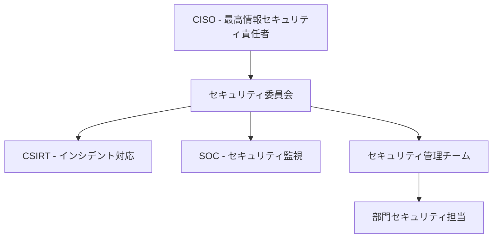
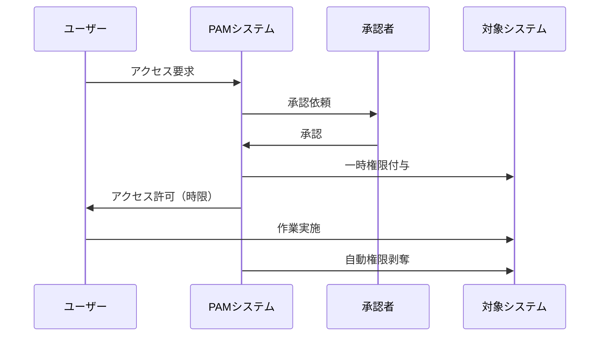
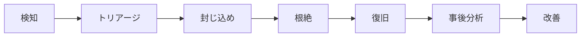

# セキュリティ仕様書
## Security Specification

### 1. 概要

#### 1.1 目的
本仕様書は、ERPシステムにおける情報セキュリティ要件を定義し、機密性（Confidentiality）、完全性（Integrity）、可用性（Availability）を確保するためのセキュリティ対策を明確化します。

#### 1.2 セキュリティ基本方針
- **ゼロトラストモデル**: 「決して信頼せず、常に検証する」
- **多層防御（Defense in Depth）**: 複数のセキュリティ層による保護
- **最小権限の原則**: 必要最小限のアクセス権限付与
- **セキュリティ・バイ・デザイン**: 設計段階からのセキュリティ組込み
- **継続的改善**: 脅威の進化に対応した対策の更新

#### 1.3 準拠標準・規格
| 標準規格 | 適用範囲 | 準拠レベル | 認証状況 |
|---------|---------|-----------|----------|
| ISO 27001 | ISMS全般 | 完全準拠 | 認証取得予定 |
| ISO 27017 | クラウドセキュリティ | 準拠 | - |
| SOC 2 Type II | セキュリティ統制 | 準拠 | レポート取得予定 |
| OWASP Top 10 | Webアプリセキュリティ | 完全対応 | - |

---

### 2. セキュリティガバナンス

#### 2.1 組織体制



#### 2.2 役割と責任

| 役割 | 責任範囲 | 主要業務 |
|------|---------|---------|
| **CISO** | セキュリティ戦略・統括 | ポリシー策定、リスク管理、投資判断 |
| **セキュリティ管理者** | 運用管理 | ポリシー実装、監査対応、教育 |
| **CSIRT** | インシデント対応 | 検知、分析、封じ込め、復旧 |
| **SOC** | 監視・分析 | 24時間監視、ログ分析、脅威検知 |
| **部門担当** | 現場セキュリティ | 日常運用、初期対応、報告 |

---

### 3. アクセス制御

#### 3.1 認証（Authentication）

##### 3.1.1 認証レベル定義
| レベル | 認証方式 | 適用対象 | 要件 |
|--------|---------|----------|------|
| **Level 1** | ID/パスワード | 一般ユーザー（参照のみ） | 複雑性要件適用 |
| **Level 2** | 多要素認証（MFA） | 一般ユーザー（更新権限） | TOTP/SMS必須 |
| **Level 3** | MFA + 証明書 | 管理者・重要操作 | PKI証明書 |
| **Level 4** | 生体認証 + MFA | 最重要システム | 指紋/顔 + TOTP |

##### 3.1.2 パスワードポリシー
| 項目 | 要件 | 備考 |
|------|------|------|
| 最小文字数 | 12文字以上 | 管理者は14文字以上 |
| 複雑性 | 大小英字+数字+記号（3種類以上） | 辞書攻撃対策 |
| 有効期限 | 90日 | 管理者は60日 |
| 履歴管理 | 過去12回と重複不可 | - |
| アカウントロック | 5回失敗で30分ロック | 管理者は3回 |
| 初期パスワード | 初回ログイン時に強制変更 | - |

##### 3.1.3 多要素認証（MFA）実装
```yaml
実装方式:
  第1要素（知識）:
    - パスワード
    - セキュリティ質問
  
  第2要素（所持）:
    - TOTP（Google Authenticator等）
    - SMS（フォールバック用）
    - ハードウェアトークン（FIDO2）
  
  第3要素（生体）:
    - 指紋認証
    - 顔認証
    - 虹彩認証（オプション）
```

#### 3.2 認可（Authorization）

##### 3.2.1 アクセス制御モデル
| モデル | 説明 | 適用範囲 |
|--------|------|----------|
| **RBAC** | ロールベースアクセス制御 | 基本的な権限管理 |
| **ABAC** | 属性ベースアクセス制御 | 動的・条件付き権限 |
| **MAC** | 強制アクセス制御 | 機密データ |
| **DAC** | 任意アクセス制御 | 個人ファイル |

##### 3.2.2 標準ロール定義
| ロール | データ参照 | データ更新 | データ削除 | 管理機能 |
|--------|-----------|-----------|-----------|---------|
| システム管理者 | ○ | ○ | ○ | ○ |
| 部門管理者 | ○（部門内） | ○（部門内） | △（承認要） | △（部門内） |
| 一般ユーザー | ○（権限範囲） | ○（権限範囲） | × | × |
| 参照ユーザー | ○（権限範囲） | × | × | × |
| ゲスト | △（公開情報） | × | × | × |

#### 3.3 特権管理（PAM）

##### 3.3.1 Just-In-Time（JIT）アクセス


##### 3.3.2 特権アカウント管理要件
| 管理項目 | 要件 | 実装 |
|---------|------|------|
| パスワード管理 | 自動生成・定期変更 | CyberArk/HashiCorp Vault |
| セッション記録 | 全操作の録画・記録 | 監査証跡 |
| 承認ワークフロー | 2段階承認 | 申請→承認→実行 |
| 利用時間制限 | 最大4時間 | 自動セッション切断 |

---

### 4. データ保護

#### 4.1 データ分類

##### 4.1.1 機密度レベル
| 分類 | 定義 | 例 | 保護要件 |
|------|------|-----|----------|
| **極秘** | 漏洩時に致命的影響 | 個人情報、財務データ、認証情報 | 暗号化必須、アクセス記録、DLP |
| **秘** | 漏洩時に重大な影響 | 顧客情報、契約内容、設計書 | 暗号化必須、アクセス制御 |
| **社外秘** | 社外開示禁止 | 社内資料、会議録 | アクセス制御、外部送信制限 |
| **公開** | 公開可能 | カタログ、プレスリリース | 改ざん防止 |

##### 4.1.2 データ取扱いマトリックス
| 処理 | 極秘 | 秘 | 社外秘 | 公開 |
|------|------|-----|--------|------|
| 保存時暗号化 | AES-256必須 | AES-256必須 | AES-128推奨 | 不要 |
| 通信時暗号化 | TLS 1.3必須 | TLS 1.3必須 | TLS 1.2以上 | HTTPS推奨 |
| アクセスログ | 全操作記録 | 全操作記録 | 更新操作記録 | 不要 |
| 外部送信 | 禁止 | DLP検査+承認 | DLP検査 | 自由 |
| 印刷 | 禁止 | 透かし入り | 記録のみ | 自由 |

#### 4.2 暗号化

##### 4.2.1 暗号化標準
| 用途 | アルゴリズム | 鍵長 | 実装 |
|------|------------|------|------|
| データ暗号化 | AES-GCM | 256bit | AWS KMS |
| 通信暗号化 | TLS 1.3 | 2048bit RSA/256bit ECC | ACM |
| ハッシュ | SHA-256/SHA-3 | - | 標準ライブラリ |
| 電子署名 | RSA-PSS/ECDSA | 2048bit/256bit | HSM |
| 鍵交換 | ECDHE | 256bit | TLS内蔵 |

##### 4.2.2 鍵管理
```yaml
鍵管理要件:
  生成:
    - HSM（Hardware Security Module）使用
    - 暗号学的に安全な乱数生成
  
  保管:
    - AWS KMS / Azure Key Vault
    - 鍵の暗号化（KEK）
  
  ローテーション:
    - データ暗号化鍵: 年次
    - 通信鍵: セッション毎
    - マスターキー: 2年毎
  
  廃棄:
    - 安全な削除（上書き）
    - 廃棄証跡の記録
```

#### 4.3 データ漏洩防止（DLP）

##### 4.3.1 DLP実装
| 監視対象 | 検知ルール | アクション |
|---------|-----------|-----------|
| メール送信 | 個人情報パターン、機密マーク | ブロック/警告/暗号化 |
| ファイル転送 | ファイルサイズ、拡張子、内容 | 承認要求/記録 |
| Web投稿 | SNS、ファイル共有サイト | ブロック/警告 |
| 印刷 | 機密文書 | 透かし追加/記録 |
| USB/外部メディア | すべて | 暗号化/ブロック |

---

### 5. ネットワークセキュリティ

#### 5.1 ネットワーク分離

##### 5.1.1 セグメンテーション設計
```yaml
ネットワークゾーン:
  DMZ:
    - Webサーバー
    - リバースプロキシ
    - WAF
  
  アプリケーション層:
    - APサーバー
    - APIゲートウェイ
    - キャッシュサーバー
  
  データ層:
    - データベース
    - ファイルサーバー
    - バックアップ
  
  管理層:
    - 管理コンソール
    - 監視システム
    - ログサーバー
```

##### 5.1.2 ファイアウォールルール
| 送信元 | 宛先 | プロトコル/ポート | アクション |
|--------|------|------------------|-----------|
| インターネット | DMZ | HTTPS(443) | 許可 |
| DMZ | アプリ層 | HTTPS(8443) | 許可 |
| アプリ層 | データ層 | PostgreSQL(5432) | 許可 |
| 管理層 | 全ゾーン | SSH(22)/RDP(3389) | 条件付き許可 |
| その他 | その他 | すべて | 拒否 |

#### 5.2 侵入検知・防御（IDS/IPS）

```yaml
検知ルール:
  シグネチャベース:
    - 既知の攻撃パターン
    - マルウェア通信
    - エクスプロイト
  
  異常検知:
    - 通信量の急増
    - 異常なアクセスパターン
    - 未知のプロトコル
  
  振る舞い検知:
    - 横断的探索
    - 権限昇格試行
    - データ大量送信
```

---

### 6. アプリケーションセキュリティ

#### 6.1 セキュアコーディング

##### 6.1.1 OWASP Top 10対策
| 脅威 | 対策 | 実装 |
|------|------|------|
| SQLインジェクション | プリペアドステートメント、入力検証 | ORM使用、パラメータ化クエリ |
| 認証の不備 | MFA、セッション管理 | OAuth 2.0、JWT |
| 機密データ露出 | 暗号化、最小権限 | TLS、データマスキング |
| XXE攻撃 | XML解析無効化 | DTD無効化 |
| アクセス制御不備 | 認可チェック | RBAC実装 |
| セキュリティ設定ミス | セキュアデフォルト | 設定テンプレート |
| XSS | 出力エスケープ、CSP | サニタイズ、React |
| 安全でないデシリアライゼーション | 入力検証 | JSON Schema検証 |
| 既知の脆弱性 | 定期更新 | Dependabot、SAST |
| ログ・監視不足 | 包括的ログ | SIEM統合 |

##### 6.1.2 セキュアSDLC
```yaml
開発フェーズ別セキュリティ:
  設計:
    - 脅威モデリング（STRIDE）
    - セキュリティ要件定義
  
  実装:
    - セキュアコーディング規約
    - コードレビュー
    - SAST（静的解析）
  
  テスト:
    - DAST（動的解析）
    - ペネトレーションテスト
    - 脆弱性診断
  
  デプロイ:
    - セキュリティ設定確認
    - 本番環境ハードニング
  
  運用:
    - 脆弱性管理
    - パッチ適用
    - 定期監査
```

#### 6.2 API セキュリティ

##### 6.2.1 API保護メカニズム
| 対策 | 実装 | 設定値 |
|------|------|--------|
| 認証 | OAuth 2.0 + JWT | RS256署名 |
| Rate Limiting | Token Bucket | 100req/min |
| Input Validation | JSON Schema | 厳格モード |
| CORS | ホワイトリスト | 許可ドメイン指定 |
| API Versioning | URLパス | /api/v1/ |
| Webhook Security | HMAC署名 | SHA-256 |

---

### 7. セキュリティ監視・監査

#### 7.1 ログ管理

##### 7.1.1 ログ収集対象
| ログ種別 | 収集内容 | 保存期間 | 用途 |
|---------|---------|----------|------|
| 認証ログ | ログイン/ログアウト、失敗 | 3年 | 不正アクセス検知 |
| アクセスログ | リソースアクセス、変更 | 1年 | 監査、フォレンジック |
| システムログ | OS、ミドルウェア | 6ヶ月 | 障害分析 |
| アプリログ | エラー、警告、処理 | 3ヶ月 | デバッグ、分析 |
| セキュリティログ | IDS/IPS、WAF | 2年 | インシデント対応 |

##### 7.1.2 ログフォーマット（統一形式）
```json
{
  "timestamp": "2025-08-23T12:34:56.789Z",
  "level": "INFO",
  "userId": "user123",
  "sessionId": "sess456",
  "ipAddress": "192.168.1.100",
  "userAgent": "Mozilla/5.0...",
  "module": "AUTH",
  "action": "LOGIN",
  "result": "SUCCESS",
  "details": {...}
}
```

#### 7.2 SIEM（Security Information and Event Management）

##### 7.2.1 相関分析ルール
```yaml
検知シナリオ:
  ブルートフォース攻撃:
    条件: 同一IPから5分間に10回以上のログイン失敗
    アクション: IP自動ブロック、アラート
  
  権限昇格試行:
    条件: 一般ユーザーの管理機能アクセス試行
    アクション: セッション切断、通知
  
  データ流出:
    条件: 通常の10倍以上のデータダウンロード
    アクション: 一時停止、確認要求
  
  異常時間アクセス:
    条件: 深夜2-5時の重要システムアクセス
    アクション: MFA再要求、記録
```

#### 7.3 セキュリティ監査

##### 7.3.1 監査計画
| 監査種別 | 頻度 | 実施者 | 対象 |
|---------|------|--------|------|
| 内部監査 | 四半期 | 内部監査部門 | 全システム |
| 外部監査 | 年次 | 第三者機関 | 重要システム |
| ペネトレーションテスト | 年2回 | 専門業者 | 外部公開システム |
| 脆弱性診断 | 月次 | セキュリティチーム | 全システム |
| コンプライアンス監査 | 年次 | 監査法人 | 規制対象システム |

---

### 8. インシデント対応

#### 8.1 インシデント分類

| レベル | 定義 | 例 | 対応時間 |
|--------|------|-----|----------|
| **Critical** | 事業継続に致命的 | 大規模情報漏洩、ランサムウェア | 即時 |
| **High** | 重大な影響 | 不正アクセス、データ改ざん | 1時間以内 |
| **Medium** | 中程度の影響 | マルウェア検知、設定ミス | 4時間以内 |
| **Low** | 軽微な影響 | スキャン検知、単純な違反 | 24時間以内 |

#### 8.2 対応フロー



##### 8.2.1 CSIRT体制
```yaml
体制:
  コアメンバー:
    - インシデントマネージャー
    - セキュリティアナリスト
    - システム管理者
    - 法務担当
  
  エスカレーション:
    Level1: セキュリティチーム
    Level2: CISO
    Level3: 経営層
  
  外部連携:
    - JPCERT/CC
    - 警察（サイバー犯罪対策）
    - 弁護士
    - フォレンジック業者
```

---

### 9. 事業継続性（BCP）

#### 9.1 セキュリティ観点のBCP

##### 9.1.1 想定シナリオと対策
| シナリオ | 影響 | 対策 | RTO |
|---------|------|------|-----|
| ランサムウェア | システム停止 | バックアップ復旧、代替システム | 4時間 |
| DDoS攻撃 | サービス停止 | CDN、自動スケール | 30分 |
| 内部不正 | データ漏洩 | アクセス制限、監査強化 | 1時間 |
| ゼロデイ攻撃 | 侵害 | 仮想パッチ、隔離 | 2時間 |

##### 9.1.2 バックアップ戦略
```yaml
3-2-1ルール:
  - 3つのバックアップコピー
  - 2つの異なるメディア
  - 1つのオフサイト保管

バックアップ種別:
  フルバックアップ: 週次
  増分バックアップ: 日次
  スナップショット: 4時間毎
  
イミュータブルバックアップ:
  - 改ざん防止
  - 保持期間: 30日
```

---

### 10. セキュリティ教育・訓練

#### 10.1 教育プログラム

| 対象者 | 内容 | 頻度 | 形式 |
|--------|------|------|------|
| 全従業員 | セキュリティ基礎、フィッシング対策 | 年2回 | e-learning |
| 開発者 | セキュアコーディング、OWASP | 四半期 | ハンズオン |
| 管理者 | インシデント対応、フォレンジック | 月次 | 演習 |
| 経営層 | サイバーリスク、BCP | 年次 | セミナー |

#### 10.2 訓練・演習

##### 10.2.1 定期訓練
```yaml
フィッシング訓練:
  頻度: 月次
  方法: 模擬メール送信
  評価: クリック率、報告率
  
インシデント対応訓練:
  頻度: 四半期
  方法: テーブルトップ演習
  シナリオ: ランサムウェア、情報漏洩
  
BCP訓練:
  頻度: 年次
  方法: フルスケール演習
  評価: RTO/RPO達成率
```

---

### 11. 実装ロードマップ

| フェーズ | 期間 | 実装内容 | 優先度 |
|---------|------|---------|--------|
| Phase 1 | 0-3ヶ月 | 基本認証、ファイアウォール、ログ | 必須 |
| Phase 2 | 4-6ヶ月 | MFA、暗号化、SIEM | 必須 |
| Phase 3 | 7-9ヶ月 | PAM、DLP、CSIRT | 高 |
| Phase 4 | 10-12ヶ月 | ゼロトラスト、高度な監視 | 中 |

---

### 改訂履歴

| 版数 | 日付 | 変更内容 | 承認者 |
|------|------|---------|--------|
| 1.0 | 2025-08-23 | 初版作成 | - |

---

*本仕様書は、脅威環境の変化に応じて定期的に見直し、更新されます。*