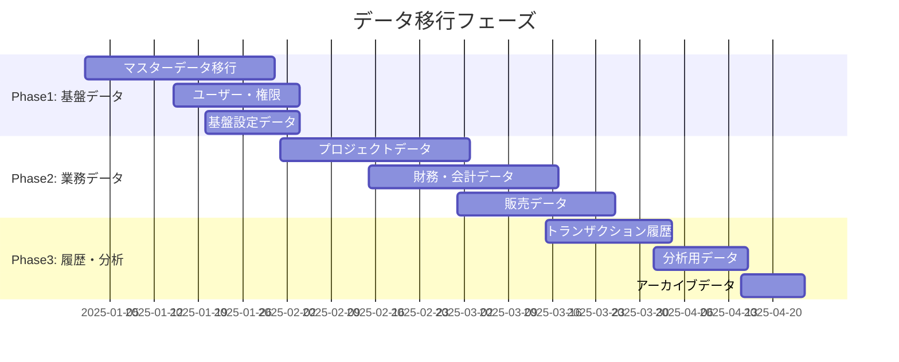
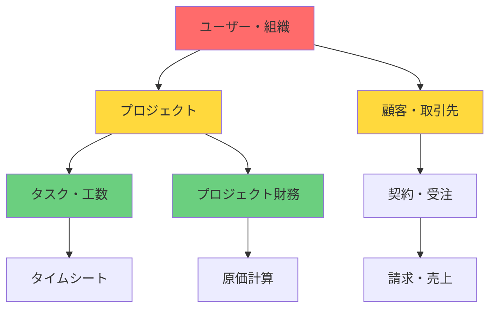
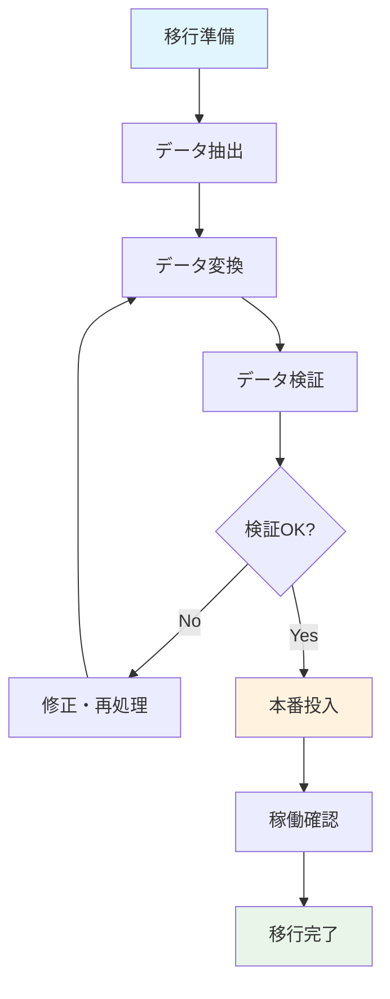
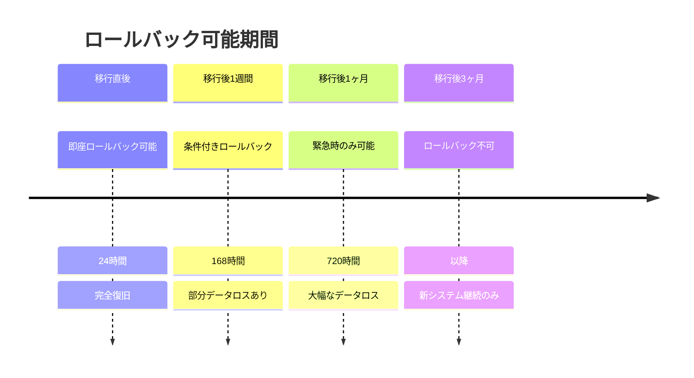
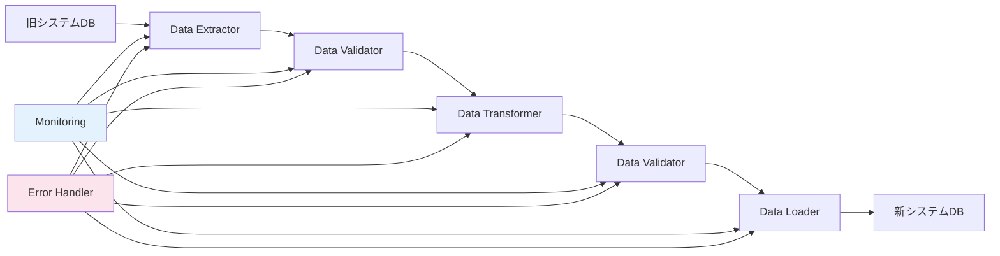
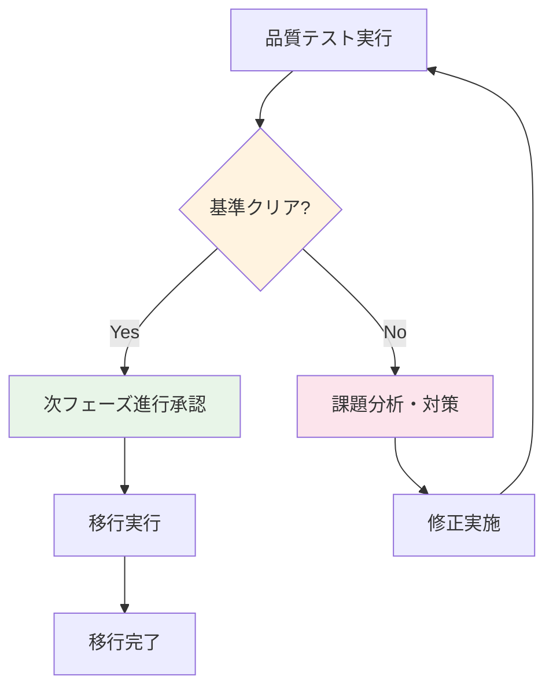
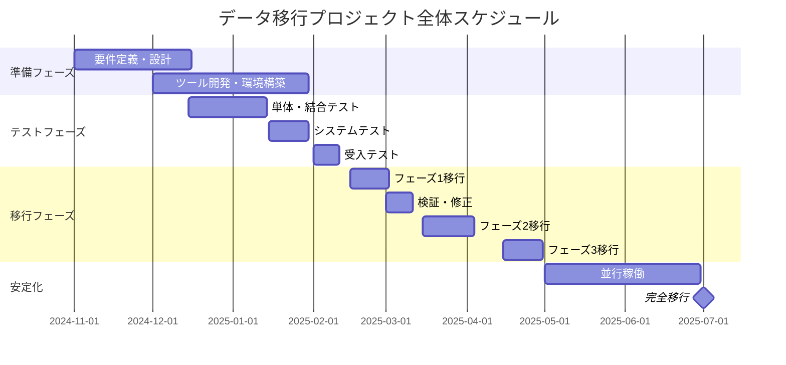
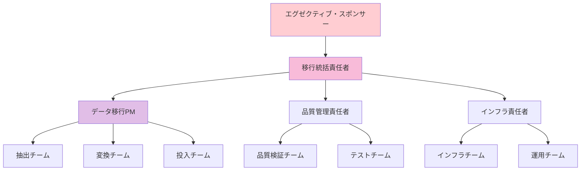

# データ移行計画詳細仕様書
## Data Migration Plan Specification

### 1. 概要

#### 1.1 目的
本仕様書は、レガシーProject-OpenシステムからモダンERPシステムへのデータ移行における詳細計画を定義し、データの完全性を保持しながら安全かつ効率的な移行を実現するための指針を提供します。

#### 1.2 適用範囲
- データ移行戦略
- 移行対象データの特定・マッピング
- 段階的移行アプローチ
- データ品質管理
- 並行稼働計画
- ロールバック計画
- 移行ツール・システム

#### 1.3 移行基本方針
- **段階的移行**: リスク最小化のための段階的実施
- **データ完整性**: データの正確性・一貫性・完全性の確保
- **可逆性**: 問題発生時の安全な戻し方法の確保
- **最小ダウンタイム**: 業務への影響を最小限に抑制
- **品質ファースト**: 徹底的な検証による品質保証

---

### 2. 移行戦略

#### 2.1 移行アプローチ

##### 2.1.1 段階的移行戦略（推奨）


##### 2.1.2 移行戦略比較
| 戦略 | メリット | デメリット | 適用ケース | リスクレベル |
|------|---------|-----------|-----------|-------------|
| **Big Bang** | 短期間、シンプル | 高リスク、長時間停止 | 小規模システム | 高 |
| **段階移行** | 低リスク、検証可能 | 複雑、期間長期化 | 大規模システム | 低 ✅ |
| **並行稼働** | 最低リスク | 最も複雑、コスト高 | ミッションクリティカル | 最低 |

#### 2.2 移行方式選定

##### 2.2.1 データ種別別移行方式
| データ種別 | 移行方式 | 理由 | 停止時間 |
|-----------|---------|------|----------|
| **マスターデータ** | 段階移行 | 依存関係管理 | 2時間 |
| **トランザクション** | 段階移行 | データ量・検証 | 4時間 |
| **履歴データ** | バッチ移行 | リアルタイム不要 | なし |
| **添付ファイル** | 並行移行 | 大容量対応 | なし |
| **設定データ** | 手動移行 | カスタマイズ必要 | 1時間 |

---

### 3. 移行対象データマッピング

#### 3.1 データ資産棚卸し

##### 3.1.1 データ分類・優先度
| データ分類 | テーブル数 | レコード数 | サイズ(GB) | 移行優先度 | 移行難易度 |
|-----------|-----------|-----------|-----------|------------|-----------|
| **マスターデータ** | 15 | 50K | 0.5 | 最高 | 中 |
| **プロジェクト** | 8 | 1.2M | 12 | 最高 | 高 |
| **財務・会計** | 12 | 2.5M | 25 | 最高 | 高 |
| **販売・契約** | 6 | 800K | 8 | 高 | 中 |
| **人事・勤怠** | 10 | 3M | 15 | 高 | 中 |
| **履歴・ログ** | 20 | 10M | 100 | 中 | 低 |
| **一時・作業** | 5 | 100K | 1 | 低 | 低 |

##### 3.1.2 データ依存関係マップ


#### 3.2 詳細データマッピング

##### 3.2.1 マスターデータマッピング
| 旧システム | 新システム | 変換ロジック | 検証ルール |
|-----------|-----------|-------------|-----------|
| `user_master` | `users` | ID変換、権限マッピング | 必須項目、一意性 |
| `company_master` | `organizations` | 階層構造変換 | 親子関係整合性 |
| `project_master` | `projects` | ステータス標準化 | 参照整合性 |
| `client_master` | `customers` | 重複排除、統合 | 重複チェック |
| `employee_master` | `employees` | 部署マッピング | 組織参照整合性 |

##### 3.2.2 複雑な変換が必要なデータ
| データ項目 | 変換内容 | 変換ロジック | 注意点 |
|-----------|---------|-------------|-------|
| **ユーザー権限** | ロール→権限モデル | 権限マトリックス変換 | 権限不足のリスク |
| **組織階層** | 部門→組織ツリー | 再帰構造変換 | 循環参照チェック |
| **プロジェクト分類** | カテゴリ→タグ | 多対多関係変換 | 分類ロジック検証 |
| **会計科目** | 科目コード変更 | コードマッピング | 勘定科目対応 |
| **通貨・単位** | 標準化 | ISO準拠変換 | 為替レート考慮 |

#### 3.3 データ品質要件

##### 3.3.1 品質チェック項目
| チェック種別 | チェック内容 | 合格基準 | 対処方法 |
|-------------|-------------|---------|----------|
| **完全性** | 必須項目の存在 | 100% | 補完・除外 |
| **一意性** | 重複レコード | 0% | マージ・削除 |
| **整合性** | 参照関係の正当性 | 100% | 修正・削除 |
| **妥当性** | データ形式・値域 | 95%以上 | 修正・デフォルト値 |
| **最新性** | データの鮮度 | 移行日基準 | 差分取得 |

##### 3.3.2 データクレンジングルール
```yaml
クレンジングルール:
  必須項目補完:
    - 氏名未設定 → "未設定ユーザー"
    - メールアドレス → システム生成
    - 部署未設定 → デフォルト部署
  
  重複データ処理:
    - 顧客データ → 名寄せロジック適用
    - ユーザーデータ → メールアドレス基準統合
    - プロジェクトデータ → 手動確認要
  
  不正データ処理:
    - 日付形式不正 → NULL設定＋ログ出力
    - 数値範囲外 → 上下限値設定
    - 文字長超過 → 切り捨て＋警告
```

---

### 4. 段階的移行アプローチ

#### 4.1 移行フェーズ設計

##### 4.1.1 フェーズ1: 基盤データ移行
```yaml
期間: 2025年1月1日～1月31日
目的: システム稼働に必要な基盤データの移行

対象データ:
  - ユーザー・認証情報
  - 組織・部署構造
  - 権限・ロール定義
  - システム設定・パラメータ
  - コード定義（会計科目等）

成功基準:
  - 全ユーザーでログイン可能
  - 権限による画面制御正常
  - 組織階層表示正常
  - エラー率 < 1%

検証項目:
  - 認証・認可テスト: 全ロール・権限
  - 組織階層テスト: 全レベル確認
  - 設定値テスト: 各機能の動作確認
```

##### 4.1.2 フェーズ2: 業務データ移行
```yaml
期間: 2025年2月1日～3月31日
目的: 日常業務に必要な業務データの移行

対象データ:
  プロジェクト関連:
    - プロジェクト基本情報
    - タスク・WBS
    - 工数・進捗データ
    - リソース配賦
  
  財務関連:
    - 請求書・売上
    - 原価データ
    - 予算・実績
    - 会計仕訳
  
  販売関連:
    - 顧客情報
    - 契約・受注データ
    - 見積情報

成功基準:
  - データ整合性 100%
  - 主要業務フロー実行可能
  - エラー率 < 0.5%
  - 性能要件満足

検証項目:
  - 業務フロー確認: 受注〜請求
  - 財務計算検証: 原価・利益計算
  - 参照整合性: 全外部キー確認
```

##### 4.1.3 フェーズ3: 履歴・分析データ移行
```yaml
期間: 2025年4月1日～4月30日
目的: 分析・レポート用履歴データの移行

対象データ:
  - 過去トランザクション履歴
  - 監査ログ・操作履歴
  - 分析用集計データ
  - アーカイブデータ

成功基準:
  - 履歴データ完全性
  - レポート機能正常動作
  - 検索性能満足

検証項目:
  - 履歴レポート確認
  - 検索機能テスト
  - データ量・性能テスト
```

#### 4.2 移行実施手順

##### 4.2.1 標準移行プロセス


##### 4.2.2 各ステップ詳細
| ステップ | 作業内容 | 責任者 | 成果物 | 判定基準 |
|---------|---------|-------|-------|---------|
| **準備** | 環境準備、ツール設定 | インフラチーム | 環境構築書 | 接続確認OK |
| **抽出** | 旧システムからデータ抽出 | データチーム | 抽出データ | 件数一致 |
| **変換** | データ形式・構造変換 | 開発チーム | 変換済データ | 形式チェックOK |
| **検証** | 品質・整合性確認 | QAチーム | 検証レポート | 合格基準クリア |
| **投入** | 新システムへデータ投入 | 運用チーム | 投入ログ | エラー0件 |
| **確認** | 業務動作確認 | ユーザー代表 | 確認書 | 業務テストOK |

---

### 5. 並行稼働計画

#### 5.1 並行稼働戦略

##### 5.1.1 並行稼働期間設計
```yaml
並行稼働期間: 2025年4月1日～2025年6月30日（3ヶ月）

フェーズ1（1ヶ月目）:
  - 新システム: 参照業務のみ
  - 旧システム: 全業務継続
  - 目的: ユーザー慣れ、不具合発見

フェーズ2（2ヶ月目）:
  - 新システム: 一部更新業務開始
  - 旧システム: メイン業務継続
  - 目的: 機能検証、性能確認

フェーズ3（3ヶ月目）:
  - 新システム: 全業務移行
  - 旧システム: バックアップのみ
  - 目的: 完全移行準備、最終確認
```

##### 5.1.2 並行稼働時のデータ同期
| データ種別 | 同期方向 | 同期頻度 | 同期方法 | 競合解決 |
|-----------|---------|---------|----------|---------|
| **マスターデータ** | 旧→新 | リアルタイム | CDC | 旧システム優先 |
| **トランザクション** | 両方向 | 1時間毎 | バッチ | タイムスタンプ |
| **ファイル** | 旧→新 | 4時間毎 | rsync | 新規のみ |
| **ログ** | 新のみ | - | - | - |

#### 5.2 業務切替計画

##### 5.2.1 機能別切替スケジュール
| 機能グループ | 切替開始 | 完了予定 | ユーザー数 | リスクレベル |
|-------------|---------|---------|-----------|-------------|
| **照会・参照** | Week 1 | Week 2 | 全員(100) | 低 |
| **マスター登録** | Week 3 | Week 4 | 管理者(10) | 中 |
| **プロジェクト管理** | Week 5 | Week 7 | PM(30) | 高 |
| **財務・経理** | Week 8 | Week 10 | 経理(15) | 高 |
| **全社レポート** | Week 11 | Week 12 | 管理職(25) | 中 |

##### 5.2.2 部門別移行計画
| 部門 | 移行順序 | 期間 | 特別対応 |
|------|---------|------|----------|
| **IT部門** | 1st | 1週間 | システム管理者育成 |
| **経営企画** | 2nd | 1週間 | ダッシュボード特化研修 |
| **営業部門** | 3rd | 2週間 | モバイル操作研修 |
| **開発部門** | 4th | 2週間 | プロジェクト管理研修 |
| **経理部門** | 5th | 3週間 | 会計処理研修強化 |

---

### 6. ロールバック計画

#### 6.1 ロールバック戦略

##### 6.1.1 ロールバック判定基準
| 判定項目 | 基準値 | 監視方法 | 判定者 |
|---------|-------|----------|-------|
| **システム稼働率** | < 95% | 自動監視 | インフラ責任者 |
| **重大障害発生** | 業務停止 | 障害通知 | プロジェクトマネージャー |
| **データ不整合** | > 1% | データ検証 | データ責任者 |
| **ユーザー業務影響** | 業務遂行不可 | ユーザー報告 | 業務責任者 |
| **性能劣化** | レスポンス > 5秒 | 性能監視 | システム責任者 |

##### 6.1.2 ロールバック可能期間


#### 6.2 ロールバック手順

##### 6.2.1 緊急ロールバック手順（24時間以内）
```yaml
ステップ1: 緊急判断（15分以内）
  - 障害レベル判定
  - ステークホルダー招集
  - ロールバック決定

ステップ2: システム停止（30分以内）
  - 新システム全停止
  - ユーザー通知
  - 外部システム連携停止

ステップ3: データ復旧（2時間以内）
  - バックアップからDB復旧
  - アプリケーション復旧
  - 設定ファイル復旧

ステップ4: 旧システム再開（1時間以内）
  - 旧システム起動
  - 動作確認
  - ユーザー利用再開通知

ステップ5: 事後処理（4時間以内）
  - 原因分析
  - 対策検討
  - 再移行計画策定
```

##### 6.2.2 ロールバック後の対応
| 対応項目 | 実施内容 | 責任者 | 期限 |
|---------|---------|-------|------|
| **原因分析** | 障害原因特定・分析 | 技術リーダー | 48時間 |
| **対策策定** | 恒久対策・暫定対策 | 開発チーム | 1週間 |
| **再移行計画** | 修正された移行計画 | PM | 2週間 |
| **影響調査** | 業務・データへの影響 | 業務チーム | 72時間 |
| **関係者報告** | 経営層・ユーザー報告 | プロジェクトスポンサー | 24時間 |

#### 6.3 データ保護対策

##### 6.3.1 バックアップ戦略
| バックアップ種別 | 取得タイミング | 保持期間 | 格納場所 | 復旧時間 |
|----------------|---------------|---------|----------|---------|
| **フルバックアップ** | 移行前・直後 | 1年間 | オンサイト・クラウド | 2時間 |
| **差分バックアップ** | 日次 | 3ヶ月 | オンサイト | 1時間 |
| **ログバックアップ** | 15分毎 | 1ヶ月 | ローカル・クラウド | 15分 |
| **設定バックアップ** | 変更時 | 永続 | Git・クラウド | 5分 |

##### 6.3.2 バックアップ検証
```yaml
検証スケジュール:
  - 移行前: フルバックアップ取得・復旧テスト
  - 移行中: 1時間毎チェックポイント作成
  - 移行後: 24時間・1週間・1ヶ月時点で復旧テスト

検証項目:
  - バックアップデータ完整性
  - 復旧手順の実行可能性
  - RTO/RPO目標達成
  - データ一貫性・整合性
```

---

### 7. 移行ツール・システム

#### 7.1 移行ツールアーキテクチャ

##### 7.1.1 移行ツール構成
```yaml
ETLツール:
  - 製品: Apache NiFi
  - 用途: データフロー管理、変換処理
  - 特徴: GUIベース、スケーラブル

データ検証ツール:
  - 製品: Great Expectations
  - 用途: データ品質検証
  - 特徴: Python、テストケース管理

監視・ログツール:
  - 製品: ELK Stack
  - 用途: 移行プロセス監視、ログ分析
  - 特徴: リアルタイム、可視化

移行管理ツール:
  - 製品: カスタム開発（Django）
  - 用途: 移行進捗管理、承認ワークフロー
  - 特徴: Web UI、権限管理
```

##### 7.1.2 データ移行パイプライン


#### 7.2 移行ツール機能要件

##### 7.2.1 データ抽出機能
| 機能 | 要件 | 実装方法 |
|------|------|----------|
| **増分抽出** | 変更データのみ抽出 | CDC（Change Data Capture） |
| **並列処理** | 複数テーブル同時処理 | マルチスレッド・プロセス |
| **リカバリ** | 中断時の続行 | チェックポイント機能 |
| **性能監視** | 抽出速度・リソース使用量 | メトリクス収集 |
| **エラー処理** | 障害時の自動復旧 | リトライ・通知機能 |

##### 7.2.2 データ変換機能
| 変換種別 | 実装内容 | パフォーマンス目標 |
|---------|---------|-------------------|
| **構造変換** | スキーママッピング | 10,000件/分 |
| **値変換** | コード・フォーマット変換 | 50,000件/分 |
| **結合処理** | 複数テーブル結合 | 5,000件/分 |
| **集計処理** | サマリデータ作成 | 1,000件/分 |
| **クレンジング** | 不正値補正 | 20,000件/分 |

#### 7.3 移行環境

##### 7.3.1 環境構成
| 環境 | 用途 | インフラ | アクセス制限 |
|------|------|---------|------------|
| **開発環境** | ツール開発・単体テスト | オンプレミス | 開発チーム |
| **テスト環境** | 移行テスト・品質検証 | クラウド（AWS） | テストチーム |
| **ステージング環境** | 本番同等環境でのテスト | クラウド（AWS） | 限定メンバー |
| **本番環境** | 実際の移行実行 | クラウド（AWS） | 管理者のみ |

##### 7.3.2 移行実行環境要件
```yaml
ハードウェア要件:
  CPU: 16コア以上
  メモリ: 64GB以上
  ストレージ: SSD 1TB以上
  ネットワーク: 1Gbps以上

ソフトウェア要件:
  OS: Ubuntu 20.04 LTS
  DB: PostgreSQL 14
  Python: 3.9+
  Java: OpenJDK 11

監視要件:
  - CPU使用率 < 80%
  - メモリ使用率 < 90%
  - ディスク使用率 < 85%
  - ネットワーク遅延 < 10ms
```

---

### 8. 品質保証・テスト

#### 8.1 移行テスト戦略

##### 8.1.1 テストフェーズ
| フェーズ | 目的 | 対象 | 期間 | 責任者 |
|---------|------|------|------|-------|
| **単体テスト** | 各移行ツール機能 | 個別コンポーネント | 2週間 | 開発者 |
| **結合テスト** | エンドツーエンド | 移行パイプライン全体 | 1週間 | テストチーム |
| **システムテスト** | 本番同等環境 | 全移行プロセス | 2週間 | QAチーム |
| **受入テスト** | 業務観点 | 移行済データ・機能 | 1週間 | ユーザー代表 |

##### 8.1.2 データ品質テスト
```yaml
データ完整性テスト:
  - 件数一致性: 移行前後の総件数
  - 項目完整性: 必須項目の存在
  - 参照整合性: 外部キー制約

データ正確性テスト:
  - 値の正確性: サンプル抽出比較
  - 計算結果: 集計値の正確性
  - フォーマット: 日付・数値形式

データ一貫性テスト:
  - 関連データ: 依存関係の一貫性
  - ビジネスルール: 業務制約の維持
  - 時系列整合性: 日付・時刻の論理性

性能テスト:
  - 移行速度: データサイズ別処理時間
  - リソース使用: CPU・メモリ・ディスク
  - 並行処理: 複数移行の干渉影響
```

#### 8.2 品質ゲート

##### 8.2.1 移行品質基準
| 品質項目 | 測定方法 | 合格基準 | 測定タイミング |
|---------|---------|---------|--------------|
| **データ完整性** | 件数比較 | 100% | 各フェーズ完了時 |
| **データ正確性** | サンプル検証 | 99.5%以上 | 各フェーズ完了時 |
| **参照整合性** | 制約チェック | 100% | データ投入後 |
| **性能** | 処理時間計測 | 計画値以内 | システムテスト時 |
| **可用性** | システム稼働率 | 99.9%以上 | 移行期間中 |

##### 8.2.2 品質ゲート判定


---

### 9. リスク管理

#### 9.1 移行リスク分析

##### 9.1.1 主要リスク一覧
| リスク | 影響度 | 発生確率 | リスクレベル | 対策優先度 |
|--------|-------|---------|-------------|-----------|
| **データ損失・破損** | 高 | 中 | 高 | 最優先 |
| **移行時間超過** | 中 | 高 | 中 | 高 |
| **システム性能劣化** | 中 | 中 | 中 | 高 |
| **データ不整合** | 高 | 中 | 高 | 最優先 |
| **ユーザー受入不備** | 中 | 中 | 中 | 中 |
| **外部システム連携障害** | 中 | 低 | 低 | 中 |
| **セキュリティ侵害** | 高 | 低 | 中 | 高 |

##### 9.1.2 リスク対策マトリックス
| リスク | 予防策 | 対処策 | 責任者 | 監視指標 |
|--------|-------|-------|-------|---------|
| **データ損失** | 多重バックアップ | 即座ロールバック | データ管理者 | バックアップ成功率 |
| **時間超過** | 事前性能テスト | 段階的実行 | PM | 進捗率 |
| **性能劣化** | 負荷テスト実施 | リソース増強 | インフラ責任者 | レスポンス時間 |
| **不整合** | 厳密な検証 | データ修正・再移行 | 品質責任者 | エラー率 |

#### 9.2 コンティンジェンシープラン

##### 9.2.1 障害レベル別対応
```yaml
レベル1（軽微）:
  - 定義: 一部データエラー、軽微な機能不具合
  - 対応: 修正・再移行で継続
  - 判断時間: 1時間以内
  - 対応者: 現場責任者

レベル2（重大）:
  - 定義: 大量データエラー、主要機能停止
  - 対応: 部分ロールバック・原因究明
  - 判断時間: 4時間以内
  - 対応者: プロジェクトマネージャー

レベル3（致命的）:
  - 定義: 全システム停止、データ破損
  - 対応: 完全ロールバック・緊急対応
  - 判断時間: 1時間以内
  - 対応者: エグゼクティブ・スポンサー
```

---

### 10. 移行スケジュール

#### 10.1 全体スケジュール

##### 10.1.1 移行プロジェクト全体計画


#### 10.2 移行実行スケジュール

##### 10.2.1 移行実行日スケジュール例
```yaml
移行実行日: 2025年3月15日（土）

前日準備（金曜日）:
  16:00-18:00: 最終バックアップ取得
  18:00-20:00: 移行環境最終確認
  20:00-22:00: チーム最終ブリーフィング

移行当日（土曜日）:
  06:00-07:00: チーム集合・最終確認
  07:00-08:00: 旧システム停止・バックアップ
  08:00-12:00: データ移行実行
  12:00-13:00: 昼休み（監視継続）
  13:00-15:00: 検証・修正作業
  15:00-17:00: 新システム稼働確認
  17:00-18:00: ユーザー受入確認
  18:00-19:00: 移行完了・報告

翌日確認（日曜日）:
  10:00-12:00: 週末batch処理確認
  14:00-16:00: 最終動作確認
  16:00-17:00: 月曜稼働準備完了
```

---

### 11. 体制・責任分担

#### 11.1 移行体制

##### 11.1.1 組織図


##### 11.1.2 役割・責任一覧
| 役割 | 責任範囲 | 担当者 | 人数 |
|------|---------|-------|------|
| **移行統括責任者** | 移行プロジェクト全体管理 | PMO責任者 | 1名 |
| **データ移行PM** | 移行作業管理・進捗統制 | シニアPM | 1名 |
| **品質管理責任者** | 品質保証・テスト管理 | QAリーダー | 1名 |
| **インフラ責任者** | システム・環境管理 | インフラリーダー | 1名 |
| **データ設計者** | データ構造設計・マッピング | シニアエンジニア | 2名 |
| **移行エンジニア** | 移行ツール開発・実行 | エンジニア | 4名 |
| **品質エンジニア** | テスト・検証実施 | QAエンジニア | 3名 |
| **業務エキスパート** | 業務観点での検証 | 各部門代表 | 5名 |

#### 11.2 移行実行時体制

##### 11.2.1 移行当日の役割分担
| 時間帯 | 作業内容 | 担当チーム | 責任者 |
|--------|---------|----------|-------|
| **06:00-08:00** | 準備・停止作業 | インフラチーム | インフラ責任者 |
| **08:00-12:00** | データ移行実行 | 移行チーム全員 | データ移行PM |
| **12:00-15:00** | 検証・修正 | 品質・移行チーム | 品質管理責任者 |
| **15:00-18:00** | 稼働確認 | 全チーム | 移行統括責任者 |
| **18:00-** | 監視・サポート | 運用チーム | インフラ責任者 |

---

### 12. 成功指標・KPI

#### 12.1 移行成功指標

##### 12.1.1 定量指標
| KPI | 測定内容 | 目標値 | 測定方法 |
|-----|---------|-------|----------|
| **データ完整性** | 移行データの完全性 | 100% | 件数比較・必須項目チェック |
| **データ正確性** | 移行データの正確性 | 99.9%以上 | サンプリング検証 |
| **移行時間** | 計画vs実績 | 計画±10%以内 | 実行ログ分析 |
| **システム可用性** | 移行期間中の稼働率 | 99.5%以上 | 監視ツール |
| **エラー率** | 移行処理のエラー発生率 | 0.1%以下 | エラーログ分析 |

##### 12.1.2 定性指標
| 評価項目 | 評価基準 | 測定方法 | 責任者 |
|---------|---------|----------|-------|
| **ユーザー満足度** | 移行後の使いやすさ | アンケート調査 | 業務責任者 |
| **業務継続性** | 業務への影響度 | 業務影響評価 | 各部門長 |
| **品質評価** | 移行データ・システム品質 | 品質チェック | 品質管理責任者 |
| **チーム連携** | 移行チーム間の連携 | プロジェクト振返り | 移行統括責任者 |

#### 12.2 継続監視指標

##### 12.2.1 移行後監視KPI
```yaml
短期監視（移行後1ヶ月）:
  - システム稼働率: 99.9%以上
  - レスポンス時間: 移行前比較+10%以内
  - エラー発生率: 0.1%以下
  - ユーザー問い合わせ: 1日10件以下

中期監視（移行後3ヶ月）:
  - 業務処理時間: 移行前比較+5%以内
  - データ品質指標: エラー率0.05%以下
  - ユーザー満足度: 80%以上
  - システム利用率: 95%以上

長期監視（移行後6ヶ月）:
  - ROI達成度: 計画値の80%以上
  - 業務効率改善: 20%向上
  - システム安定性: 障害0件/月
  - 運用コスト: 計画値±10%以内
```

---

### 13. 教育・トレーニング

#### 13.1 移行チーム教育

##### 13.1.1 技術トレーニング計画
| 対象 | 研修内容 | 期間 | 実施時期 |
|------|---------|------|----------|
| **移行エンジニア** | 移行ツール操作、トラブルシューティング | 3日間 | 移行1ヶ月前 |
| **品質エンジニア** | 検証手法、品質基準 | 2日間 | 移行3週間前 |
| **インフラチーム** | システム監視、障害対応 | 2日間 | 移行2週間前 |
| **業務エキスパート** | データ検証、業務テスト | 1日間 | 移行1週間前 |

#### 13.2 エンドユーザー教育

##### 13.2.1 ユーザー研修計画
| ユーザー層 | 研修形式 | 内容 | 期間 |
|-----------|---------|------|------|
| **一般ユーザー** | 集合研修 | 基本操作、画面遷移 | 半日 |
| **パワーユーザー** | 個別指導 | 高度機能、カスタマイズ | 1日 |
| **管理者** | 専門研修 | システム管理、設定 | 2日 |
| **経営層** | 概要説明 | ダッシュボード、レポート | 2時間 |

---

### 14. 移行後運用

#### 14.1 移行後サポート体制

##### 14.1.1 サポート体制
```yaml
移行直後（1週間）:
  - 24時間体制
  - 移行チーム全員待機
  - 即座対応・修正

安定期（1ヶ月）:
  - 平日9-18時サポート
  - 緊急時24時間対応
  - 週次定例レビュー

通常運用移行（3ヶ月後）:
  - 通常ヘルプデスク対応
  - 月次定例レビュー
  - 四半期改善計画
```

#### 14.2 継続改善

##### 14.2.1 改善プロセス
| フェーズ | 期間 | 改善内容 | 責任者 |
|---------|------|---------|-------|
| **即時改善** | 移行後1週間 | 緊急不具合修正 | 移行チーム |
| **短期改善** | 移行後1ヶ月 | 操作性向上、性能調整 | 開発チーム |
| **中期改善** | 移行後3ヶ月 | 機能追加、業務最適化 | プロダクトオーナー |
| **長期改善** | 移行後6ヶ月以降 | システム拡張、高度化 | 事業責任者 |

---

### 15. ドキュメント管理

#### 15.1 移行ドキュメント一覧

##### 15.1.1 技術ドキュメント
| ドキュメント名 | 内容 | 作成者 | 更新頻度 |
|---------------|------|-------|----------|
| **データマッピング仕様書** | テーブル・項目対応 | データ設計者 | 変更時 |
| **移行ツール仕様書** | ツール機能・操作 | 移行エンジニア | 変更時 |
| **テスト仕様書** | テストケース・手順 | 品質エンジニア | フェーズ毎 |
| **運用手順書** | 移行実行・監視手順 | インフラチーム | 月次 |
| **障害対応手順書** | トラブル時の対処 | 全チーム | 四半期 |

#### 15.2 知識管理

##### 15.2.1 ナレッジベース
- 移行過程で得た知見・ノウハウの蓄積
- 問題・解決策のデータベース化
- 次回移行時の参考資料として活用
- 定期的なレビュー・更新による鮮度維持

---

### 改訂履歴

| 版数 | 日付 | 変更内容 | 承認者 |
|------|------|---------|--------|
| 1.0 | 2025-08-23 | 初版作成 | - |

---

*本移行計画は、ERPシステムデータ移行の詳細実行計画書です。実際の移行実施時は、最新のシステム状況と要件を反映した計画で実行してください。*