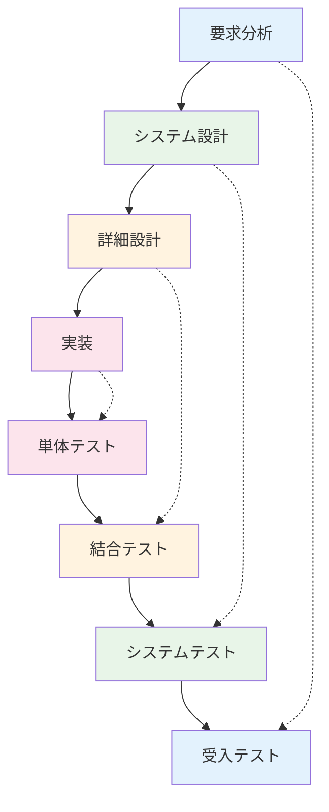
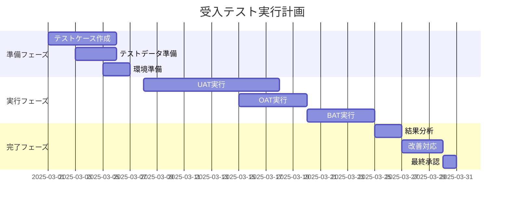
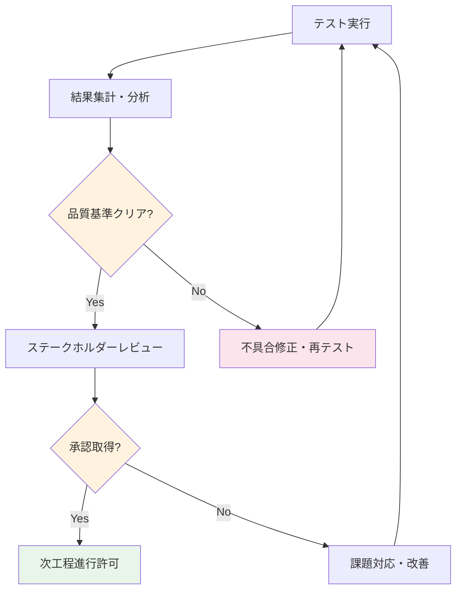
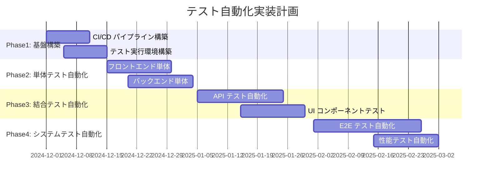
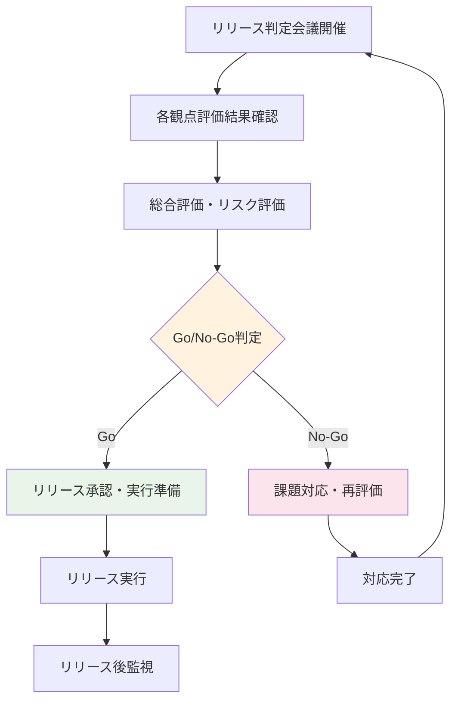

# テスト仕様書
## Testing Specification

### 1. 概要

#### 1.1 目的
本仕様書は、モダンERPシステムの品質保証を確実に実現するため、V字モデルに基づく体系的なテスト戦略、各テストレベルの詳細計画、および品質ゲート基準を定義します。

#### 1.2 適用範囲
- テスト戦略・方針
- テストレベル別計画
- 受入テスト基準
- 性能テスト計画
- セキュリティテスト計画
- テスト環境・データ管理
- 品質保証プロセス

#### 1.3 テスト基本方針
- **V字モデル採用**: 開発フェーズと対応したテスト設計
- **シフトレフト**: 早期品質作り込み
- **自動化推進**: 継続的品質保証
- **リスクベース**: 重要度に応じたテスト配分
- **アジャイル対応**: 短期間でのフィードバックサイクル

---

### 2. テスト戦略

#### 2.1 V字モデルテスト戦略

##### 2.1.1 V字モデル概要図


##### 2.1.2 テストレベル対応表
| 開発フェーズ | 対応テストレベル | テスト観点 | 責任者 | 期間比率 |
|-------------|----------------|-----------|-------|---------|
| **要求分析** | 受入テスト設計 | 業務要件充足 | ビジネスアナリスト | 15% |
| **システム設計** | システムテスト設計 | 非機能要件 | システムアーキテクト | 20% |
| **詳細設計** | 結合テスト設計 | モジュール間連携 | 開発リーダー | 25% |
| **実装** | 単体テスト設計・実行 | 個別機能 | 開発者 | 40% |

#### 2.2 テストピラミッド戦略

##### 2.2.1 テストピラミッド構成
```yaml
受入テスト（5%）:
  - ユーザー受入テスト
  - 運用受入テスト
  - ビジネス受入テスト

システム・E2Eテスト（15%）:
  - システム全体の動作確認
  - 統合シナリオテスト
  - 非機能要件検証

結合テスト（30%）:
  - API結合テスト
  - モジュール間結合
  - 外部システム結合

単体テスト（50%）:
  - 関数・メソッドテスト
  - クラステスト
  - コンポーネントテスト
```

##### 2.2.2 自動化戦略
| テストレベル | 自動化率目標 | 自動化ツール | 実行頻度 |
|-------------|-------------|-------------|----------|
| **単体テスト** | 90%以上 | Jest, React Testing Library | コミット毎 |
| **結合テスト** | 70%以上 | Cypress, Postman | PR毎 |
| **システムテスト** | 50%以上 | Selenium, K6 | デイリー |
| **受入テスト** | 30%以上 | Cucumber, TestCafe | リリース前 |

---

### 3. テストレベル別計画

#### 3.1 単体テスト

##### 3.1.1 単体テスト範囲・観点
| 対象 | テスト観点 | カバレッジ目標 | ツール |
|------|-----------|---------------|--------|
| **フロントエンド** | コンポーネント動作、状態管理 | 90%以上 | Jest, RTL |
| **バックエンド** | ビジネスロジック、API | 85%以上 | Jest, Supertest |
| **データベース** | クエリ、制約 | 80%以上 | DB Unit Tests |
| **ユーティリティ** | 共通関数、ヘルパー | 95%以上 | Jest |

##### 3.1.2 単体テスト詳細計画
```yaml
フロントエンド単体テスト:
  React コンポーネント:
    - プロパティ受け渡し
    - 状態変更
    - イベントハンドリング
    - エラー境界
  
  Redux/状態管理:
    - アクション生成
    - リデューサー動作
    - セレクター
    - ミドルウェア
  
  ユーティリティ関数:
    - データ変換
    - バリデーション
    - フォーマット処理

バックエンド単体テスト:
  Controller:
    - リクエスト処理
    - レスポンス生成
    - エラーハンドリング
  
  Service/Business Logic:
    - ビジネスルール
    - データ操作
    - 外部API呼び出し
  
  Repository/DAO:
    - データアクセス
    - クエリ生成
    - トランザクション
```

##### 3.1.3 単体テスト品質基準
| 品質指標 | 目標値 | 測定方法 | 判定基準 |
|---------|-------|----------|---------|
| **コードカバレッジ** | 85%以上 | Istanbul/NYC | 85%未満は差戻し |
| **テスト成功率** | 100% | CI/CD結果 | 1件でも失敗は差戻し |
| **テスト実行時間** | 5分以内 | CI/CD実行時間 | 5分超過は最適化要 |
| **テストコード品質** | Aランク以上 | SonarQube | Bランク以下は改善要 |

#### 3.2 結合テスト

##### 3.2.1 結合テスト分類・範囲
| 結合種別 | 対象 | テスト観点 | 期間 |
|---------|------|-----------|------|
| **コンポーネント結合** | フロントエンド内部 | 画面遷移、データ連携 | 1週間 |
| **API結合** | フロント・バック間 | API通信、データ形式 | 1週間 |
| **モジュール結合** | バックエンド内部 | サービス間連携 | 1週間 |
| **データベース結合** | アプリ・DB間 | データ整合性、制約 | 3日間 |
| **外部システム結合** | 外部API・システム | インタフェース連携 | 1週間 |

##### 3.2.2 API結合テスト詳細
```yaml
RESTful API結合テスト:
  認証・認可:
    - JWT トークン検証
    - 権限チェック
    - セッション管理
  
  CRUD操作:
    - 作成（POST）
    - 参照（GET）
    - 更新（PUT/PATCH）
    - 削除（DELETE）
  
  エラーハンドリング:
    - 4xx クライアントエラー
    - 5xx サーバーエラー
    - タイムアウト処理
  
  データフォーマット:
    - JSON構造検証
    - 日付・時刻形式
    - 多言語対応

GraphQL API結合テスト:
  クエリ・ミューテーション:
    - 複雑なクエリ
    - ネストしたデータ取得
    - バッチ処理
  
  スキーマ検証:
    - 型定義準拠
    - 必須フィールド
    - 列挙型制約
```

##### 3.2.3 外部システム結合テスト
| 外部システム | インタフェース | テストシナリオ | モック有無 |
|-------------|---------------|---------------|-----------|
| **会計システム** | REST API | 仕訳データ連携、残高照会 | モック使用 |
| **銀行API** | REST API | 振込、残高照会 | モック使用 |
| **メール配信** | SMTP | 通知メール送信 | 実システム |
| **ファイルストレージ** | S3 API | ファイル保存・取得 | 実システム |
| **認証プロバイダー** | OIDC | SSO認証 | モック使用 |

#### 3.3 システムテスト

##### 3.3.1 システムテスト観点・項目
| テスト分類 | 観点 | 重要度 | 期間 |
|-----------|------|-------|------|
| **機能テスト** | 要求仕様書準拠 | 最高 | 2週間 |
| **性能テスト** | レスポンス、スループット | 高 | 1週間 |
| **セキュリティテスト** | 脆弱性、認証・認可 | 最高 | 1週間 |
| **ユーザビリティテスト** | 操作性、UI/UX | 中 | 3日間 |
| **互換性テスト** | ブラウザ、デバイス | 中 | 3日間 |
| **可用性テスト** | 障害時動作、復旧 | 高 | 3日間 |

##### 3.3.2 機能テストシナリオ
```yaml
プロジェクト管理機能:
  基本シナリオ:
    - プロジェクト作成 → タスク登録 → 工数入力 → 進捗確認
    - リソース配賦 → スケジュール調整 → ガントチャート表示
  
  異常シナリオ:
    - 不正データ入力時のエラーハンドリング
    - 権限外操作の制御
    - 同時編集時の競合処理

財務管理機能:
  基本シナリオ:
    - 請求書作成 → 承認フロー → 会計連携 → 入金確認
    - 原価計算 → 予実比較 → レポート出力
  
  異常シナリオ:
    - 計算エラー時の処理
    - 外部システム連携エラー
    - 大量データ処理時の性能

業務横断シナリオ:
  受注〜請求フロー:
    - 受注登録 → プロジェクト作成 → 工数管理 → 請求処理
  
  月次決算処理:
    - データ集計 → 仕訳生成 → 会計連携 → レポート作成
```

#### 3.4 受入テスト

##### 3.4.1 受入テスト分類
| 受入テスト種別 | 実施者 | 観点 | 期間 | 合格基準 |
|---------------|-------|------|------|---------|
| **ユーザー受入テスト（UAT）** | エンドユーザー | 業務適合性 | 2週間 | 重要シナリオ100%成功 |
| **運用受入テスト（OAT）** | 運用チーム | 運用性・保守性 | 1週間 | 運用手順書実行可能 |
| **ビジネス受入テスト（BAT）** | 事業部門 | ビジネス価値 | 1週間 | KPI達成見込み |
| **コンプライアンス受入** | 監査部門 | 法的要件 | 3日間 | 法的要件100%準拠 |

##### 3.4.2 ユーザー受入テスト詳細
```yaml
UAT実施計画:
  参加者:
    - 各部門代表ユーザー: 15名
    - 業務エキスパート: 5名
    - システム管理者: 3名
  
  テストシナリオ:
    日次業務シナリオ:
      - 朝の業務開始〜夕方の業務終了
      - 各ユーザーロールでの典型的業務
    
    月次業務シナリオ:
      - 月初設定〜月末締処理
      - 各種レポート作成・確認
    
    例外業務シナリオ:
      - エラー発生時の対処
      - 緊急時の業務継続
  
  評価項目:
    機能性:
      - 業務要件の充足度
      - 操作の直感性
      - レスポンスの妥当性
    
    使いやすさ:
      - 学習のしやすさ
      - 効率性の向上
      - エラーからの回復性
```

---

### 4. 受入テスト基準

#### 4.1 受入基準マトリックス

##### 4.1.1 機能別受入基準
| 機能カテゴリ | 受入基準 | 測定方法 | 合格ライン |
|-------------|---------|----------|-----------|
| **プロジェクト管理** | 全必須機能動作 | 機能テスト | 100%成功 |
| **財務管理** | 計算精度・会計連携 | 精度検証 | 誤差1%未満 |
| **販売管理** | 受注〜請求フロー | シナリオテスト | エンドツーエンド成功 |
| **ユーザー管理** | 認証・認可制御 | セキュリティテスト | 脆弱性0件 |
| **レポート機能** | データ正確性 | データ整合性チェック | 100%一致 |
| **システム管理** | 設定・監視機能 | 運用テスト | 全機能利用可能 |

##### 4.1.2 品質特性別受入基準
| 品質特性 | 受入基準 | 測定指標 | 目標値 |
|---------|---------|----------|-------|
| **機能性** | 要求機能の実装 | 機能実装率 | 100% |
| **信頼性** | システム安定性 | 平均故障間隔（MTBF） | 720時間以上 |
| **使用性** | ユーザビリティ | System Usability Scale | 70以上 |
| **効率性** | 性能要件達成 | レスポンス時間 | 95%が2秒以内 |
| **保守性** | 保守・拡張の容易さ | 循環複雑度 | 平均10以下 |
| **移植性** | 環境適応性 | ブラウザ対応率 | 主要ブラウザ100% |

#### 4.2 受入テスト実行計画

##### 4.2.1 受入テストフェーズ


##### 4.2.2 受入テスト判定プロセス
```yaml
段階別判定:
  Phase 1 - 機能確認:
    判定基準: 重要機能100%動作
    判定者: 業務責任者
    期間: 1週間
  
  Phase 2 - 業務適合性:
    判定基準: 業務フロー完全実行
    判定者: エンドユーザー代表
    期間: 1週間
  
  Phase 3 - 総合評価:
    判定基準: 全受入基準クリア
    判定者: プロジェクトステアリング
    期間: 2日

最終承認:
  承認条件:
    - 全受入テストPASS
    - 重大な未解決課題なし
    - 運用準備完了
  承認者: エグゼクティブスポンサー
```

---

### 5. 性能テスト計画

#### 5.1 性能テスト戦略

##### 5.1.1 性能要件定義
| 性能指標 | 目標値 | 測定条件 | 許容値 |
|---------|-------|----------|--------|
| **レスポンス時間** | 2秒以内 | 通常時95%ile | 5秒以内 |
| **スループット** | 1000 TPS | ピーク時 | 500 TPS |
| **同時接続数** | 500ユーザー | 同時操作 | 300ユーザー |
| **CPU使用率** | 70%以下 | 平常時 | 85%以下 |
| **メモリ使用率** | 80%以下 | 平常時 | 90%以下 |
| **ディスク使用率** | 80%以下 | 平常時 | 90%以下 |

##### 5.1.2 性能テスト種類
| テスト種類 | 目的 | 実行条件 | 期間 |
|-----------|------|----------|------|
| **負荷テスト** | 通常時性能確認 | 想定ユーザー数 | 2日間 |
| **ストレステスト** | 限界性能確認 | 限界まで負荷増加 | 1日間 |
| **スパイクテスト** | 急激負荷変動 | 短時間で負荷急増 | 半日 |
| **耐久テスト** | 長時間安定性 | 長時間継続実行 | 24時間 |
| **ボリュームテスト** | 大量データ処理 | 本番想定データ量 | 1日間 |

#### 5.2 性能テスト詳細計画

##### 5.2.1 負荷テストシナリオ
```yaml
シナリオ1: 通常業務負荷
  同時ユーザー数: 100名
  実行時間: 1時間
  操作パターン:
    - ログイン → ダッシュボード表示 (20%)
    - プロジェクト一覧 → 詳細確認 (30%)
    - タスク登録・更新 (25%)
    - レポート表示 (15%)
    - ログアウト (10%)

シナリオ2: ピーク時負荷
  同時ユーザー数: 300名
  実行時間: 30分
  操作パターン:
    - 朝の出社時一斉ログイン
    - 月末の集中作業
    - 大量データ処理

シナリオ3: 段階的負荷増加
  開始ユーザー数: 50名
  最大ユーザー数: 500名
  増加ペース: 50名/5分
  継続時間: 2時間
```

##### 5.2.2 性能監視項目
| 監視レイヤー | 監視項目 | ツール | 閾値 |
|-------------|---------|--------|------|
| **アプリケーション** | レスポンス時間、エラー率 | Application Insights | 2秒、1% |
| **Webサーバー** | CPU、メモリ、接続数 | CloudWatch | 70%、80%、1000 |
| **アプリサーバー** | JVM、スレッド、GC | New Relic | JVMヒープ80% |
| **データベース** | 接続数、クエリ時間、ロック | pganalyze | 500、1秒、10 |
| **ネットワーク** | 帯域、パケットロス | CloudWatch | 80%、0.1% |

#### 5.3 性能テスト環境

##### 5.3.1 性能テスト環境構成
```yaml
負荷生成環境:
  ツール: Apache JMeter, K6
  インスタンス: AWS EC2 m5.xlarge × 5台
  配置: 複数AZ分散配置

測定対象環境:
  アーキテクチャ: 本番同等環境
  スケール: 本番の80%規模
  データ: 本番同等のテストデータ

監視環境:
  APMツール: New Relic, Datadog
  ログ監視: ELK Stack
  インフラ監視: CloudWatch
```

##### 5.3.2 性能テストデータ
| データ種別 | ボリューム | 特徴 |
|-----------|----------|------|
| **ユーザーデータ** | 10,000件 | 実名・権限パターン網羅 |
| **プロジェクトデータ** | 5,000件 | 規模・期間・状態分散 |
| **タスクデータ** | 100,000件 | 階層構造・依存関係含む |
| **タイムシートデータ** | 1,000,000件 | 過去2年分の実績 |
| **財務データ** | 500,000件 | 請求・支払・仕訳データ |

---

### 6. セキュリティテスト計画

#### 6.1 セキュリティテスト戦略

##### 6.1.1 セキュリティ要件・基準
| セキュリティ領域 | 要件 | テスト観点 | 基準 |
|-----------------|------|-----------|------|
| **認証** | 強固な認証機構 | パスワードポリシー、MFA | NIST準拠 |
| **認可** | 適切なアクセス制御 | ロールベース、リソースレベル | 最小権限の原則 |
| **暗号化** | データ保護 | 保存時・転送時暗号化 | AES-256、TLS1.3 |
| **入力検証** | インジェクション対策 | SQLi、XSS、CSRF | OWASP Top10 |
| **ログ・監査** | 証跡管理 | アクセスログ、操作ログ | 改ざん不可 |
| **プライバシー** | 個人情報保護 | データマスキング、匿名化 | GDPR準拠 |

##### 6.1.2 セキュリティテスト分類
| テスト種別 | 目的 | 手法 | 実施者 |
|-----------|------|------|-------|
| **脆弱性スキャン** | 既知脆弱性検出 | 自動ツール | セキュリティエンジニア |
| **侵入テスト** | 実攻撃シミュレーション | 手動・自動 | 外部専門機関 |
| **コードレビュー** | ソースコード検査 | 静的解析 | 開発チーム |
| **設定監査** | セキュリティ設定確認 | チェックリスト | インフラチーム |

#### 6.2 脆弱性テスト詳細

##### 6.2.1 OWASP Top 10対策テスト
| 脆弱性 | テストシナリオ | 対策確認項目 | ツール |
|--------|---------------|-------------|--------|
| **インジェクション** | SQL、NoSQL、OS、LDAPインジェクション | パラメータ化クエリ、入力検証 | SQLMap, Burp Suite |
| **認証の不備** | 弱いパスワード、セッション管理 | パスワードポリシー、トークン管理 | Hydra, OWASP ZAP |
| **機密データ露出** | 暗号化不備、情報漏洩 | データ暗号化、通信暗号化 | SSLyze, Nmap |
| **XML外部エンティティ** | XXE攻撃 | XML パーサー設定 | XXE injector |
| **アクセス制御不備** | 権限昇格、水平権限移動 | 認可ロジック、URL制御 | Burp Suite |
| **不適切なセキュリティ設定** | デフォルト設定、不要機能 | セキュリティヘッダー、設定監査 | Nikto, Nessus |
| **XSS** | Stored、Reflected、DOM XSS | 出力エスケープ、CSP | XSS Hunter |
| **安全でない逆シリアル化** | リモートコード実行 | シリアル化制御 | ysoserial |
| **既知脆弱性コンポーネント** | 古いライブラリ、フレームワーク | 依存関係管理、更新 | OWASP Dependency Check |
| **不十分ログ・監視** | 攻撃検知不備 | ログ記録、アラート | 手動確認 |

##### 6.2.2 認証・認可テスト詳細
```yaml
認証テスト:
  パスワード認証:
    - 弱いパスワード拒否
    - アカウントロックアウト
    - パスワード履歴管理
    - パスワード有効期限
  
  多要素認証:
    - TOTP実装
    - SMS認証
    - 生体認証（将来）
  
  セッション管理:
    - セッションタイムアウト
    - セッションFixation対策
    - CSRF トークン
    - セキュアクッキー

認可テスト:
  ロールベースアクセス制御:
    - 管理者権限
    - 一般ユーザー権限
    - 読み取り専用権限
    - ゲスト権限
  
  リソースレベル制御:
    - データオーナーシップ
    - 部門間アクセス制限
    - プロジェクトベース権限
    - API エンドポイント制御
```

#### 6.3 侵入テスト計画

##### 6.3.1 侵入テスト範囲・手法
| 対象範囲 | テスト手法 | 期間 | 実施タイミング |
|---------|-----------|------|--------------|
| **Webアプリケーション** | Black Box、Gray Box | 5日間 | システムテスト後 |
| **API エンドポイント** | API fuzzing、認証バイパス | 3日間 | 結合テスト後 |
| **インフラ** | ポートスキャン、設定監査 | 2日間 | 環境構築後 |
| **ネットワーク** | VLAN浸透、横展開 | 3日間 | システムテスト後 |

##### 6.3.2 侵入テストシナリオ
```yaml
外部攻撃者シナリオ:
  情報収集フェーズ:
    - DNS情報収集
    - ポートスキャン
    - Webアプリケーション探索
  
  侵入フェーズ:
    - 脆弱性exploitationn
    - 認証バイパス
    - 権限昇格
  
  横展開フェーズ:
    - 内部ネットワーク探索
    - 機密情報収集
    - 永続化

内部攻撃者シナリオ:
  一般ユーザー権限:
    - 権限昇格の試行
    - 他ユーザーデータアクセス
    - システム設定変更試行
  
  特権ユーザー権限:
    - データベース直接アクセス
    - システムファイル改変
    - ログ改ざん
```

---

### 7. テスト環境・データ管理

#### 7.1 テスト環境戦略

##### 7.1.1 テスト環境構成
| 環境名 | 用途 | 構成 | 利用チーム | データ更新頻度 |
|--------|------|------|-----------|-------------|
| **開発環境** | 開発・単体テスト | 最小構成 | 開発者 | 随時 |
| **テスト環境** | 結合・システムテスト | 中規模構成 | QAチーム | 週次 |
| **ステージング環境** | 受入テスト・性能テスト | 本番同等 | 全チーム | 日次 |
| **セキュリティテスト環境** | セキュリティテスト専用 | 隔離環境 | セキュリティチーム | 月次 |

##### 7.1.2 環境管理・運用
```yaml
環境プロビジョニング:
  Infrastructure as Code:
    - Terraform による環境構築
    - Ansible による設定管理
    - Docker/Kubernetes による分散配備
  
  CI/CD パイプライン:
    - GitHub Actions
    - 自動テスト実行
    - 環境への自動デプロイ
  
環境監視:
  健全性監視:
    - アプリケーション稼働状況
    - データベース状態
    - リソース使用状況
  
  利用状況管理:
    - 環境利用予約
    - テスト実行スケジューリング
    - リソース競合回避
```

#### 7.2 テストデータ管理

##### 7.2.1 テストデータ戦略
| データカテゴリ | 作成方法 | データ量 | 更新頻度 | プライバシー対応 |
|---------------|---------|----------|----------|-----------------|
| **マスターデータ** | 手動作成 | 1,000件 | 月次 | 仮名化 |
| **トランザクションデータ** | 自動生成 | 100万件 | 週次 | 匿名化 |
| **ユーザーデータ** | 合成データ | 10,000件 | 月次 | 完全匿名化 |
| **設定データ** | 手動作成 | 100件 | 変更時 | 非該当 |
| **履歴データ** | 本番コピー | 500万件 | 四半期 | 匿名化 |

##### 7.2.2 テストデータ作成・管理プロセス
```yaml
データ作成プロセス:
  要求定義:
    - テストシナリオ分析
    - 必要データ特定
    - データ量見積もり
  
  データ生成:
    - 合成データ生成（Faker.js）
    - 本番データサブセット
    - 手動作成（複雑な関係性）
  
  データ検証:
    - 整合性チェック
    - プライバシー確認
    - 品質検証

データ管理:
  バージョン管理:
    - Git による管理
    - データセットバージョニング
    - 変更履歴追跡
  
  アクセス制御:
    - 環境別アクセス権限
    - データ利用承認フロー
    - 利用ログ記録
```

#### 7.3 テストデータプライバシー保護

##### 7.3.1 個人情報保護対策
| 保護レベル | 対象データ | 対策手法 | 適用環境 |
|-----------|-----------|---------|----------|
| **完全匿名化** | 氏名、住所、電話番号 | ランダム生成 | 開発・テスト |
| **仮名化** | メールアドレス、ID | ハッシュ化 | ステージング |
| **マスキング** | クレジットカード、口座 | 部分マスキング | 全環境 |
| **暗号化** | 機密情報 | AES暗号化 | 全環境 |

##### 7.3.2 データ保護プロセス
```yaml
データサニタイズ:
  検出フェーズ:
    - 個人情報自動検出
    - 機密データ特定
    - リスク評価

  変換フェーズ:
    - データマスキング
    - 匿名化処理
    - 関係性保持

  検証フェーズ:
    - 匿名化検証
    - 品質確認
    - 利用可能性確認

データライフサイクル管理:
  - データ作成時のプライバシー確認
  - 定期的なデータ更新
  - 不要データの自動削除
  - 利用終了時のデータ完全削除
```

---

### 8. 品質保証プロセス

#### 8.1 品質ゲート管理

##### 8.1.1 品質ゲート一覧
| ゲート | タイミング | 判定基準 | 判定者 | 次工程への影響 |
|--------|-----------|---------|-------|---------------|
| **QG1: 設計完了** | 詳細設計後 | レビュー完了、承認取得 | アーキテクト | 実装開始可否 |
| **QG2: 単体テスト完了** | 実装後 | カバレッジ85%以上 | 開発リーダー | 結合テスト開始可否 |
| **QG3: 結合テスト完了** | 結合テスト後 | 重大バグ0件 | QAリーダー | システムテスト開始可否 |
| **QG4: システムテスト完了** | システムテスト後 | 受入基準クリア | QAマネージャー | 受入テスト開始可否 |
| **QG5: 受入テスト完了** | 受入テスト後 | ユーザー承認取得 | ビジネスオーナー | 本番リリース可否 |

##### 8.1.2 品質ゲート判定プロセス


#### 8.2 不具合管理

##### 8.2.1 不具合分類・優先度
| 重要度 | 分類 | 内容 | 対応時間 | エスカレーション |
|--------|------|------|----------|-----------------|
| **Critical** | システム停止 | 全機能利用不可 | 4時間以内 | 即座にPM・責任者 |
| **High** | 主要機能不具合 | 重要業務に支障 | 24時間以内 | 8時間後にPM |
| **Medium** | 軽微な機能不具合 | 業務に軽微な影響 | 1週間以内 | 3日後にリーダー |
| **Low** | UI/表示問題 | 利便性に影響 | 次リリース | エスカレーションなし |

##### 8.2.2 不具合管理プロセス
```yaml
不具合検出:
  テスト実行時:
    - 自動テストでの検出
    - 手動テストでの発見
    - 探索的テストでの発見
  
  運用時:
    - ユーザーからの報告
    - ログ監視での検知
    - 監視アラート

不具合処理フロー:
  登録・分類:
    - 不具合チケット作成
    - 重要度・優先度設定
    - 担当者アサイン
  
  修正・検証:
    - 原因分析・修正実装
    - 修正内容レビュー
    - 修正版テスト実行
  
  完了・確認:
    - 修正完了確認
    - 回帰テスト実行
    - クローズ承認
```

#### 8.3 品質メトリクス

##### 8.3.1 品質測定指標
| カテゴリ | メトリクス | 計算式 | 目標値 | 測定頻度 |
|---------|-----------|--------|--------|----------|
| **テストカバレッジ** | コードカバレッジ | 実行行数/総行数 × 100 | 85%以上 | 日次 |
| **不具合密度** | 不具合密度 | 不具合数/KLOC | 2件以下 | 週次 |
| **テスト効率** | 不具合検出率 | テストで発見/総不具合 × 100 | 80%以上 | フェーズ終了時 |
| **テスト生産性** | テストケース実行率 | 実行数/予定数 × 100 | 95%以上 | 日次 |
| **品質安定性** | 不具合再発率 | 再発不具合/総不具合 × 100 | 5%以下 | 月次 |

##### 8.3.2 品質ダッシュボード
```yaml
リアルタイム表示項目:
  テスト進捗:
    - テストケース実行状況
    - 合格/不合格率
    - 残作業量

  不具合状況:
    - 重要度別不具合数
    - 未解決不具合推移
    - 修正完了率

  品質指標:
    - カバレッジ推移
    - 不具合密度トレンド
    - 品質ゲート通過状況

週次・月次レポート:
  - 品質メトリクス推移
  - 不具合分析レポート
  - テスト効率分析
  - 改善提案
```

---

### 9. テスト自動化

#### 9.1 自動化戦略

##### 9.1.1 自動化対象・範囲
| テストレベル | 自動化対象 | 自動化率目標 | 工数削減効果 |
|-------------|-----------|-------------|-------------|
| **単体テスト** | 全関数・メソッド | 90% | 80% |
| **結合テスト** | API、コンポーネント結合 | 70% | 60% |
| **システムテスト** | 回帰テスト、煙突テスト | 50% | 40% |
| **受入テスト** | 主要業務シナリオ | 30% | 20% |

##### 9.1.2 自動化ツール選定
| テスト種別 | ツール | 選定理由 | 習得コスト |
|-----------|--------|----------|-----------|
| **単体テスト** | Jest, React Testing Library | React標準、豊富な機能 | 低 |
| **API テスト** | Postman, Newman | GUI・CUI双方対応 | 低 |
| **E2E テスト** | Cypress | モダン、デバッグ容易 | 中 |
| **性能テスト** | K6, JMeter | スケーラブル、クラウド対応 | 中 |
| **セキュリティテスト** | OWASP ZAP | オープンソース、CI/CD統合 | 高 |

#### 9.2 自動化実装計画

##### 9.2.1 自動化実装フェーズ


##### 9.2.2 自動化テストスイート構成
```yaml
単体テスト自動化:
  React Components:
    - スナップショットテスト
    - Props テスト
    - Event ハンドリングテスト
    - State 管理テスト
  
  Node.js Services:
    - Business Logic テスト
    - Database Access テスト
    - External API テスト
    - Error Handling テスト

結合テスト自動化:
  API テスト:
    - CRUD 操作テスト
    - 認証・認可テスト
    - エラーレスポンステスト
    - レスポンス形式テスト
  
  UI 結合テスト:
    - 画面遷移テスト
    - フォーム入力・検証
    - データ表示・更新

E2E テスト自動化:
  業務シナリオ:
    - ユーザーログイン〜ログアウト
    - プロジェクト作成〜完了
    - 受注〜請求処理フロー
    - レポート作成・出力
```

#### 9.3 CI/CDパイプライン統合

##### 9.3.1 パイプライン構成
```yaml
CI パイプライン (GitHub Actions):
  Trigger:
    - Pull Request 作成時
    - main ブランチ Push 時
    - 夜間定期実行

  Stage 1 - Build & Unit Test:
    - ソースコードビルド
    - 単体テスト実行
    - コードカバレッジ測定
    - 静的解析実行

  Stage 2 - Integration Test:
    - テスト環境デプロイ
    - API テスト実行
    - UI コンポーネントテスト
    - データベーステスト

  Stage 3 - System Test:
    - ステージング環境デプロイ
    - E2E テスト実行
    - 性能テスト実行
    - セキュリティテスト実行

  Stage 4 - Quality Gate:
    - 品質メトリクス判定
    - 不具合レポート生成
    - 通知・レポート送信
```

##### 9.3.2 自動化テスト結果管理
| 結果種別 | 出力形式 | 保存場所 | 保持期間 |
|---------|---------|----------|---------|
| **単体テスト結果** | JUnit XML | CI/CD システム | 3ヶ月 |
| **カバレッジレポート** | HTML, LCOV | SonarQube | 6ヶ月 |
| **API テスト結果** | JSON | Test Management Tool | 6ヶ月 |
| **E2E テスト結果** | Screenshots, Videos | Cloud Storage | 1ヶ月 |
| **性能テスト結果** | JTL, CSV | 性能監視DB | 1年 |

---

### 10. テスト管理・レポート

#### 10.1 テスト管理ツール

##### 10.1.1 テスト管理ツール構成
| ツール | 用途 | 選定理由 | 連携ツール |
|--------|------|---------|-----------|
| **TestRail** | テストケース管理 | 豊富な機能、API連携 | Jira, Jenkins |
| **Jira** | 不具合管理・プロジェクト管理 | 開発チーム標準 | TestRail, Confluence |
| **Confluence** | テスト計画・レポート | ドキュメント管理 | Jira |
| **SonarQube** | コード品質管理 | 品質ゲート統合 | CI/CD Pipeline |

##### 10.1.2 テストケース管理
```yaml
テストケース構造:
  階層管理:
    - プロジェクト
      - テストスイート
        - テストセクション
          - テストケース
            - テストステップ

  テストケース属性:
    - ID、タイトル、概要
    - 前提条件、手順、期待結果
    - 優先度、重要度
    - 担当者、実行日時
    - 実行環境、テストデータ

  実行結果管理:
    - Pass/Fail/Blocked/Retest
    - 不具合リンク
    - 実行時間、実行者
    - コメント・添付ファイル
```

#### 10.2 テストレポート

##### 10.2.1 定期レポート一覧
| レポート | 頻度 | 対象者 | 内容 |
|---------|------|-------|------|
| **日次テストレポート** | 日次 | 開発・QAチーム | 実行状況、不具合状況 |
| **週次品質レポート** | 週次 | PM、マネージャー | 品質メトリクス、進捗 |
| **フェーズ完了レポート** | フェーズ終了時 | ステークホルダー | 品質評価、課題 |
| **リリース判定レポート** | リリース前 | 経営層 | リリース可否判定 |

##### 10.2.2 レポート詳細内容
```yaml
日次テストレポート:
  実行状況:
    - 計画 vs 実績実行数
    - Pass/Fail 率
    - 実行済み/未実行率
    - ブロッカー状況

  不具合状況:
    - 新規登録数
    - 修正完了数
    - 未解決数（重要度別）
    - 対応状況

週次品質レポート:
  品質メトリクス:
    - カバレッジ推移
    - 不具合密度
    - テスト効率
    - 品質トレンド

  進捗状況:
    - テスト進捗率
    - 品質ゲート通過状況
    - リスク・課題
    - 次週予定

フェーズ完了レポート:
  品質評価:
    - 品質目標達成度
    - 残存リスク評価
    - 不具合分析結果
    - 品質改善提案

  次フェーズ準備:
    - 準備完了状況
    - 引き継ぎ事項
    - 注意点・留意事項
```

#### 10.3 品質可視化ダッシュボード

##### 10.3.1 リアルタイムダッシュボード
```yaml
テスト実行状況:
  - 本日の実行計画 vs 実績
  - リアルタイム実行結果
  - 実行中テストケース
  - 完了予定時間

品質状況:
  - 品質メトリクス（カバレッジ、不具合密度）
  - 品質トレンドグラフ
  - 品質ゲート通過状況
  - 重要な品質アラート

不具合管理:
  - 重要度別不具合数
  - 新規/解決/未解決推移
  - 対応期限超過アラート
  - 担当者別対応状況

進捗管理:
  - テスト進捗率
  - 予定との乖離
  - ボトルネック特定
  - リソース使用状況
```

---

### 11. 非機能テスト

#### 11.1 可用性テスト

##### 11.1.1 可用性要件・テスト項目
| 可用性要件 | 目標値 | テスト方法 | 合格基準 |
|-----------|-------|-----------|---------|
| **システム稼働率** | 99.9% | 長時間稼働テスト | 月間稼働率99.9%以上 |
| **MTBF（平均故障間隔）** | 720時間以上 | 耐久テスト | 30日間無停止稼働 |
| **MTTR（平均復旧時間）** | 1時間以内 | 障害復旧テスト | 障害から1時間以内復旧 |
| **計画停止時間** | 月4時間以内 | メンテナンス手順確認 | メンテナンス時間短縮 |

##### 11.1.2 障害シミュレーション
```yaml
インフラ障害シミュレーション:
  サーバー障害:
    - Webサーバー停止
    - アプリケーションサーバー停止
    - データベースサーバー障害
    - ロードバランサー障害

  ネットワーク障害:
    - ネットワーク切断
    - 帯域制限
    - パケット損失
    - レイテンシ増加

  ストレージ障害:
    - ディスク障害
    - ファイルシステム障害
    - バックアップ障害

アプリケーション障害シミュレーション:
  - メモリリーク
  - デッドロック
  - 無限ループ
  - API タイムアウト
```

#### 11.2 スケーラビリティテスト

##### 11.2.1 スケーラビリティ要件
| スケーラビリティ指標 | 現在 | 1年後 | 3年後 | テスト方法 |
|-------------------|------|-------|-------|-----------|
| **同時ユーザー数** | 300 | 800 | 2000 | 負荷テスト |
| **データ量** | 1GB | 10GB | 100GB | ボリュームテスト |
| **トランザクション数** | 1000/日 | 5000/日 | 20000/日 | 負荷テスト |
| **API呼び出し数** | 10万/日 | 50万/日 | 200万/日 | API負荷テスト |

##### 11.2.2 スケーリングテスト
```yaml
水平スケーリングテスト:
  アプリケーション層:
    - インスタンス数増加テスト
    - ロードバランシング効果確認
    - セッション共有テスト

  データベース層:
    - 読み込みレプリカ効果
    - シャーディング効果
    - 接続プール設定最適化

垂直スケーリングテスト:
  リソース増強効果:
    - CPU コア数増加効果
    - メモリ増設効果
    - ストレージ性能向上効果
```

#### 11.3 データ整合性・バックアップテスト

##### 11.3.1 データ整合性テスト
| テスト項目 | テスト内容 | 実行頻度 | 合格基準 |
|-----------|-----------|----------|---------|
| **ACID特性** | トランザクション整合性 | 結合テスト時 | 100%整合 |
| **参照整合性** | 外部キー制約 | システムテスト時 | 制約違反0件 |
| **業務整合性** | ビジネスルール | 受入テスト時 | ルール準拠100% |
| **並行制御** | 同時更新制御 | システムテスト時 | データ破損0件 |

##### 11.3.2 バックアップ・復旧テスト
```yaml
バックアップテスト:
  フルバックアップ:
    - バックアップ実行時間
    - バックアップサイズ
    - バックアップファイル検証

  増分バックアップ:
    - 増分バックアップ精度
    - 復旧時の整合性
    - バックアップチェーン検証

復旧テスト:
  Point-in-Time Recovery:
    - 任意時点復旧
    - 復旧時間測定
    - データ整合性確認

  災害復旧:
    - 別サイトへの復旧
    - 復旧手順の実行性
    - RTO/RPO達成確認
```

---

### 12. モバイル・多デバイステスト

#### 12.1 モバイル対応テスト

##### 12.1.1 対応デバイス・ブラウザ
| デバイス種別 | OS | ブラウザ | 対応レベル | テスト優先度 |
|-------------|-----|---------|----------|------------|
| **デスクトップ** | Windows 10/11 | Chrome, Edge, Firefox | フル対応 | 最高 |
| **デスクトップ** | macOS | Chrome, Safari, Firefox | フル対応 | 高 |
| **タブレット** | iOS | Safari, Chrome | 基本対応 | 中 |
| **タブレット** | Android | Chrome | 基本対応 | 中 |
| **スマートフォン** | iOS | Safari | モバイル最適化 | 高 |
| **スマートフォン** | Android | Chrome | モバイル最適化 | 高 |

##### 12.1.2 レスポンシブデザインテスト
```yaml
ブレークポイントテスト:
  デスクトップ（1920px〜）:
    - 全機能表示確認
    - レイアウト最適化
    - 大画面活用

  ラップトップ（1280px〜1919px）:
    - 機能配置調整
    - サイドバー表示制御

  タブレット（768px〜1279px）:
    - ナビゲーション変更
    - コンテンツ再配置
    - タッチ操作対応

  モバイル（〜767px）:
    - ハンバーガーメニュー
    - 単一カラムレイアウト
    - タップサイズ最適化

機能別モバイル対応:
  データ入力:
    - 仮想キーボード対応
    - 入力支援機能
    - バリデーション表示

  データ表示:
    - スクロール・ページング
    - カード表示への変更
    - 重要情報の優先表示
```

#### 12.2 タッチ操作・ジェスチャーテスト

##### 12.2.1 タッチ操作テスト項目
| 操作種別 | テスト内容 | 期待動作 | 検証項目 |
|---------|-----------|---------|----------|
| **タップ** | 単発タッチ | 選択・実行 | 反応速度、視覚フィードバック |
| **長押し** | 長時間タッチ | コンテキストメニュー | 判定時間、メニュー表示 |
| **ダブルタップ** | 2回連続タッチ | 拡大・選択 | 判定間隔、誤動作防止 |
| **スワイプ** | 水平・垂直移動 | スクロール・ページ切替 | スムーズさ、慣性 |
| **ピンチ** | 2点間距離変更 | 拡大・縮小 | 拡大率、中心点 |
| **回転** | 2点回転 | オブジェクト回転 | 回転角度、軸 |

##### 12.2.2 モバイルUXテスト
```yaml
ナビゲーションテスト:
  ハンバーガーメニュー:
    - メニュー開閉動作
    - メニュー項目アクセス
    - 階層ナビゲーション

  スワイプナビゲーション:
    - 画面間遷移
    - タブ切り替え
    - カード操作

フォーム操作テスト:
  入力体験:
    - 仮想キーボード表示
    - 入力フィールドフォーカス
    - 自動入力補完

  バリデーション:
    - リアルタイム検証
    - エラー表示位置
    - 修正しやすさ
```

---

### 13. アクセシビリティテスト

#### 13.1 WCAG 2.1準拠テスト

##### 13.1.1 適合レベル別テスト計画
| 適合レベル | 対象機能 | テスト項目数 | 自動化率 | 手動確認項目 |
|-----------|---------|-------------|---------|-------------|
| **レベルA** | 全機能 | 30項目 | 70% | キーボード操作 |
| **レベルAA** | 主要機能 | 20項目 | 50% | コントラスト比 |
| **レベルAAA** | 一部機能 | 6項目 | 30% | 文章理解性 |

##### 13.1.2 WCAG 2.1テスト詳細
```yaml
知覚可能（Perceivable）:
  代替テキスト:
    - 画像の alt 属性
    - 装飾画像の適切なマーク
    - 複雑な画像の詳細説明

  音声・映像:
    - 字幕提供
    - 音声解説
    - 手話通訳

  色・コントラスト:
    - 色のみに依存しない表現
    - コントラスト比4.5:1以上（AA）
    - テキストサイズ調整対応

操作可能（Operable）:
  キーボード操作:
    - 全機能キーボードアクセス
    - タブオーダー適切性
    - フォーカス表示

  時間制限:
    - セッションタイムアウト調整
    - 自動更新制御
    - 時間延長オプション

理解可能（Understandable）:
  読みやすさ:
    - 言語設定
    - 専門用語説明
    - 文章構造明確化

  予測可能性:
    - 一貫したナビゲーション
    - 一貫した識別
    - コンテキスト変更の制御

堅牢（Robust）:
  互換性:
    - 有効なHTML/CSS
    - 支援技術対応
    - ブラウザ互換性
```

#### 13.2 支援技術対応テスト

##### 13.2.1 支援技術別テスト
| 支援技術 | 対象ユーザー | テスト内容 | 確認項目 |
|---------|-------------|-----------|---------|
| **スクリーンリーダー** | 視覚障害者 | 音声読み上げ | 読み上げ順序、内容理解 |
| **音声認識** | 上肢障害者 | 音声操作 | 音声コマンド認識 |
| **拡大ソフト** | 弱視者 | 画面拡大 | 拡大時レイアウト |
| **オンスクリーンキーボード** | 上肢障害者 | 仮想キーボード | 入力操作性 |

##### 13.2.2 スクリーンリーダーテスト詳細
```yaml
NVDA（Windows）テスト:
  ナビゲーション:
    - 見出しナビゲーション
    - ランドマークナビゲーション
    - リンクリスト
    - フォーム要素リスト

  コンテンツ理解:
    - 読み上げ順序
    - 表の理解
    - フォーム入力ガイダンス
    - エラーメッセージ理解

JAWS（Windows）テスト:
  - NVDA と同様の項目
  - JAWS固有機能確認
  - 設定による動作差異

VoiceOver（macOS/iOS）テスト:
  - ローター操作
  - ジェスチャーナビゲーション
  - アプリ間連携
  - iOSアクセシビリティ機能
```

---

### 14. 国際化・多言語テスト

#### 14.1 多言語対応テスト

##### 14.1.1 対象言語・文字セット
| 言語 | 文字セット | 対応レベル | 特殊要件 | テスト重点項目 |
|------|-----------|-----------|---------|--------------|
| **日本語** | UTF-8 | フル対応 | - | 基準言語 |
| **英語** | ASCII/UTF-8 | フル対応 | - | インタフェース標準 |
| **中国語（簡体字）** | UTF-8 | フル対応 | 中国本土向け | 長い文字列表示 |
| **韓国語** | UTF-8 | 基本対応 | - | ハングル表示 |
| **アラビア語** | UTF-8 | 計画中 | RTL（右から左） | 文字方向・レイアウト |

##### 14.1.2 国際化テスト項目
```yaml
文字表示テスト:
  フォント対応:
    - 各言語フォント表示
    - フォールバック設定
    - 文字化け確認

  文字長対応:
    - UI要素サイズ調整
    - 長い翻訳文対応
    - 省略表示制御

  特殊文字:
    - 日本語（ひらがな、カタカナ、漢字）
    - 中国語（簡体字・繁体字）
    - アラビア語（RTL、結合文字）

入力・処理テスト:
  文字入力:
    - IME入力対応
    - 文字変換
    - 入力制限・バリデーション

  データ処理:
    - ソート順序（言語別）
    - 検索機能（全文・部分検索）
    - 文字エンコーディング
```

#### 14.2 タイムゾーン・地域設定テスト

##### 14.2.1 タイムゾーン対応
| 地域 | タイムゾーン | 夏時間 | テスト項目 |
|------|-------------|--------|-----------|
| **日本** | JST（UTC+9） | なし | 基準タイムゾーン |
| **アメリカ東部** | EST/EDT（UTC-5/-4） | あり | 夏時間切替 |
| **ヨーロッパ中部** | CET/CEST（UTC+1/+2） | あり | 夏時間切替 |
| **オーストラリア東部** | AEST/AEDT（UTC+10/+11） | あり | 南半球夏時間 |

##### 14.2.2 地域固有機能テスト
```yaml
日付・時刻表示:
  フォーマット:
    - 日本: YYYY/MM/DD HH:mm
    - アメリカ: MM/DD/YYYY HH:mm AM/PM
    - ヨーロッパ: DD.MM.YYYY HH:mm

  カレンダー:
    - 週の開始曜日（日曜/月曜）
    - 祝日設定
    - 営業日計算

数値・通貨表示:
  数値フォーマット:
    - 小数点記号（.カンマ）
    - 桁区切り（,スペース）
    
  通貨表示:
    - 通貨記号位置
    - 為替レート適用
    - 税率計算
```

---

### 15. テスト環境・インフラテスト

#### 15.1 クラウド環境テスト

##### 15.1.1 AWS インフラテスト項目
| AWS サービス | テスト項目 | 確認内容 | 自動化 |
|-------------|-----------|---------|--------|
| **EC2** | インスタンス起動・停止 | 可用性・復旧時間 | ○ |
| **RDS** | フェイルオーバー | DB可用性・データ整合性 | ○ |
| **ALB** | 負荷分散 | トラフィック分散・ヘルスチェック | ○ |
| **S3** | ファイル操作 | アップロード・ダウンロード・権限 | ○ |
| **CloudFront** | CDN配信 | キャッシュ・地域配信 | △ |
| **Lambda** | サーバーレス実行 | 実行時間・メモリ・エラー処理 | ○ |

##### 15.1.2 マルチAZ・災害復旧テスト
```yaml
高可用性テスト:
  AZ障害シミュレーション:
    - Primary AZ停止
    - Secondary AZへの切り替え
    - サービス継続性確認
    - データ整合性確認

  リージョン間レプリケーション:
    - データ同期確認
    - RPO/RTO測定
    - 災害復旧手順実行

自動復旧テスト:
  Auto Scaling:
    - スケールアウト・インテスト
    - 異常インスタンス置き換え
    - 負荷分散再配分

  Health Check:
    - アプリケーションヘルスチェック
    - 異常検知・通知
    - 自動復旧プロセス
```

#### 15.2 Kubernetes環境テスト

##### 15.2.1 コンテナ・Pod テスト
| テスト項目 | 確認内容 | ツール | 頻度 |
|-----------|---------|--------|------|
| **Pod ライフサイクル** | 起動・停止・再起動 | kubectl | 日次 |
| **リソース制限** | CPU・メモリ制限 | Kubernetes Metrics | 日次 |
| **ヘルスチェック** | Liveness・Readiness Probe | kubectl | 常時 |
| **ログ出力** | ログ収集・転送 | Fluentd、ELK | 常時 |
| **セキュリティ** | Pod Security Policy | OPA Gatekeeper | 週次 |

##### 15.2.2 マイクロサービステスト
```yaml
サービス間通信テスト:
  Service Discovery:
    - サービス検出・接続
    - DNS解決
    - ロードバランシング

  API Gateway:
    - ルーティング
    - 認証・認可
    - レート制限

Circuit Breaker テスト:
  障害伝播防止:
    - 下流サービス障害時
    - タイムアウト制御
    - フォールバック動作

  復旧テスト:
    - 自動復旧
    - ヘルスチェック
    - グレースフルシャットダウン
```

---

### 16. 継続的テスト・DevOps

#### 16.1 CI/CD パイプラインテスト

##### 16.1.1 パイプライン段階別テスト
| パイプライン段階 | テスト種別 | 実行時間目標 | 失敗時アクション |
|-----------------|-----------|-------------|-----------------|
| **Commit Stage** | 単体テスト・静的解析 | 5分以内 | ビルド中断・通知 |
| **Acceptance Stage** | 結合・システムテスト | 30分以内 | デプロイ中断・ロールバック |
| **Performance Stage** | 性能・負荷テスト | 1時間以内 | 性能劣化アラート |
| **Security Stage** | セキュリティテスト | 20分以内 | セキュリティ問題報告 |
| **Production Stage** | 本番監視・煙突テスト | 2分以内 | 自動ロールバック |

##### 16.1.2 デプロイ戦略別テスト
```yaml
Blue-Green デプロイテスト:
  環境切り替えテスト:
    - Green環境デプロイ
    - ヘルスチェック確認
    - トラフィック切り替え
    - Blue環境停止

  ロールバックテスト:
    - 問題検知時の自動切り戻し
    - データ整合性確認
    - ダウンタイム測定

Canary デプロイテスト:
  段階的展開:
    - 1% トラフィックカナリア
    - メトリクス監視
    - 段階的拡張（5%→25%→100%）

  異常検知・ロールバック:
    - エラー率閾値超過
    - レスポンス時間劣化
    - 自動ロールバック実行
```

#### 16.2 監視・アラート・インシデント対応テスト

##### 16.2.1 監視システムテスト
| 監視対象 | 監視項目 | アラート閾値 | 対応時間 |
|---------|---------|-------------|---------|
| **アプリケーション** | エラー率、レスポンス時間 | 1%、2秒 | 5分以内 |
| **インフラ** | CPU、メモリ、ディスク | 80%、85%、90% | 10分以内 |
| **データベース** | 接続数、スロークエリ | 500、1秒 | 5分以内 |
| **ネットワーク** | 帯域、パケットロス | 80%、0.1% | 15分以内 |

##### 16.2.2 インシデント対応プロセステスト
```yaml
インシデント対応訓練:
  障害シナリオ:
    - アプリケーション停止
    - データベース障害
    - ネットワーク分断
    - セキュリティインシデント

  対応プロセス:
    - 検知・通知（5分以内）
    - 初動対応（15分以内）
    - エスカレーション（30分以内）
    - 復旧・事後対応

  改善プロセス:
    - ポストモーテム作成
    - 根本原因分析
    - 再発防止策
    - プロセス改善
```

---

### 17. テスト完了基準・リリース判定

#### 17.1 テスト完了基準

##### 17.1.1 各テストフェーズ完了基準
| テストフェーズ | 完了基準 | 品質ゲート | 次フェーズ移行条件 |
|--------------|---------|-----------|------------------|
| **単体テスト** | カバレッジ85%以上、全テストPASS | QG2 | 開発リーダー承認 |
| **結合テスト** | 重大バグ0件、中バグ5件以下 | QG3 | QAリーダー承認 |
| **システムテスト** | 全受入基準クリア | QG4 | QAマネージャー承認 |
| **受入テスト** | ユーザー承認、運用承認取得 | QG5 | ビジネスオーナー承認 |

##### 17.1.2 総合完了基準
```yaml
機能完了基準:
  - 必須機能100%実装・テスト完了
  - 重要機能の品質基準クリア
  - ユーザー受入テスト完了

品質完了基準:
  - Critical/High バグ0件
  - Medium バグ10件以下
  - 品質メトリクス目標達成

非機能完了基準:
  - 性能要件達成
  - セキュリティテスト完了
  - 可用性要件確認

運用準備完了:
  - 運用手順書整備
  - 監視・アラート設定
  - 障害対応手順確認
```

#### 17.2 リリース判定基準

##### 17.2.1 Go/No-Go判定項目
| 判定観点 | 評価基準 | 重み | 判定者 |
|---------|---------|------|-------|
| **機能品質** | 必須機能100%動作 | 30% | QA責任者 |
| **非機能品質** | 性能・セキュリティ基準達成 | 25% | 技術責任者 |
| **ユーザー受入** | UAT完了・ユーザー承認 | 20% | ビジネス責任者 |
| **運用準備** | 運用体制・手順整備 | 15% | 運用責任者 |
| **リスク評価** | 残存リスク評価 | 10% | プロジェクトマネージャー |

##### 17.2.2 リリース判定プロセス


---

### 18. 改善・振り返り

#### 18.1 テストプロセス改善

##### 18.1.1 改善活動サイクル
```yaml
振り返りサイクル:
  Daily:
    - テスト実行結果レビュー
    - 即座改善可能な課題対応
    - 翌日計画調整

  Weekly:
    - 週次品質メトリクス分析
    - プロセス改善提案
    - チーム内知識共有

  Monthly:
    - 月次品質レポート
    - 中長期改善計画
    - ベストプラクティス展開

  Phase End:
    - フェーズ振り返り会
    - Lessons Learned収集
    - 次フェーズ改善適用
```

##### 18.1.2 改善指標・KPI
| 改善領域 | KPI | 現在値 | 目標値 | 改善アクション |
|---------|-----|-------|-------|--------------|
| **効率性** | テスト実行時間 | 8時間 | 6時間 | 自動化推進 |
| **品質** | 本番バグ発見率 | 15% | 5% | テストケース改善 |
| **生産性** | テストケース作成効率 | 5件/日 | 8件/日 | テンプレート整備 |
| **自動化** | 自動化率 | 60% | 80% | 自動化ツール拡充 |

#### 18.2 ナレッジ管理・共有

##### 18.2.1 知識管理体系
```yaml
テスト知識ベース:
  テストケース・シナリオ:
    - 再利用可能テンプレート
    - 業界標準テストケース
    - 過去プロジェクト知見

  不具合・対処法:
    - 頻発する不具合パターン
    - 効果的な対処法
    - 根本原因分析結果

  ツール・技法:
    - ツール使用方法
    - 効果的な技法
    - 設定・設置手順

トレーニング・育成:
  新メンバー教育:
    - テスト基礎知識
    - プロジェクト固有知識
    - ツール操作トレーニング

  継続スキルアップ:
    - 最新技術・手法
    - 外部研修・資格取得
    - 社内勉強会・LT大会
```

---

### 19. ツール・技術選定

#### 19.1 テストツール一覧

##### 19.1.1 カテゴリ別ツール選定
| カテゴリ | ツール名 | 用途 | ライセンス | 習得コスト |
|---------|---------|------|-----------|-----------|
| **テスト管理** | TestRail | テストケース管理 | Commercial | 中 |
| **単体テスト** | Jest | JavaScript単体テスト | MIT | 低 |
| **E2E テスト** | Cypress | ブラウザ自動化 | MIT | 中 |
| **API テスト** | Postman/Newman | RESTful API テスト | Commercial/Free | 低 |
| **性能テスト** | K6 | 負荷・性能テスト | Open Source | 中 |
| **セキュリティ** | OWASP ZAP | 脆弱性スキャン | Apache 2.0 | 高 |
| **モバイル** | Appium | モバイルアプリテスト | Apache 2.0 | 高 |

##### 19.1.2 CI/CD統合ツール
```yaml
CI/CD Pipeline:
  Version Control: Git (GitHub)
  CI/CD Platform: GitHub Actions
  Artifact Management: GitHub Packages
  Deployment: AWS CodeDeploy, ArgoCD

Quality Gates:
  Code Quality: SonarQube
  Security Scan: GitHub Security
  Dependency Check: Dependabot
  License Check: FOSSA

Monitoring & Analytics:
  Application Monitoring: New Relic, Datadog
  Test Analytics: TestRail Analytics
  Quality Metrics: SonarQube Dashboard
```

#### 19.2 テストデータツール

##### 19.2.1 テストデータ生成ツール
| ツール | 用途 | データ種別 | 生成能力 |
|--------|------|-----------|---------|
| **Faker.js** | 合成データ生成 | 個人情報、住所、テキスト | 100万件/分 |
| **Mockaroo** | 構造化データ生成 | CSV、JSON、SQL | WebUI・API |
| **Synthea** | 医療データ生成 | 患者データ、診療記録 | 10万件/日 |
| **Custom Scripts** | プロジェクト固有データ | ビジネスルール準拠 | 要開発 |

##### 19.2.2 データマスキング・匿名化ツール
```yaml
データプライバシー保護:
  匿名化ツール:
    - ARX (オープンソース)
    - Privacera (エンタープライズ)
    - カスタムスクリプト

  マスキング手法:
    - 静的マスキング（バッチ処理）
    - 動的マスキング（リアルタイム）
    - フォーマット保持マスキング
    - 関係性保持マスキング
```

---

### 20. 予算・コスト管理

#### 20.1 テスト予算計画

##### 20.1.1 テスト工数・コスト見積もり
| テストフェーズ | 工数（人日） | 人件費（万円） | ツール費用（万円） | 合計（万円） |
|--------------|-------------|-------------|------------------|-------------|
| **テスト設計** | 60 | 480 | 20 | 500 |
| **単体テスト** | 80 | 480 | 10 | 490 |
| **結合テスト** | 100 | 800 | 30 | 830 |
| **システムテスト** | 120 | 960 | 50 | 1010 |
| **受入テスト** | 40 | 240 | 10 | 250 |
| **テスト環境** | - | - | 200 | 200 |
| **外部委託** | - | 300 | - | 300 |
| **合計** | 400 | 3260 | 320 | 3580 |

##### 20.1.2 ROI・投資対効果
```yaml
品質向上による効果:
  本番バグ削減効果:
    - 想定本番バグ: 100件
    - テストによる事前検出: 85件
    - 本番対応コスト削減: 85件 × 50万円 = 4,250万円

  開発効率向上:
    - 自動化による工数削減: 年間200人日
    - 工数削減効果: 200人日 × 8万円 = 1,600万円

  ユーザー満足度向上:
    - システム品質向上
    - ユーザー受入率向上
    - 継続利用率向上

総投資対効果:
  投資: 3,580万円
  効果: 4,250万円 + 1,600万円 = 5,850万円
  ROI: (5,850 - 3,580) / 3,580 × 100 = 63%
```

---

### 改訂履歴

| 版数 | 日付 | 変更内容 | 承認者 |
|------|------|---------|--------|
| 1.0 | 2025-08-23 | 初版作成 | - |

---

*本テスト仕様書は、ERPシステムの包括的な品質保証を実現するための詳細計画書です。プロジェクト進行に応じて、最新の要件と技術動向を反映して更新してください。*